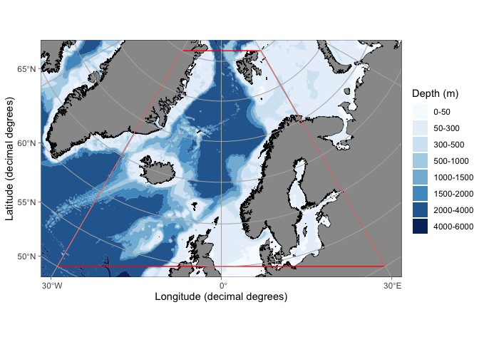
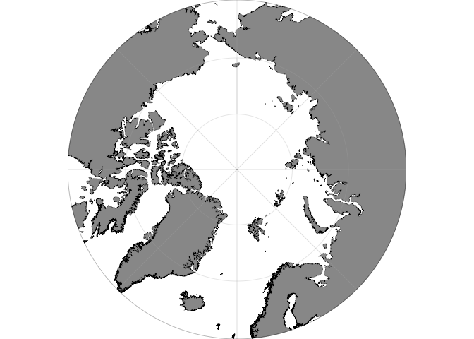

# ggOceanMaps

**Plot data on oceanographic maps using ggplot2. R package version
1.4.0**

<!-- badges: start -->

[](https://doi.org/10.5281/zenodo.4554714)
[](https://github.com/MikkoVihtakari/ggOceanMaps/actions)
[](https://CRAN.R-project.org/package=ggOceanMaps)
<!-- badges: end -->

<!-- [](https://github.com/MikkoVihtakari/ggOceanMaps/actions/workflows/R-CMD-check.yaml) -->

**Breaking news** (pun intended) **: ggOceanMaps goes
[sf](https://r-spatial.github.io/sf/)!** New bugs have likely been
introduced. If things do not work as expected, delete all files in
ggOceanMapsLargeData, remove ggOceanMapsData and reinstall ggOceanMaps.
See the
[changelog](https://mikkovihtakari.github.io/ggOceanMaps/news/index.html)
for detailed information on changes and new features.

## Overview

The ggOceanMaps package for [R](https://www.r-project.org/) allows
plotting data on bathymetric maps using
[ggplot2](https://ggplot2.tidyverse.org/reference). The package is
designed for ocean sciences and greatly simplifies bathymetric map
plotting anywhere around the globe. ggOceanMaps uses openly available
geographic data. Citing the particular data sources is advised by the
CC-BY licenses whenever maps from the package are published (see the
[*Citations and data sources*](#citations-and-data-sources) section).

The ggOceanMaps package has been developed by the [Institute of Marine
Research](https://www.hi.no/en). Note that the package comes with
absolutely no warranty and that maps generated by the package are meant
for plotting scientific data only. The maps are coarse generalizations
of third-party data and therefore inaccurate. Any [bug reports and code
fixes](https://github.com/MikkoVihtakari/ggOceanMaps/issues) are warmly
welcomed. See [*Contributions*](#contributions) for further details.

## Installation

The package is available on
[CRAN](https://CRAN.R-project.org/package=ggOceanMaps) and as a [GitHub
version](https://github.com/MikkoVihtakari/ggOceanMaps), which is
updated more frequently than the CRAN version.

Installation of the CRAN version:

``` r
install.packages("ggOceanMaps")
```

Due to the package size limitations, ggOceanMaps requires the
[ggOceanMapsData](https://github.com/MikkoVihtakari/ggOceanMapsData)
package which stores shapefiles used in low-resolution maps. If the data
package does not install automatically, you can install it from GitHub
using devtools or remotes packages, or a drat repository on Windows and
Mac:

``` r
remotes::install_github("MikkoVihtakari/ggOceanMapsData")

# OR:

install.packages(
  "ggOceanMapsData", 
  repos = c("https://mikkovihtakari.github.io/drat", 
            "https://cloud.r-project.org")
)
```

The GitHub version of ggOceanMaps can be installed using the
[**remotes**](https://CRAN.R-project.org/package=remotes) package.

``` r
remotes::install_github("MikkoVihtakari/ggOceanMapsData") # required by ggOceanMaps
remotes::install_github("MikkoVihtakari/ggOceanMaps")
```

## Usage

**ggOceanMaps** extends on
[**ggplot2**](http://ggplot2.tidyverse.org/reference/). The package uses
spatial shapefiles, [GIS packages for
R](https://cran.r-project.org/web/views/Spatial.html) to manipulate, and
the
[**ggspatial**](https://cran.r-project.org/web/packages/ggspatial/index.html)
package to help to plot these shapefiles. The shapefile plotting is
conducted internally in the `basemap` function and uses [ggplot’s sf
object plotting
capabilities](https://ggplot2.tidyverse.org/reference/ggsf.html). Maps
are plotted using the `basemap()` or `qmap()` functions that work almost
similarly to [`ggplot()` as a
base](https://ggplot2.tidyverse.org/reference/index.html) for adding
further layers to the plot using the `+` operator. The maps generated
this way already contain multiple ggplot layers. Consequently, the
[`data` argument](https://ggplot2.tidyverse.org/reference/ggplot.html)
needs to be explicitly specified inside `geom_*` functions when adding
`ggplot2` layers. Depending on the location of the map, the underlying
coordinates may be projected. Decimal degree coordinates need to be
transformed to the projected coordinates using the `transform_coord`,
[ggspatial](https://paleolimbot.github.io/ggspatial/), or [`geom_sf`
functions.](https://ggplot2.tidyverse.org/reference/ggsf.html)

``` r
library(ggOceanMaps)

dt <- data.frame(lon = c(-30, -30, 30, 30), lat = c(50, 80, 80, 50))

basemap(data = dt, bathymetry = TRUE) + 
  geom_polygon(data = transform_coord(dt), aes(x = lon, y = lat), 
               color = "red", fill = NA)
```

<!-- -->

See the [ggOceanMaps
website](https://mikkovihtakari.github.io/ggOceanMaps/index.html),
[function
reference](https://mikkovihtakari.github.io/ggOceanMaps/reference/index.html),
and the [user
manual](https://mikkovihtakari.github.io/ggOceanMaps/articles/ggOceanMaps.html)
for how to use and modify the maps plotted by the package. You may also
find [these slides about the
package](https://aen-r-workshop.github.io/4-ggOceanMaps/ggOceanMaps_workshop.html#1)
useful.

## Data path

While ggOceanMaps allows plotting any custom-made shapefiles, the
package contains a shortcut to plot higher resolution maps for [certain
areas needed by the
author](https://github.com/MikkoVihtakari/ggOceanMapsLargeData/tree/master/data)
without the need of generating the shapefiles manually. These
high-resolution shapefiles are downloaded from the
[ggOceanMapsLargeData](https://github.com/MikkoVihtakari/ggOceanMapsLargeData)
repository. As a default, the shapefiles are downloaded into a temporary
directory meaning that the user would need to download the large
shapefiles every time they restart R. This limitation is set by [CRAN
policies](https://cran.r-project.org/web/packages/policies.html). You
can define a custom folder for high-resolution shapefiles on your
computer by modifying your .Rprofile file
(e.g. `usethis::edit_r_profile()`). Add the following lines to the file:

``` r
.ggOceanMapsenv <- new.env()
.ggOceanMapsenv$datapath <- 'YourCustomPath'
```

It is smart to use a directory R has writing access to. For example
`"~/Documents/ggOceanMapsLargeData"` would work for most operating
systems.

You will need to set up the data path to your .Rprofile file only once
and ggOceanMaps will find the path even though you updated your R or
packages. ggOceanMaps will inform you about your data path when you load
the package.

## Citations and data sources

The data used by the package are not the property of the Institute of
Marine Research nor the author of the package. It is, therefore,
important that you cite the data sources used in a map you generate with
the package. The spatial data used by this package have been acquired
from the following sources:

- **ggOceanMapsData land polygons.** [Natural Earth
  Data](https://www.naturalearthdata.com/downloads/10m-physical-vectors/)
  1:10m Physical Vectors with the Land and Minor Island datasets
  combined. Distributed under the [CC Public Domain
  license](https://creativecommons.org/publicdomain/) ([terms of
  use](https://www.naturalearthdata.com/about/terms-of-use/)).
- **ggOceanMapsData glacier polygons.** [Natural Earth
  Data](https://www.naturalearthdata.com/downloads/10m-physical-vectors/)
  1:10m Physical Vectors with the Glaciated Areas and Antarctic Ice
  Shelves datasets combined. Distributed under the [CC Public Domain
  license](https://creativecommons.org/publicdomain/) ([terms of
  use](https://www.naturalearthdata.com/about/terms-of-use/)).
- **ggOceanMapsData bathymetry.** [Amante, C. and B.W. Eakins, 2009.
  ETOPO1 1 Arc-Minute Global Relief Model: Procedures, Data Sources and
  Analysis. NOAA Technical Memorandum NESDIS NGDC-24. National
  Geophysical Data Center,
  NOAA](https://www.ngdc.noaa.gov/mgg/global/relief/ETOPO1/docs/ETOPO1.pdf).
  Distributed under the [U.S. Government Work
  license](https://www.usa.gov/government-works).
- **Detailed shapefiles of Svalbard and the Norwegian coast in
  [ggOceanMapsLargeData](https://github.com/MikkoVihtakari/ggOceanMapsLargeData)**
  are from [Geonorge.no](https://www.geonorge.no/). Distributed under
  the [CC BY 4.0 license](https://creativecommons.org/licenses/by/4.0/).
- **Detailed bathymetry of the Arctic (IBCAO), Northern Hemisphere
  (GEBCO) and the Barents Sea (BarentsSea) in
  [ggOceanMapsLargeData](https://github.com/MikkoVihtakari/ggOceanMapsLargeData)**
  are vectorized from the [General Bathymetric Chart of the
  Oceans](https://www.gebco.net/data_and_products/gridded_bathymetry_data/)
  15-arcsecond 2021 grid. [Terms of
  use](https://www.gebco.net/data_and_products/gridded_bathymetry_data/gebco_2019/grid_terms_of_use.html)
- **Detailed bathymetry of the Northeast Atlantic (EMODned) in
  [ggOceanMapsLargeData](https://github.com/MikkoVihtakari/ggOceanMapsLargeData)**
  is vectorized from the [European Marine Observation and Data
  Network](https://www.emodnet-bathymetry.eu/data-products)
  3.75-arcsecond grid. [Terms of
  use](https://www.emodnet-bathymetry.eu/home/terms-of-use)

Further, please cite the package whenever maps generated by the package
are published. For up-to-date citation information, please use:

``` r
citation("ggOceanMaps")
#> To cite package 'ggOceanMaps' in publications use:
#> 
#>   Vihtakari M (2023). _ggOceanMaps: Plot Data on Oceanographic Maps
#>   using 'ggplot2'_. R package version 1.4.0,
#>   <https://mikkovihtakari.github.io/ggOceanMaps/>.
#> 
#> A BibTeX entry for LaTeX users is
#> 
#>   @Manual{,
#>     title = {ggOceanMaps: Plot Data on Oceanographic Maps using 'ggplot2'},
#>     author = {Mikko Vihtakari},
#>     year = {2023},
#>     note = {R package version 1.4.0},
#>     url = {https://mikkovihtakari.github.io/ggOceanMaps/},
#>   }
```

## Getting help

If your problem does not involve bugs in ggOceanMaps, the quickest way
of getting help is posting your problem to [Stack
Overflow](https://stackoverflow.com/questions/tagged/r). Please remember
to include a reproducible example that illustrates your problem.

## Contributions

Any contributions to the package are more than welcome. Please contact
the package maintainer Mikko Vihtakari (<mikko.vihtakari@hi.no>) to
discuss your ideas on improving the package. Bug reports and corrections
should be submitted directly to [the GitHub
site](https://github.com/MikkoVihtakari/ggOceanMaps/issues). Please
include a [minimal reproducible
example](https://en.wikipedia.org/wiki/Minimal_working_example).
Considerable contributions to the package development will be credited
with authorship.

## Debugging installation

After a successful installation, the following code should return a plot
shown under

``` r
library(ggOceanMaps)
basemap(60)
```

<!-- -->

If the `basemap()` function complains about ggOceanMapsData package not
being available, the drat repository may have issues (assuming you
followed the installation instructions above). Try installing the
ggOceanMapsData package using the devtools/remotes package. The data
package does not contain any C++ code and should compile easily.

If you encounter problems during the devtools installation, you may set
the `upgrade` argument to `"never"` and try the following steps:

1.  Manually update all R packages you have installed (Packages -\>
    Update -\> Select all -\> Install updates in R Studio). If an update
    of a package fails, try installing that package again using the
    `install.packages` function or the R Studio menu.
2.  Run
    `devtools::install_github("MikkoVihtakari/ggOceanMaps", upgrade = "never")`.
3.  If the installation of a dependency fails, try installing that
    package manually and repeat step 2.
4.  Since R has lately been updated to 4.0, you may have to update your
    R to the latest major version for all dependencies to work (`stars`,
    `rgdal` and `sf` have been reported to cause trouble during the
    installation).
