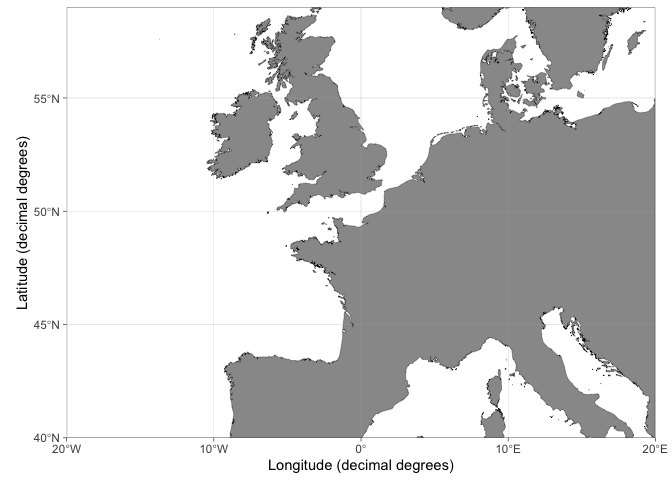
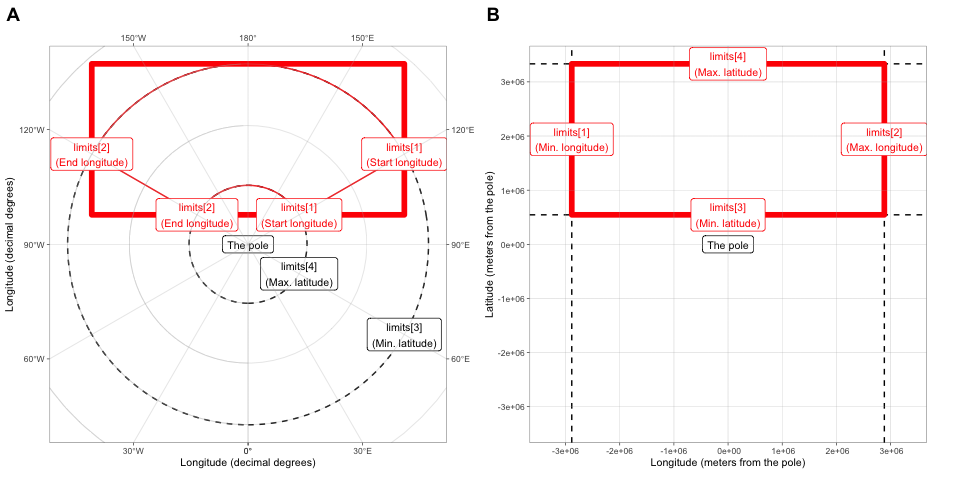
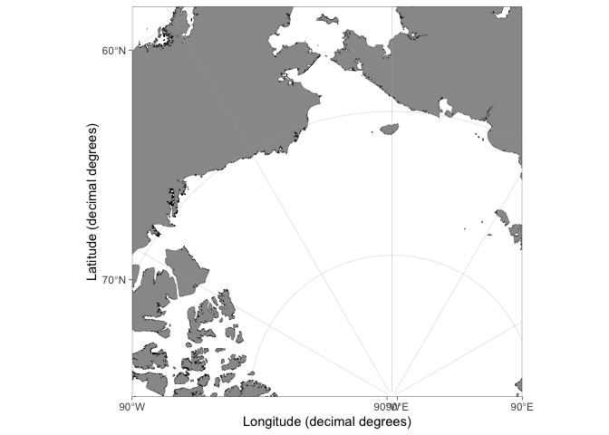
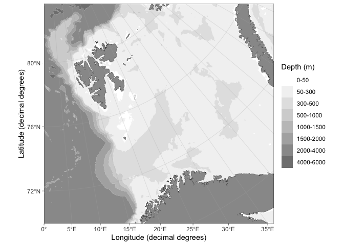
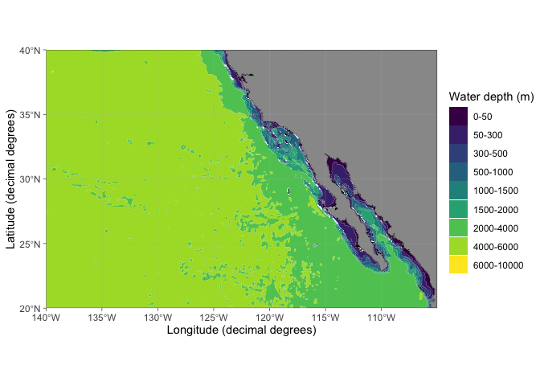
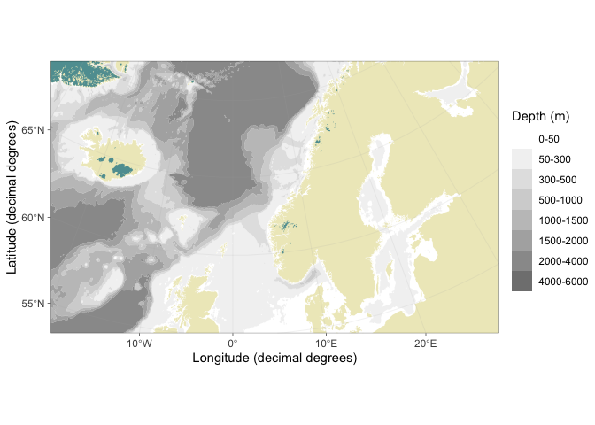
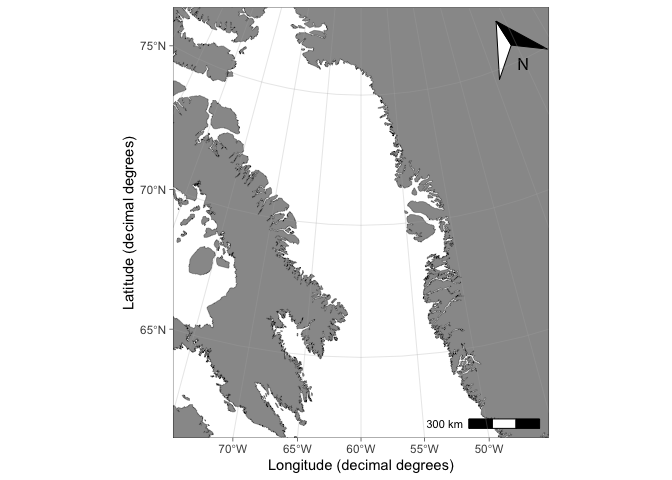
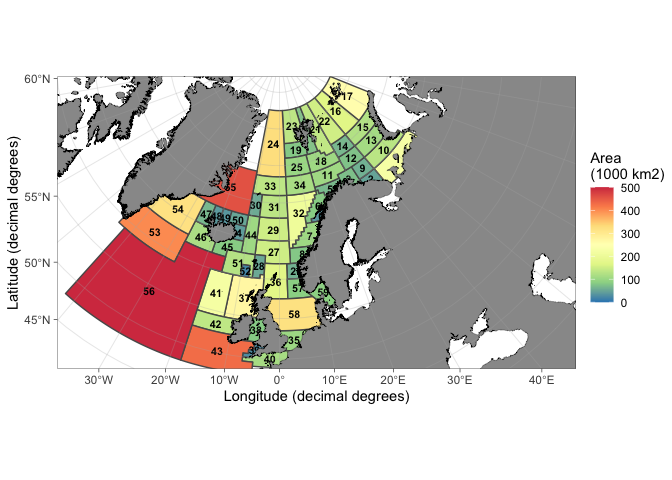
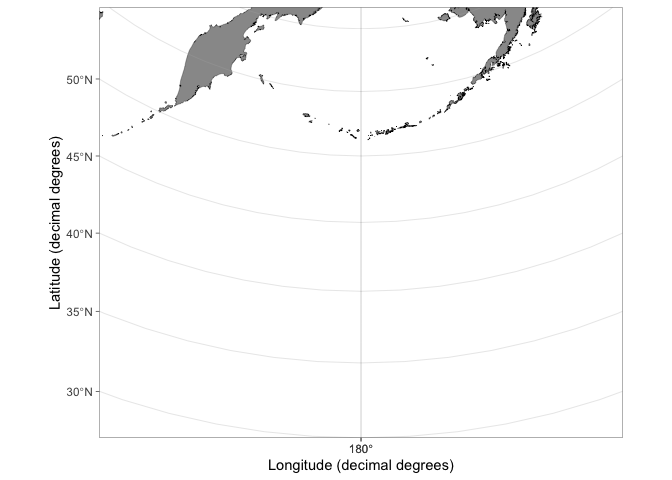

ggOceanMaps
================
Mikko Vihtakari (Institute of Marine Research)

**Plot data on oceanographic maps using ggplot2. R package version
0.2.0**

The ggOceanMaps package for [R](https://www.r-project.org/) allows
plotting data on bathymetric maps using
[ggplot2](https://ggplot2.tidyverse.org/reference). The package is
designed for marine research and greatly simplifies bathymetric map
plotting anywhere around the globe. ggOceanMaps uses openly available
geographic data. Citing the particular data sources is advised by the
CC-BY licenses whenever maps from the package are published (see the
[Citations and data sources](#datasources) section).

ggOceanMaps has been developed by the [Institute of Marine
Research](https://www.hi.no/en). The package is a continuation of the
work by the lead author with the
[PlotSvalbard](https://github.com/MikkoVihtakari/PlotSvalbard) package,
which could not be uploaded to [CRAN](https://cran.r-project.org/) due
to package size limitations and was designed for a limited region. The
sole purpose of ggOceanMaps is to allow the installation from CRAN and
to expand the mapping capabilities for the entire world. Due to the
package size limitations, ggOceanMaps depends on the
[ggOceanMapsData](https://github.com/MikkoVihtakari/ggOceanMapsData)
package which stores the shapefiles.

This is the developmental site for ggOceanMaps, which is in the process
of being uploaded to CRAN. The developmental version may be ahead of the
CRAN version but may also contain unstable features. Note that the
package comes with absolutely no warranty and that maps generated by the
package are meant for plotting scientific data only. The maps are coarse
generalizations of third party data and therefore wrong. Any [bug
reports and code
fixes](https://github.com/MikkoVihtakari/ggOceanMaps/issues) are warmly
welcomed. See [*Contributions and contact information*](#contributions)
for further details.

# Installation

The package should be available on CRAN soon. The developmental version
can be installed using the
[**devtools**](https://cran.r-project.org/web/packages/devtools/index.html)
package.

``` r
devtools::install_github("MikkoVihtakari/ggOceanMapsData") # required by ggOceanMaps
devtools::install_github("MikkoVihtakari/ggOceanMaps")
```

If you encounter problems during the devtools installation, you may set
the `upgrade` argument to `"never"` and try the following steps: 1.
Manually update all R packages you have installed (Packages -\> Update
-\> Select all -\> Install updates in R Studio). If an update of a
package fails, try installing that package again using the
`install.packages` function or the R Studio menu. 2. Run
`devtools::install_github("MikkoVihtakari/ggOceanMaps", upgrade =
"never")`. 3. If installation of a dependency fails, try installing that
package manually and repeat step 2.

# Basic use

**ggOceanMaps** extends on
[**ggplot2**](http://ggplot2.tidyverse.org/reference/). Data that
contain geographic information can be plotted on the maps generated by
ggOceanMaps using the ggplot2 layers separated by the `+` operator. The
package uses spatial shapefiles, [GIS packages for
R](https://cran.r-project.org/web/views/Spatial.html) to manipulate, and
the
[**ggspatial**](https://cran.r-project.org/web/packages/ggspatial/index.html)
package to help to plot these shapefiles. The shapefile plotting is
conducted internally in the `basemap` function and uses [ggplot’s sf
object plotting
capabilities](https://ggplot2.tidyverse.org/reference/ggsf.html).

The primary aim of ggOceanMaps is to make plotting oceanographic spatial
data as simple as feasible, but also flexible for custom modifications.
The “as simple as feasible” part will be covered in this section, while
the “flexible for custom modifications” part is covered in the [Advanced
use](#advanced) section. The basic use section of this tutorial assumes
that the user knows how to use ggplot. If you are not familiar with this
package, you may read the [Data
visualization](https://r4ds.had.co.nz/data-visualisation.html) section
in [Hadley Wickham & Garrett Grolemund](https://r4ds.had.co.nz/). This
tutorial does not describe functions in ggOceanMaps but rather focusses
on how to use them. Make sure to refer to the function documentation
while reading the tutorial.

## Limits

To ensure simplicity, ggOceanMaps package attempts to use [decimal
degree](https://en.wikipedia.org/wiki/Decimal_degrees) [coordinate
system](https://en.wikipedia.org/wiki/Coordinate_system) as much as
possible. This system represents coordinates on a sphere, while maps are
plotted in two dimensions. Therefore, the underlying map data have to be
projected using [different mathematical algorithms depending on the
geographic location](#projections). The simplest way of defining the
geographic location is to use the `limits` argument with decimal
degrees. The limits argument can be defined either as a numeric vector
of length 1 or 4. Specifying the argument as a single integer between 30
and 88 or -88 and -30 plots a polar stereographic map for the Arctic or
Antarctic, respectively.

``` r
library(ggOceanMaps)
basemap(limits = 60)
```

<!-- -->

Rectangular maps are plotted by specifying the `limits` argument as a
numeric vector of length 4 where the first element defines the start
longitude, the second element the end longitude, the third element the
minimum latitude and the fourth element the maximum latitude of the
bounding box:

``` r
basemap(limits = c(-20, 20, 40, 59))
```

<!-- -->

Limiting maps using decimal degrees is somewhat counter-intuitive
because maps plotted for polar regions (\>= 60 or \<= -60 latitude) are
actually projected to Arctic and Antarctic polar stereographic systems.
Because decimal degrees are angular units running counter-clockwise,
also the longitude limits have to be defined **counter-clockwise**.
Projected maps with decimal degree `limits` will lead to expanded limits
towards the poles when using Arctic and Atlantic Polar Stereographic
projections because decimal degrees represent a sphere:

<!-- -->

The figure above: Limiting rectangular basemaps is done by placing four
coordinates to the limit argument. A) If the limits are in decimal
degrees, the longitude limits (`[1:2]`) specify the start and end
segments of corresponding angular lines that should reside inside the
map area. The longitude limits are defined **counter-clockwise**. The
latitude limits `[3:4]` define the parallels that should reside inside
the limited region given the longitude segments. Note that the resulting
limited region (polygon with thick red borders) becomes wider than the
polygon defined by the coordinates (thin red borders). The example
limits are `c(120, -120, 60, 80)`. B) If the limits are given as
projected coordinates or as decimal degrees for maps with |latitude| \<
60, limits elements represent lines encompassing the map area in
cartesian space. The example limits are the limits from A) projected to
the Arctic stereographic (crs = 3995). When limiting basemaps using
data, the limits are calculated for the maximum reach of projected
coordinates as in B but with an added buffer to place all points inside
the map area.

As an example:

``` r
dt <- data.frame(lon = c(160, 160, -160, -160), lat = c(60, 80, 80, 60))

basemap(limits = c(160, -160, 60, 80)) +
  geom_spatial_polygon(data = dt, aes(x = lon, y = lat), fill = NA, color = "red")
```

<!-- -->

Exact control of map limits can be difficult using decimal degree limits
in polar regions. The `limits` argument also allows specifying the
limits in the underlying projected coordinate units. First, we will need
to find out how these units look like:

``` r
basemap(limits = 60, projection.grid = TRUE, grid.col = "red")
```

<!-- -->

The `projection.grid` argument plots a grid using the projected actual
map coordinates instead of decimal degrees. The grid helps in defining
the `limits` using projected coordinates giving better control over the
map limits than decimal degree coordinates. The automatic shapefile
definition algorithm does not work for projected coordinates. Therefore,
if the limits are not given as decimal degrees (any longitude outside
the range \[-180, 180\] or latitude \[-90, 90\]), the function asks to
specify `shapefiles`. The `shapefiles` can be defined by partially
matching the names of the pre-made shapefiles in `shapefile_list`
(e.g. “Ar” would be enough for “ArcticStereographic”):

``` r
basemap(limits = c(-2e6, 1e6, 0, 3e6), shapefiles = "Arctic") 
```

<!-- -->

## Data limits

The limits of a map can also be defined by inputting a data frame to the
`data` argument. The limits are automatically defined allowing the user
to quickly find limits for a desired spatial dataset:

``` r
dt <- expand.grid(lon = c(160, -160), lat = c(60, 80))

basemap(data = dt) +
  geom_spatial_point(data = dt, aes(x = lon, y = lat), color = "red")
```

<!-- -->

Note how the function expands the map to make all data fit inside the
map area compared to a similar plot using the `limits` argument above.
The function automatically detects columns containing longitude and
latitude information. The automatic detection algorithm is not very
advanced and it is recommended to use intuitive column names for
longitude (such as “lon”, “long”, or “longitude”) and latitude (“lat”,
“latitude”) columns. The coordinate data have to be given as decimal
degrees for the `data` argument to function.

## Bathymetry and glaciers

It is advised to limit your map first and only then plot bathymetry and
glaciers to save the processing time of your computer (the bathymetry
shapes can be large). Bathymetry is plotted simply by specifying
`bathymetry = TRUE`:

``` r
basemap(limits = c(100, 160, -20, 30), bathymetry = TRUE)
```

<!-- -->

Glaciers can be plotted using the `glaciers` argument:

``` r
basemap(limits = 60, glaciers = TRUE, bathymetry = TRUE)
```

<!-- -->

## Adding data to maps

The `basemap(...)` function works almost similarly to the `ggplot(...)`
function as a base for adding further layers to the plot. The difference
between the `basemap()` and the `ggplot()` is that the `basemap()` plot
already contains multiple ggplot layers. All layers except bathymetry
have no other `aes` mapping than `x`, `y` and `group`. Bathymetry is
mapped to `fill` or `color` color in addition. This means that when you
add ggplot layers, you need to specify the `data` argument explicitly as
shown below. Another difference is that basemaps are plotted using
projected coordinates. The
[ggspatial](https://cran.r-project.org/web/packages/ggspatial/index.html)
and ggplot’s
[`geom_sf`](https://ggplot2.tidyverse.org/reference/ggsf.html) functions
convert the coordinates automatically to the projected coordinates:

``` r
dt <- data.frame(lon = c(seq(-180, 0, 30), seq(30, 180, 30)), lat = -70)
basemap(limits = -60, glaciers = TRUE) + geom_spatial_point(data = dt, aes(x = lon, y = lat), color = "red")
```

<!-- -->

The ggplot functions can also be used, but the coordinates need to be
transformed to the basemap projection first using the `transform_coord`
function:

``` r
basemap(limits = -60, glaciers = TRUE) + 
  geom_point(data = transform_coord(dt), aes(x = lon, y = lat), color = "red")
```

<!-- -->

Note that the maps plotted in temperate and tropical regions are not
projected. Consequently, decimal degrees work for such maps directly:

``` r
dt <- data.frame(lon = c(-100, -80, -60), lat = c(10, 25, 40))
basemap(data = dt) + geom_point(data = dt, aes(x = lon, y = lat), color = "red")
```

<!-- -->

The `transform_coord` function detects the projection automatically,
given that the map is limited using a similar range of coordinates.
Therefore you can use the `transform_coord` as demonstrated above
whenever using standard ggplot layers.

``` r
transform_coord(data.frame(lon = -80, lat = 25), bind = TRUE)
```

    #>   lon lat lon.proj lat.proj
    #> 1 -80  25      -80       25

## Rotating maps

The stereographic maps can be rotated to point towards north using the
`rotate` argument:

``` r
basemap(limits = c(-160, -80, 60, 85), rotate = TRUE)
```

<!-- -->

A word of warning, however: the rotation involves reprojecting all
shapefiles in their entirety and is memory consuming especially for
large bathymetry shapes. Make sure to limit your map correctly before
you add bathymetry. The rotation is still experimental and does not work
for `limit`s defined using projected coordinates or `data`. This
functionality is likely to contain a whole lot of bugs.

## Quick map

The `qmap` function is designed as a shortcut to quickly take a look at
a spatial dataset similar to the ggplot’s
[`qplot`](https://ggplot2.tidyverse.org/reference/qplot.html) function.
This function is supposed to automatically detect the type of data fed
into the function and plot a map using appropriate geometries, limits,
and projection. The function has not been developed properly yet and
requires user feedback and testing.

``` r
qmap(dt, color = "red")
```

<!-- -->

# Advanced use

This section focuses on flexibility and user modifications. It is
assumed that advanced users understand the basics of geographic
information systems (GIS) and how to use these systems in R (e.g. see
the [Making Maps with
R](https://geocompr.robinlovelace.net/adv-map.html) chapter in [Lovelace
et al. 2020](https://geocompr.robinlovelace.net/index.html)).

## Projections

The `basemap` function uses the `limits` argument to automatically
detect the required projection for a map (or the `data` argument to
calculate `limits`). The algorithms deciding which projection to use are
defined in `define_shapefiles` and `shapefile_list` functions. These
conditions are expected to change during the development of the package
and documented information here or in the `basemap` function might be
outdated. Make sure to check the projection definition functions for
up-to-date information. At the time of writing, the function uses three
different projections (given as [EPSG codes](https://epsg.io/)):

  - **3995** WGS 84 / Arctic Polar Stereographic. Called
    “ArcticStereographic”. For max latitude (`limits[4]`) \>= 60 (if
    min latitude (`limits[3]`) \>= 30), and single integer latitudes \>=
    30 and \<= 89.
  - **3031** WGS 84 / Antarctic Polar Stereographic. Called
    “AntarcticStereographic”. For max latitude (`limits[4]`) \<= -60
    (if min latitude (`limits[3]`) \<= -30), and single integer
    latitudes \<= -30 and \>= -89.
  - **4326** WGS 84 / World Geodetic System 1984, used in GPS. Called
    “DecimalDegree”. For min latitude (`limits[3]`) \< 30 or \> -30,
    max latitude (`limits[4]`) \< 60 or \> -60, and single integer
    latitudes \< 30 and \> -30.

The `basemap` function uses pre-transformed shapefiles for each of the
projections above (defined in `shapefile_list`). This is to make the
plotting quicker and more memory efficient but leads to larger data size
required by the package.

## Appearance

### Bathymetry styles

The `basemap` function contains four pre-made bathymetry styles defined
using the `bathy.style` argument. Two of these alternatives (`"poly_*"`)
have been mapped to `fill` using the `geom_polygon` function, while the
two others (`contour_*`) have been mapped to `color`. The default style
(`"poly_blues"`) has been displayed throughout this user manual. The
other styles are:

``` r
basemap(limits = c(0, 46, 70, 81), bathymetry = TRUE, bathy.style = "poly_greys")
```

<!-- -->

``` r
basemap(limits = c(0, 46, 70, 81), bathymetry = TRUE, bathy.style = "contour_blues")
```

<!-- -->

``` r
basemap(limits = c(0, 46, 70, 81), bathymetry = TRUE, bathy.style = "contour_grey")
```

<!-- -->

#### Customizing bathymetry styles

The `bathy.style = "poly_*"` bathymetry polygons are mapped to
`geom_fill_discrete` and can be modifying using standard ggplot syntax:

``` r
basemap(limits = c(-140, -105, 20, 40), bathymetry = TRUE) + scale_fill_viridis_d("Water depth (m)")
```

<!-- -->

The `bathy.style = "contour_*"` bathymetry lines are mapped to
`geom_color_discrete` and can be modifying using standard ggplot syntax:

``` r
basemap(limits = c(0, 60, 68, 80), bathymetry = TRUE, bathy.style = "contour_blues") + scale_color_hue()
```

<!-- -->

### Graphical parameters

The `basemap` function uses graphical parameters that (very objectively)
happen to please the eye of the author and have worked in the
applications needed by the author. The default parameters may suddenly
change without warning. You may want to modify the appearances of a
`basemap` to your own liking. This can be done using the `*.col` (fill),
`*.border.col` (line color) and `*.size` (line width) arguments:

``` r
basemap(limits = c(-20, 30, 55, 70), glaciers = TRUE, 
        bathymetry = TRUE, bathy.style = "poly_greys",
        land.col = "#eeeac4", gla.col = "cadetblue", 
        land.border.col = NA, gla.border.col = NA,
        grid.size = 0.05)
```

<!-- -->

Grid lines can be removed by setting the `grid.col` to `NA`. Axis labels
can be manipulated using standard ggplot code:

``` r
basemap(limits = c(124, 148, 31, 50), grid.col = NA) + labs(x = NULL, y = "Only latitude for you, ...")
```

<!-- -->

### Add scale bar and north arrow

Scale bar and north arrows can be added using the [**ggspatial**
functions](https://cran.r-project.org/web/packages/ggspatial/vignettes/ggspatial.html)
(the package is automatically loaded when you use ggOceanMaps):

``` r
basemap(limits = c(-75, -45, 62, 78), rotate = TRUE) + 
  annotation_scale(location = "br") + 
  annotation_north_arrow(location = "tr", which_north = "true") 
```

<!-- -->

Note that the north arrow in the example above points towards North
where it is placed and that the direction of North varies as shown by
the meridians. The scale bar is correct at 71 \(\circ\)N latitude as
specified by the projection (crs = 3995) for Arctic stereographic maps.

## Modifying basemap objects

The objects produced by the `basemap` function are standard ggplot
objects with the difference that relevant information used in mapping is
added to `attributes` of the object:

``` r
p <- basemap(-60)
attributes(p)
```

    #> $names
    #> [1] "data"        "layers"      "scales"      "mapping"     "theme"      
    #> [6] "coordinates" "facet"       "plot_env"    "labels"     
    #> 
    #> $class
    #> [1] "gg"          "ggplot"      "ggOceanMaps"
    #> 
    #> $bathymetry
    #> [1] FALSE
    #> 
    #> $glaciers
    #> [1] FALSE
    #> 
    #> $limits
    #> [1] -3333134  3333134 -3333134  3333134
    #> 
    #> $polarmap
    #> [1] TRUE
    #> 
    #> $crs
    #> [1] 3031
    #> 
    #> $proj
    #> [1] "+proj=stere +lat_0=-90 +lat_ts=-71 +lon_0=0 +k=1 +x_0=0 +y_0=0 +datum=WGS84 +units=m +no_defs +ellps=WGS84 +towgs84=0,0,0"

Accessing the `attributes` allow custom modifications of maps produced
by the `basemap` function. See the [Reordering layers](#reordering)
section as an example.

### Reordering layers

Sometimes there is a need to move land, glacier, and grid layers on top
of spatial data added on a `basemap`. This can be done using the
`reorder_layers` function. This example uses Norwegian fishing regions
(Hovedområder f.o.m. 2018), which can be downloaded from the [Norwegian
Directorate of Fisheries data portal](https://kart.fiskeridir.no/stat)
(use “ESRI shapefile” option). The example works for any spatial
polygons with crs information, however.

The Norwegian fishing regions are included as an example dataset in the
**ggOceanMaps** package. You can download these data and use the
`rgdal::readOGR` function to read the shapefile if you wish to follow
the example fully.

``` r
data(fishingAreasNor)

basemap(limits = raster::extent(fishingAreasNor)[1:4]) + 
  annotation_spatial(fishingAreasNor, fill = NA) + 
  coord_sf(expand = FALSE)
```

<!-- -->

The initial plot draws the polygons. Note how we had to add
`coord_sf(expand = FALSE)` because `layer_spatial` and
`annotation_spatial` functions from the ggspatial package seem to modify
`coord_sf` when added to the plot. The `basemap` function uses `expand =
FALSE` (run the script without the addition and see the difference).
Note also how the polygon boundaries are partly on land. We want to
eventually hide them under land. We also add region labels and color the
polygons based on their area to demonstrate the capabilities of ggplot,
ggspatial and ggOceanMaps:

``` r
labels <- sp::SpatialPointsDataFrame(rgeos::gCentroid(fishingAreasNor, byid=TRUE), 
                                     data = fishingAreasNor@data)
fishingAreasNor@data$area <- raster::area(fishingAreasNor)/1e9 # calculate area in 1000 km2

p <- basemap(limits = raster::extent(fishingAreasNor)[1:4]) + 
  annotation_spatial(fishingAreasNor, aes(fill = area)) + 
  geom_spatial_text(data = df_spatial(labels), aes(x = x, y = y, label = FID), size = FS(8), fontface = 2) +
  scale_fill_distiller(name = "Area\n(1000 km2)", 
                       palette = "Spectral", na.value = "white",
                       limits = c(0, 500), oob = scales::squish)

reorder_layers(p)
```

<!-- -->

Ideally, the region labels should not go under land. This can be fixed
by plotting the labels on top of the reordered ggplot object. To
demonstrate how to reorder layers, we do this manually here:

``` r
p <- reorder_layers(p)
tmp <- sapply(p$layers, function(k) !is.null(k$mapping$label)) # the layer with label mapping
p$layers <- c(p$layers[-which(tmp)], p$layers[which(tmp)])
p
```

<!-- -->

## Custom shapefiles

The **ggOceanMaps package uses vector (spatial polygon) data** to make
the plotting more efficient and to produce sharp images at any
resolution. For the time being, the package supports three kinds of
shapefiles: 1) land shapes, 2) glacier shapes, and 3) bathymetry shapes.
Each of these shapes has to be defined using the same projection. Since
the shapefiles are large and generating them may require long processing
time, it is most convenient to save them in a Rdata file as
`sp::SpatialPolygonsDataFrames` objects and load them to the memory when
used to make a map. Useful sources for spatial data are:

**Vector data**

  - [Natural Earth
    Data](http://www.naturalearthdata.com/downloads/10m-physical-vectors/)
    provides polygon data in relatively high detail for the entire
    Earth. Used as data-source for land and glacier shapes throughout
    the package, except for the most detailed maps.
  - [Norwegian Mapping
    Authority](https://www.kartverket.no/en/data/Open-and-Free-geospatial-data-from-Norway/)
    provides high-resolution spatial data for mainland Norway and
    Svalbard.
    <!-- Used as data-source for detailed coastal Norwegian maps as well as for detailed bathymetry in Svalbard maps. -->
  - [Norwegian Polar Institute](https://geodata.npolar.no/) provides
    high-resolution vector data for Norwegian polar regions.
    <!-- Used as data-source for detailed Svalbard maps.  -->

**Raster data for bathymetry**

  - [GEBCO Compilation Group (2019) GEBCO 2019 15-arcsecond
    grid](https://www.gebco.net/data_and_products/gridded_bathymetry_data/gebco_2019/gebco_2019_info.html).
    The highest resolution open bathymetry grid available at the moment.
    Referred to as “GEBCO data”.
  - [ETOPO1 1 Arc-Minute Global Relief
    Model](https://doi.org/10.7289/V5C8276M). Can also be accessed using
    the
    [`marmap::getNOAA.bathy`](https://www.rdocumentation.org/packages/marmap/versions/1.0.3/topics/getNOAA.bathy)
    (see [Section 1](#making)). Referred to as “NOAA data” and “ETOPO1
    data”.

There are probably more sources which the author has not needed yet.
Please send an email to add more options to the list. The bathymetry
datasets are large and require vectorization before they can be plotted
in *ggplot2* within a reasonable time.

Here we go through how to plot customized shapefiles for the Barents Sea
as an example. A similar procedure can be applied to any region in the
world.

### Bathymetries

The [Natural Earth
Data](http://www.naturalearthdata.com/downloads/10m-physical-vectors/)
provides bathymetry vector data, which can be readily used in
ggOceanMaps. The contours in that dataset are, however, not very
practical for marine biology and fisheries in shallow seas such as the
Barents Sea. Download the [ETOPO1 dataset as grid registered NetCDF
gmt4](https://www.ngdc.noaa.gov/mgg/global/relief/ETOPO1/data/ice_surface/grid_registered/netcdf/)
to a folder in your computer. It may be beneficial to make a “GIS” or
“Shapefiles” folder where you store similar datasets for later use.
Whether you use ice or bed-rock surface does not matter for this example
as there are no glaciers under the sea-level within the region of
interest. In any case, this choice has no visual effect because land and
glaciers will be plotted on top of the bathymetry, but the ice surface
option will lead to smaller file size.

The bathymetry needs first to be reclassified and formatted for the
consequent vectorization step. First, we need to define the location of
the ETOPO1 dataset and to find limits for our region in decimal degrees.
The limits can be found using the `basemap` function. It is advised to
use slightly wider limits than the region of interest.

``` r
etopoPath <- "" # Replace by the path to the folder where the ETOPO1 grd file is located.
lims <- c(-8, 65, 68, 82)
projection <- "+init=epsg:32636"
basemap(limits = lims)
```

We also need to define an appropriate projection. We will use the
[UTM 36N zone projection](http://epsg.io/32636), which is approximately
in the middle of our area of interest. We define higher resolution
contour in depths 0-500 m because our area of interest is relatively
shallow. The `raster_bathymetry` function is relatively slow for large
data. The `aggregation.factor` argument can be used to reduce file size
but will influence the resolution of the resulting shapefile (higher
factors lead to a lower resolution).

``` r
rb <- raster_bathymetry(bathy = paste(etopoPath, "ETOPO1_Ice_g_gmt4.grd", sep = "/"),
                        depths = c(50, 100, 200, 300, 500, 1000, 1500, 2000, 4000, 6000, 10000), 
                        proj.out = projection, 
                        boundary = lims
)
```

Now we have the bathyRaster object which can be vectorized:

``` r
class(rb)
names(rb)
raster::plot(rb$raster)
```

The vectorization is done using the `vector_bathymetry` function. The
`drop.crumbs` and `remove.holes` parameters can be used to reduce the
file size, while the `smooth` parameter makes the contours look smoother
under high zoom levels. Note that the smoothing of raster cell edges is
completely arbitrary and may lead to map contours that do not exist in
reality.

``` r
bs_bathy <- vector_bathymetry(rb)
sp::plot(bs_bathy)
```

### Land shapes

Land shapes could theoretically be defined from the bathymetry raster
(depth = 0). Nevertheless, since the [10m Natural Earth
Data](http://www.naturalearthdata.com/downloads/10m-physical-vectors/)
vectors are of high resolution, there has been no need to write a
function to do this. We use Natural Earth Data instead. Download the
Natural Earth Data [Land and Minor
Islands](http://www.naturalearthdata.com/downloads/10m-physical-vectors/)
vectors to your “GIS” or “Shapefiles” folder and define folder paths
under:

``` r
NEDPath <- "" # Natural Earth Data location
outPath <- "" # Data output location
```

Once done, we go ahead and process the shapefiles:

``` r
world <- rgdal::readOGR(paste(NEDPath, "ne_10m_land/ne_10m_land.shp", sep = "/"))
islands <- rgdal::readOGR(paste(NEDPath, "ne_10m_minor_islands/ne_10m_minor_islands.shp", sep = "/"))
world <- rbind(world, islands)

bs_land <- clip_shapefile(world, lims)
bs_land <- sp::spTransform(bs_land, CRSobj = sp::CRS(projection))
rgeos::gIsValid(bs_land) # Has to return TRUE, if not use rgeos::gBuffer
bs_land <- rgeos::gBuffer(bs_land, byid = TRUE, width = 0)
sp::plot(bs_land)
```

### Glacier shapes

Download the Natural Earth Data [Glaciated
Areas](http://www.naturalearthdata.com/downloads/10m-physical-vectors/)
vectors to your `NEDPath`.

``` r
glaciers <- rgdal::readOGR(paste(NEDPath, "ne_10m_glaciated_areas/ne_10m_glaciated_areas.shp", sep = "/"))
rgeos::gIsValid(glaciers) # Needs buffering
glaciers <- rgeos::gBuffer(glaciers, byid = TRUE, width = 0)

bs_glacier <- clip_shapefile(glaciers, lims)
bs_glacier <- sp::spTransform(bs_glacier, CRSobj = sp::CRS(projection))
rgeos::gIsValid(bs_glacier)
sp::plot(bs_glacier)
```

### Plotting the shapefiles using basemap

Now that we have the shapefiles, we can save them to a file so that we
do not run the script above every time we plot a map using custom
shapefiles.

``` r
save(bs_bathy, bs_land, bs_glacier, file = paste(outPath, "bs_shapes.rda", sep = "/"), compress = "xz")
```

The shapefiles can now be plotted using the `basemap` function:

``` r
basemap(shapefiles = list(land = bs_land, glacier = bs_glacier, bathy = bs_bathy), bathymetry = TRUE, glaciers = TRUE)
```

<!-- -->

The list elements `land`, `glacier` and `bathy` are required, but
`glacier` and `bathy` can be set to `NULL` if `bathymetry` and
`glaciers` are set to `FALSE`, respectively. This means that you are not
forced to define bathymetries and glaciers for your custom shapefile
maps if plotting them is not desired. Note how the map becomes plotted
outside its actual limits. This issue will hopefully be fixed in the
future. The map can be limited using the `limits` or `data` arguments as
any `basemap`:

``` r
basemap(limits = c(10, 53, 70, 80), shapefiles = list(land = bs_land, glacier = bs_glacier, bathy = bs_bathy), bathymetry = TRUE, glaciers = TRUE)
```

<!-- -->

## Pre-made shapefiles

Shapefiles used by this package have been defined as follows:

### Low-resolution shapefiles shipped with ggOceanMap

Download the datasets specified in [Citations and
datasources](#datasources) to folders on your computer. Replace the
paths under with the correct folder paths on your computer.

``` r
etopoPath <- ""
NEDPath <- ""
outPath <- ""
```

#### Decimal degrees

Bathymetry:

``` r
rb <- raster_bathymetry(bathy = paste(etopoPath, "ETOPO1_Ice_g_gmt4.grd", sep = "/"),
                        depths = c(50, 300, 500, 1000, 1500, 2000, 4000, 6000, 10000), 
                        proj.out = "+init=epsg:4326", 
                        boundary = c(-180.0083, 180.0083, -70, 70), 
                        aggregation.factor = 6
)

dd_bathy <- vector_bathymetry(rb, drop.crumbs = 50, remove.holes = 50)

save(dd_bathy, file = paste(outPath, "dd_bathy.rda", sep = "/"), compress = "xz")
```

Land:

``` r
world <- rgdal::readOGR(paste(NEDPath, "ne_10m_land/ne_10m_land.shp", sep = "/"))
islands <- rgdal::readOGR(paste(NEDPath, "ne_10m_minor_islands/ne_10m_minor_islands.shp", sep = "/"))
world <- rbind(world, islands)

dd_land <- clip_shapefile(world, c(-180, 180, -70, 70))

save(dd_land, file = paste(outPath, "dd_land.rda", sep = "/"), compress = "xz")
```

Glaciers:

``` r
glaciers <- rgdal::readOGR(paste(NEDPath, "ne_10m_glaciated_areas/ne_10m_glaciated_areas.shp", sep = "/"))
iceshelves <- rgdal::readOGR(paste(NEDPath, "ne_10m_antarctic_ice_shelves_polys/ne_10m_antarctic_ice_shelves_polys.shp", sep = "/"))

glaciers <- rbind(glaciers, iceshelves)
glaciers <- rgeos::gBuffer(glaciers, byid = TRUE, width = 0)

dd_glacier <- clip_shapefile(glaciers, c(-180, 180, -70, 70))
dd_glacier <- rgeos::gBuffer(dd_glacier, byid = FALSE, width = 0.1)
dd_glacier <- rgeos::gBuffer(dd_glacier, byid = FALSE, width = -0.1)

save(dd_glacier, file = paste(outPath, "dd_glacier.rda", sep = "/"), compress = "xz")
```

#### Arctic stereographic

Bathymetry:

``` r
rb <- raster_bathymetry(bathy = paste(etopoPath, "ETOPO1_Ice_g_gmt4.grd", sep = "/"), 
                        depths = c(50, 300, 500, 1000, 1500, 2000, 4000, 6000, 10000), 
                        proj.out = "+init=epsg:3995", 
                        boundary = c(-180.0083, 180.0083, 30, 90), 
                        aggregation.factor = 2
)

arctic_bathy <- vector_bathymetry(rb)

save(arctic_bathy, file = paste(outPath, "arctic_bathy.rda", sep = "/"), compress = "xz")
```

Land:

``` r
arctic_land <- clip_shapefile(world, c(-180, 180, 30, 90))
arctic_land <- sp::spTransform(arctic_land, sp::CRS(sp::proj4string(arctic_bathy)))
arctic_land <- rgeos::gBuffer(arctic_land, byid = TRUE, width = 0)

save(arctic_land, file = paste(outPath, "arctic_land.rda", sep = "/"), compress = "xz")
```

Glaciers:

``` r
arctic_glacier <- clip_shapefile(glaciers, c(-180, 180, 40, 90))
arctic_glacier <- sp::spTransform(arctic_glacier, sp::CRS(sp::proj4string(arctic_bathy)))
arctic_glacier <- rgeos::gBuffer(arctic_glacier, byid = FALSE, width = 1000)
arctic_glacier <- rgeos::gBuffer(arctic_glacier, byid = FALSE, width = -1000)

save(arctic_glacier, file = paste(outPath, "arctic_glacier.rda", sep = "/"), compress = "xz")
```

#### Antarctic steregraphic

Bathymetry:

``` r
rb <- raster_bathymetry(bathy = paste(etopoPath, "ETOPO1_Ice_g_gmt4.grd", sep = "/"), 
                        depths = c(50, 300, 500, 1000, 1500, 2000, 4000, 6000, 10000), 
                        proj.out = "+init=epsg:3031", 
                        boundary = c(-180.0083, 180.0083, -80, -30), 
                        aggregation.factor = 2
)

antarctic_bathy <- vector_bathymetry(rb)

save(antarctic_bathy, file = paste(outPath, "antarctic_bathy.rda", sep = "/"), compress = "xz")
```

Land:

``` r
antarctic_land <- clip_shapefile(world, c(-180, 180, -90, -30))
antarctic_land <- sp::spTransform(antarctic_land, sp::CRS(sp::proj4string(antarctic_bathy)))
antarctic_land <- rgeos::gBuffer(antarctic_land, byid = TRUE, width = 0)

save(antarctic_land, file = paste(outPath, "antarctic_land.rda", sep = "/"), compress = "xz")
```

Glaciers:

``` r
antarctic_glacier <- clip_shapefile(glaciers, c(-180, 180, -90, -30))
antarctic_glacier <- sp::spTransform(antarctic_glacier, sp::CRS(sp::proj4string(antarctic_bathy)))
antarctic_glacier <- rgeos::gBuffer(antarctic_glacier, byid = FALSE, width = 1000)
antarctic_glacier <- rgeos::gBuffer(antarctic_glacier, byid = FALSE, width = -1000)

save(antarctic_glacier, file = paste(outPath, "antarctic_glacier.rda", sep = "/"), compress = "xz")
```

## Known issues

### Antimeridian (date-line) issues

As any decimal degree projection, the ggOceanMaps suffers from the
antimeridian issue for regions \< 30 and \> -30 latitude. Currently, the
`basemap` function plots the entire world instead of the desired region:

``` r
basemap(limits = c(160, -160, 0, 30)) # not evaluated
```

While this problem has yet to be solved, the projected maps \(\geq\) 30
and \(\leq\) -30 can tackle with antimeridians:

``` r
basemap(limits = c(160, -160, 30, 60), rotate = TRUE)
```

<!-- -->

Note also that limiting the polar stereographic maps using decimal
degree longitude `limits[1:2]` using equal longitudes in decimal degree
space (e.g. `c(90, 90)`, `c(-180, 180)`, …) is equal to limiting a map
using latitude argument furthest from the pole. This is because all
limit points end up along a single line in angular space. The function
automatically corrects for this definition error:

``` r
basemap(limits = c(-180, 180, -70, -60))
```

<!-- -->

### Cannot add a fill scale when using bathymetry

``` r
basemap(limits = raster::extent(fishingAreasNor)[1:4], bathymetry = TRUE) + 
  annotation_spatial(fishingAreasNor, aes(fill = area))
#> Error: Continuous value supplied to discrete scale
```

This issue is because ggplot does not allow two color scales with
similar mapping in one plot. The issue can be evaded by using contour
bathymetry:

``` r
basemap(limits = raster::extent(fishingAreasNor)[1:4], bathymetry = TRUE, 
        bathy.style = "contour_blues", legends = FALSE) + 
  annotation_spatial(fishingAreasNor, aes(fill = area), alpha = 0.4) + 
  coord_sf(expand = FALSE)
```

If you really need the polygon bathymetries, you can use the
[ggnewscale](https://github.com/eliocamp/ggnewscale) package to make the
data `fill` mapping disconnected from that in `basemap`.

<!-- ### Other issues -->

<!-- This section is here to remind that the maps do not work as intended yet. The examples here will hopefully disappear over time. The code has not been evaluated. Copy a respective piece of code and see if you can find a solution for it (if you feel like helping). -->

# Citations and data sources

The data used by the package are not the property of the Institute of
Marine Research nor the author of the package. It is, therefore,
important that you cite the data sources used in a map you generate with
the package. The spatial data used by this package have been acquired
from the following sources:

  - **Land polygons.** [Natural Earth
    Data](https://www.naturalearthdata.com/downloads/10m-physical-vectors/)
    1:10m Physical Vectors with the Land and Minor Island datasets
    combined. Distributed under the [CC Public Domain
    license](https://creativecommons.org/publicdomain/) ([terms of
    use](https://www.naturalearthdata.com/about/terms-of-use/)).
  - **Glacier polygons.** [Natural Earth
    Data](https://www.naturalearthdata.com/downloads/10m-physical-vectors/)
    1:10m Physical Vectors with the Glaciated Areas and Antarctic Ice
    Shelves datasets combined. Distributed under the [CC Public Domain
    license](https://creativecommons.org/publicdomain/) ([terms of
    use](https://www.naturalearthdata.com/about/terms-of-use/)).
  - **Bathymetry.** [Amante, C. and B.W. Eakins, 2009. ETOPO1 1
    Arc-Minute Global Relief Model: Procedures, Data Sources and
    Analysis. NOAA Technical Memorandum NESDIS NGDC-24. National
    Geophysical Data Center, NOAA](https://doi.org/10.7289/V5C8276M).
    Distributed under the [U.S. Government Work
    license](https://www.usa.gov/government-works).

Further, a citation to ggOceanMaps is required by the GPL-3 license used
by the package whenever maps generated by the package are published. For
up-to-date citation information, please use:

``` r
citation("ggOceanMaps")
```

    #> 
    #> To cite package 'ggOceanMaps' in publications use:
    #> 
    #>   Mikko Vihtakari (2020). ggOceanMaps: Plot Data on Oceanographic Maps
    #>   using ggplot2. R package version 0.2.0.
    #>   https://github.com/MikkoVihtakari/ggOceanMaps
    #> 
    #> A BibTeX entry for LaTeX users is
    #> 
    #>   @Manual{,
    #>     title = {ggOceanMaps: Plot Data on Oceanographic Maps using ggplot2},
    #>     author = {Mikko Vihtakari},
    #>     year = {2020},
    #>     note = {R package version 0.2.0},
    #>     url = {https://github.com/MikkoVihtakari/ggOceanMaps},
    #>   }

# Contributions and contact information

Any contributions to the package are more than welcome. Please contact
the package creator Mikko Vihtakari (<mikko.vihtakari@hi.no>) to discuss
your ideas on improving the package. Bug reports and corrections should
be submitted directly to [the GitHub
site](https://github.com/MikkoVihtakari/ggOceanMaps/issues). Please
include a [minimal reproducible
example](https://en.wikipedia.org/wiki/Minimal_working_example).
Considerable contributions to the package development will be credited
with authorship.
