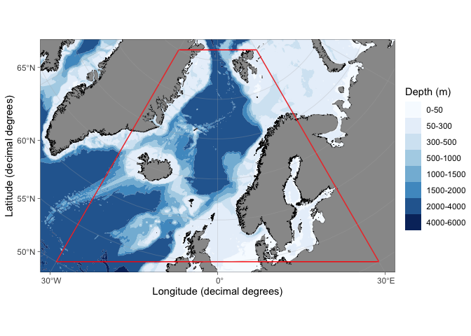

# ggOceanMaps

**Plot data on oceanographic maps using ggplot2. R package version
0.4.3**

## Overview

The ggOceanMaps package for [R](https://www.r-project.org/) allows
plotting data on bathymetric maps using
[ggplot2](https://ggplot2.tidyverse.org/reference). The package is
designed for ocean sciences and greatly simplifies bathymetric map
plotting anywhere around the globe. ggOceanMaps uses openly available
geographic data. Citing the particular data sources is advised by the
CC-BY licenses whenever maps from the package are published (see the
[*Citations and data sources*](#citations-and-data-sources) section).

ggOceanMaps has been developed by the [Institute of Marine
Research](https://www.hi.no/en). The package is a continuation of the
work by the lead author with the
[PlotSvalbard](https://github.com/MikkoVihtakari/PlotSvalbard) package,
which could not be uploaded to [CRAN](https://cran.r-project.org/) due
to package size limitations and was designed for a limited region. The
sole purpose of ggOceanMaps is to allow the installation from CRAN and
to expand the mapping capabilities for the entire world.

Note that the package comes with absolutely no warranty and that maps
generated by the package are meant for plotting scientific data only.
The maps are coarse generalizations of third party data and therefore
inaccurate. Any [bug reports and code
fixes](https://github.com/MikkoVihtakari/ggOceanMaps/issues) are warmly
welcomed. See [*Contributions*](#contributions) for further details.

## Installation

The package comes in three versions with different update cycles: 1) the
[CRAN](https://cran.r-project.org/) version is updated infrequently (a
few times a year), 2) The
[drat](https://cran.r-project.org/web/packages/drat/index.html) version
is updated when major features are added or bad bugs fixed, and 3) the
GitHub version is updated whenever the author works with the package.

When available, the CRAN version can be installed using
`install.packages("ggOceanMaps")`. A more frequently updated drat
version of the package can be installed as follows:

``` r
install.packages("ggOceanMaps", repos = c("https://mikkovihtakari.github.io/drat", "https://cloud.r-project.org"))
```

Due to the package size limitations, ggOceanMaps requires the
[ggOceanMapsData](https://github.com/MikkoVihtakari/ggOceanMapsData)
package which stores the shapefiles and should be installed
automatically when ggOceanMaps is loaded. Note that actual installation
size of the package is larger (about 35 Mb) than stated on CRAN due to
shapefiles used by ggOceanMaps.

Frequently updated developmental version can be installed using the
[**devtools**](https://cran.r-project.org/web/packages/devtools/index.html)
package.

``` r
devtools::install_github("MikkoVihtakari/ggOceanMapsData") # required by ggOceanMaps
devtools::install_github("MikkoVihtakari/ggOceanMaps")
```

If you encounter problems during the devtools installation, you may set
the `upgrade` argument to `"never"` and try the following steps:

1.  Manually update all R packages you have installed (Packages -\>
    Update -\> Select all -\> Install updates in R Studio). If an update
    of a package fails, try installing that package again using the
    `install.packages` function or the R Studio menu.
2.  Run `devtools::install_github("MikkoVihtakari/ggOceanMaps", upgrade
    = "never")`.
3.  If installation of a dependency fails, try installing that package
    manually and repeat step 2.
4.  Since R has lately been updated to 4.0, you may have to update your
    R to the latest major version for all dependencies to work (`stars`,
    `rgdal` and `sf` have been reported to cause trouble during the
    installation).

## Usage

**ggOceanMaps** extends on
[**ggplot2**](http://ggplot2.tidyverse.org/reference/). The package uses
spatial shapefiles, [GIS packages for
R](https://cran.r-project.org/web/views/Spatial.html) to manipulate, and
the
[**ggspatial**](https://cran.r-project.org/web/packages/ggspatial/index.html)
package to help to plot these shapefiles. The shapefile plotting is
conducted internally in the `basemap` function and uses [ggplot’s sf
object plotting
capabilities](https://ggplot2.tidyverse.org/reference/ggsf.html). Maps
are plotted using the `basemap()` or `qmap()` functions that work almost
similarly to [`ggplot()` as a
base](https://ggplot2.tidyverse.org/reference/index.html) for adding
further layers to the plot using the `+` operator. The maps generated
this way already contain multiple ggplot layers. Consequently, the
[`data` argument](https://ggplot2.tidyverse.org/reference/ggplot.html)
needs to be explicitly specified inside `geom_*` functions when adding
`ggplot2` layers. Depending on the location of the map, the underlying
coordinates may be projected. Decimal degree coordinates need to be
transformed to the projected coordinates using the `transform_coord`,
[ggspatial](https://paleolimbot.github.io/ggspatial/), or [`geom_sf`
functions.](https://ggplot2.tidyverse.org/reference/ggsf.html)

``` r
library(ggOceanMaps)

dt <- data.frame(lon = c(-30, -30, 30, 30), lat = c(50, 80, 80, 50))

basemap(data = dt, bathymetry = TRUE) + 
  geom_polygon(data = transform_coord(dt), aes(x = lon, y = lat), color = "red", fill = NA)
```

<!-- -->

See the [ggOceanMaps
website](https://mikkovihtakari.github.io/ggOceanMaps/index.html),
[function
reference](https://mikkovihtakari.github.io/ggOceanMaps/reference/index.html),
and the [user
manual](https://mikkovihtakari.github.io/ggOceanMaps/articles/ggOceanMaps.html)
for how to use and modify the maps plotted by the package.

## Citations and data sources

The data used by the package are not the property of the Institute of
Marine Research nor the author of the package. It is, therefore,
important that you cite the data sources used in a map you generate with
the package. The spatial data used by this package have been acquired
from the following sources:

  - **Land polygons.** [Natural Earth
    Data](https://www.naturalearthdata.com/downloads/10m-physical-vectors/)
    1:10m Physical Vectors with the Land and Minor Island datasets
    combined. Distributed under the [CC Public Domain
    license](https://creativecommons.org/publicdomain/) ([terms of
    use](https://www.naturalearthdata.com/about/terms-of-use/)).
  - **Glacier polygons.** [Natural Earth
    Data](https://www.naturalearthdata.com/downloads/10m-physical-vectors/)
    1:10m Physical Vectors with the Glaciated Areas and Antarctic Ice
    Shelves datasets combined. Distributed under the [CC Public Domain
    license](https://creativecommons.org/publicdomain/) ([terms of
    use](https://www.naturalearthdata.com/about/terms-of-use/)).
  - **Bathymetry.** [Amante, C. and B.W. Eakins, 2009. ETOPO1 1
    Arc-Minute Global Relief Model: Procedures, Data Sources and
    Analysis. NOAA Technical Memorandum NESDIS NGDC-24. National
    Geophysical Data Center, NOAA](https://doi.org/10.7289/V5C8276M).
    Distributed under the [U.S. Government Work
    license](https://www.usa.gov/government-works).

Further, please cite the package whenever maps generated by the package
are published. For up-to-date citation information, please use:

``` r
citation("ggOceanMaps")
#> 
#> To cite package 'ggOceanMaps' in publications use:
#> 
#>   Mikko Vihtakari (2020). ggOceanMaps: Plot Data on Oceanographic Maps
#>   using 'ggplot2'. R package version 0.4.3.
#>   https://mikkovihtakari.github.io/ggOceanMaps
#> 
#> A BibTeX entry for LaTeX users is
#> 
#>   @Manual{,
#>     title = {ggOceanMaps: Plot Data on Oceanographic Maps using 'ggplot2'},
#>     author = {Mikko Vihtakari},
#>     year = {2020},
#>     note = {R package version 0.4.3},
#>     url = {https://mikkovihtakari.github.io/ggOceanMaps},
#>   }
```

## Getting help

If your problem does not involve bugs in ggOceanMaps, the quickest way
of getting help is posting your problem to [Stack
Overflow](https://stackoverflow.com/questions/tagged/r). Please remember
to include a reproducible example that illustrates your problem.

## Contributions

Any contributions to the package are more than welcome. Please contact
the package maintainer Mikko Vihtakari (<mikko.vihtakari@hi.no>) to
discuss your ideas on improving the package. Bug reports and corrections
should be submitted directly to [the GitHub
site](https://github.com/MikkoVihtakari/ggOceanMaps/issues). Please
include a [minimal reproducible
example](https://en.wikipedia.org/wiki/Minimal_working_example).
Considerable contributions to the package development will be credited
with authorship.
