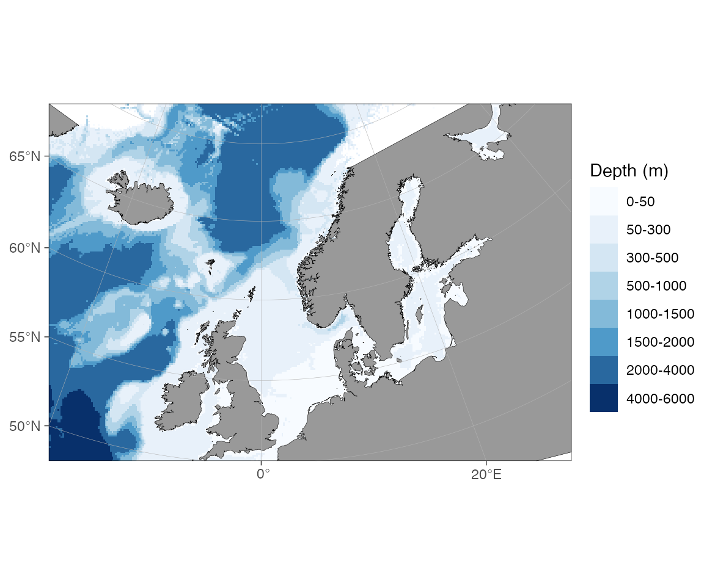
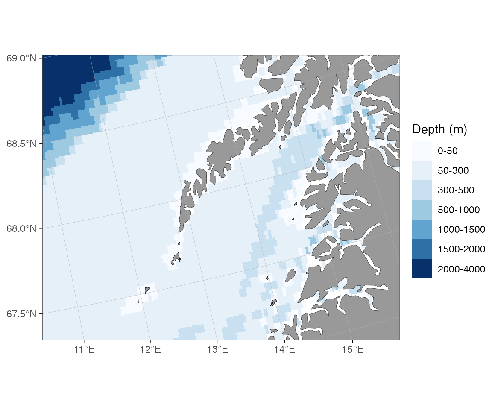
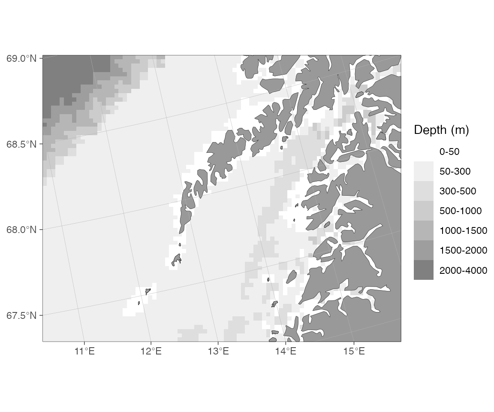

# Bathymetry in ggOceanMaps

``` r

library(ggOceanMaps)
library(ggplot2)
```

ggOceanMaps plots bathymetry from five kinds of data source. They differ
mainly in resolution and in how much setup they require: the shipped
raster works offline with no preparation, while the higher-resolution
options need either an internet connection or a one-time download. This
vignette describes each source and shows the `bathy.style` argument that
selects it.

The examples that download or fetch data are not evaluated when the
vignette is built; the figures shown for them were rendered beforehand.

## Quick decision guide

| Need | Source | `bathy.style` |
|----|----|----|
| Works offline, no setup (default) | Shipped low-resolution raster | `"rbb"` |
| Higher detail, global and polar maps | ggOceanMapsLargeData continuous raster | `"rcb"` |
| Filled depth-band contours | ggOceanMapsLargeData polygon contours | `"pb"` |
| Contour lines only | ggOceanMapsLargeData contour lines | `"cb"` |
| Anywhere on the globe, ~1.85 km | ETOPO1 Web Coverage Service (live) | `"wceb"` |
| European waters, ~115 m | EMODnet Web Coverage Service (live) | `"wemb"` |
| Your own GEBCO / ETOPO / IBCAO file | Local raster via `userpath` | `"rub"` |
| Custom contour polygons or land | [`raster_bathymetry()`](https://mikkovihtakari.github.io/ggOceanMaps/reference/raster_bathymetry.md) + [`vector_bathymetry()`](https://mikkovihtakari.github.io/ggOceanMaps/reference/vector_bathymetry.md) / [`vector_land()`](https://mikkovihtakari.github.io/ggOceanMaps/reference/vector_land.md) | `shapefiles = list(...)` |

Substitute `g` for the final `b` in any abbreviation to get the
greyscale variant (`rbb` → `rbg`, `wemb` → `wemg`, and so on). The full
alias list is in
[`?basemap`](https://mikkovihtakari.github.io/ggOceanMaps/reference/basemap.md).

## 1. Shipped low-resolution raster (no setup)

The package bundles a coarse global bathymetry raster, `dd_rbathy`,
which is always available and needs no download. It is downsampled from
the ETOPO 2022 15 arc-second global relief model (NOAA National Centers
for Environmental Information, <https://doi.org/10.25921/fd45-gt74>) and
binned into depth bands. This is the default source, so it is enough to
set `bathymetry = TRUE`:

``` r

basemap(limits = c(-20, 30, 50, 70), bathymetry = TRUE)
```



The style can also be set explicitly with `bathy.style = "rbb"` (raster,
binned, blues):

``` r

basemap(c(11, 16, 67.3, 68.6), bathy.style = "rbb")
```



The greyscale variant is `"rbg"`:

``` r

basemap(c(11, 16, 67.3, 68.6), bathy.style = "rbg")
```



The shipped raster is kept coarse to keep the package within CRAN’s size
limit. It is well suited to overview maps and exploratory plots; for
publication maps one of the higher-resolution sources below is usually
preferable.

## 2. ggOceanMapsLargeData (one-time download per region)

The companion repository
[ggOceanMapsLargeData](https://github.com/MikkoVihtakari/ggOceanMapsLargeData)
hosts higher-resolution data for the supported regions (Decimal Degree,
Arctic Stereographic, Antarctic Stereographic, and several pre-made
regional shapefile sets). It provides three styles: a continuous raster,
filled polygon contours, and contour lines.
[`basemap()`](https://mikkovihtakari.github.io/ggOceanMaps/reference/basemap.md)
downloads what it needs on first use and caches it locally.

**One-time setup.** Choose a permanent directory so the files persist
between R sessions, and add this line to `~/.Rprofile`:

``` r

options(ggOceanMaps.datapath = "~/ggOceanMaps_data")
```

On the first call for a region a prompt asks you to confirm the download
(roughly 15–100 MB depending on the region). Subsequent calls read from
the cache and are immediate.

### Continuous raster (`rcb`)

The recommended high-resolution source for most maps. `downsample = n`
reduces the rendering cost at the expense of detail.

``` r

basemap(c(11, 16, 67.3, 68.6), bathy.style = "rcb")
basemap(c(11, 16, 67.3, 68.6), bathy.style = "rcb", downsample = 10)
basemap(c(11, 16, 67.3, 68.6), bathy.style = "rcg") # greyscale
```


**Figure:** Continuous raster bathymetry (`rcb`) off Lofoten, northern
Norway.

### Polygon contours (`pb`)

Filled depth bands stored as polygons. This was the default before
version 2.0.

``` r

basemap(c(11, 16, 67.3, 68.6), bathy.style = "pb")
basemap(c(11, 16, 67.3, 68.6), bathy.style = "pg") # greyscale
```


**Figure:** Polygon-contour bathymetry (`pb`) showing filled depth
bands.

### Contour lines (`cb`)

Depth contours drawn as lines, with no fill. Useful when the bathymetry
should not compete visually with overplotted data.

``` r

basemap(c(11, 16, 67.3, 68.6), bathy.style = "cb")
basemap(c(11, 16, 67.3, 68.6), bathy.style = "cg") # greyscale
```


**Figure:** Contour-line bathymetry (`cb`), lines only.

## 3. Live download from a Web Coverage Service (WCS)

For one-off maps, or workflows where you would rather not manage local
files, ggOceanMaps can fetch bathymetry on demand from two OGC Web
Coverage Services. No pre-download is required; fetched tiles are cached
under `getOption("ggOceanMaps.datapath")`, so repeated calls for the
same bounding box are immediate.

| Source | Style | Coverage | Resolution |
|----|----|----|----|
| **ETOPO1 (NOAA NCEI)** | `wcs_etopo_blues` (`wceb`) | Global | ~1.85 km |
| **EMODnet** | `wcs_emodnet_blues` (`wemb`) | European waters | ~115 m |

``` r

# Hawaii — global coverage from ETOPO
basemap(c(-160, -154, 18, 23), bathy.style = "wceb")
```


**Figure:** Global ETOPO1 bathymetry (`wceb`) around the Hawaiian
Islands.

``` r

# North Sea — high-resolution European waters from EMODnet
basemap(c(2, 3, 54, 55), bathy.style = "wemb")
```


**Figure:** High-resolution EMODnet bathymetry (`wemb`) in the North
Sea.

If you request EMODnet for an area outside its European coverage, the
error message points you to ETOPO:

``` r

basemap(c(110, 120, -20, 30), bathy.style = "wemb")
#> Error: Bounding box (110.0° to 120.0° lon, -20.0° to 30.0° lat) lies
#> entirely outside the approximate coverage of EMODnet (≈-36° to 43° lon,
#> 15° to 90° lat).
#> For global bathymetry coverage, download GEBCO or ETOPO data locally and
#> use raster_bathymetry() + vector_bathymetry() instead, or wait for a
#> global WCS source to be added to ggOceanMaps.
```

Replacing `wemb` with `wceb` makes the same call work.

### Manual fetch with `wcs_bathymetry()`

The `bathy.style` route is the simplest option, but for full control —
passing the raster into
[`vector_bathymetry()`](https://mikkovihtakari.github.io/ggOceanMaps/reference/vector_bathymetry.md),
combining regions, or sharing a cache with other tools — call
[`wcs_bathymetry()`](https://mikkovihtakari.github.io/ggOceanMaps/reference/wcs_bathymetry.md)
directly:

``` r

bathy <- wcs_bathymetry(c(2, 3, 54, 55), source = "emodnet")

basemap(c(2, 3, 54, 55),
        shapefiles = list(land = dd_land, glacier = NULL,
                          bathy = bathy$raster),
        bathymetry = TRUE)
```

### WCS caveats

- **Decimal-degree limits only.** Polar maps and projected-CRS limits
  are not yet supported.
- **Per-source size caps.** EMODnet defaults to a 50 deg² maximum
  bounding box (it reads 8-byte doubles internally, and a 4° tile
  already exceeds its read cap); ETOPO defaults to 2000 deg² because the
  underlying grid is much coarser. Override either with
  `max_area_deg2 = ...` in
  [`wcs_bathymetry()`](https://mikkovihtakari.github.io/ggOceanMaps/reference/wcs_bathymetry.md).
  Larger boxes are tiled and mosaicked automatically.

## 4. Your own raster (GEBCO, ETOPO, IBCAO, …)

When you need a specific dataset — the latest GEBCO grid, an ETOPO 2022
variant, a regional IBCAO compilation, or a file processed by your own
group — download it once, point ggOceanMaps at it through
`ggOceanMaps.userpath`, and use the `rub` / `rug` styles:

``` r

# Set once (in .Rprofile for persistence):
options(ggOceanMaps.userpath = "path/to/your/bathymetry.nc")

# Then any basemap call uses your file:
basemap(c(11, 16, 67.3, 68.6), bathy.style = "rub")
basemap(c(11, 16, 67.3, 68.6), bathy.style = "rub", downsample = 10)
basemap(c(11, 16, 67.3, 68.6), bathy.style = "rug") # greyscale
```


**Figure:** User-supplied GEBCO raster (`rub`) off Lofoten.

Any format that
[`stars::read_stars()`](https://r-spatial.github.io/stars/reference/read_stars.html)
can open is accepted (NetCDF `.nc`, GeoTIFF `.tif`, GMT `.grd`, and so
on). The file is read in full on every call, so the user-raster route
can be slower than a pre-processed ggOceanMapsLargeData object for the
same region. Use `downsample` to trade resolution for speed.

`ggOceanMaps.userpath` is also used by
[`get_depth()`](https://mikkovihtakari.github.io/ggOceanMaps/reference/get_depth.md)
to look up point depths from your raster:

``` r

dt <- data.frame(lon = seq(-20, 80, length.out = 41), lat = 50:90)
dt <- get_depth(dt, bathy.style = "ru")
qmap(dt, color = depth) + scale_color_viridis_c()
```

## 5. Build your own shapefiles

When you need contour polygons, custom depth bins, or a matched land +
bathymetry pair, the
[`raster_bathymetry()`](https://mikkovihtakari.github.io/ggOceanMaps/reference/raster_bathymetry.md)
/
[`vector_bathymetry()`](https://mikkovihtakari.github.io/ggOceanMaps/reference/vector_bathymetry.md)
/
[`vector_land()`](https://mikkovihtakari.github.io/ggOceanMaps/reference/vector_land.md)
pipeline turns any raster source into reusable shapefile objects:

``` r

# 1. Process the raster — crop, sign-flip, optionally bin into contours
rb <- raster_bathymetry(
  "path/to/your/bathymetry.nc",
  depths = c(50, 200, 500, 1000, 2000, 4000),  # depth break points
  boundary = c(-5, 10, 50, 60)                  # crop to your region
)

# 2a. Vectorize bathymetry into depth-band polygons
vb <- vector_bathymetry(rb, drop.crumbs = 10)   # drop islands < 10 km²

# 2b. Vectorize land from the same raster
vl <- vector_land(rb, drop.crumbs = 10)

# 3. Plot — both layers plug into basemap()
basemap(c(-5, 10, 50, 60),
        shapefiles = list(land = vl, glacier = NULL, bathy = vb),
        bathymetry = TRUE)
```

Setting `depths = NULL` skips the binning step and returns a continuous
raster — useful for `geom_raster`-style fills without the vectorization
overhead.

Save the processed objects so the processing cost is paid only once:

``` r

save(vb, vl, file = "my_region_bathy.rda")
```

## Mixing styles across a multi-panel figure

`bathy.style` is set per call, so each panel of a multi-panel figure can
use its own source:

``` r

library(patchwork)
p1 <- basemap(c(-160, -154, 18, 23), bathy.style = "wceb") + ggtitle("ETOPO (1.85 km)")
p2 <- basemap(c(2, 3, 54, 55), bathy.style = "wemb") + ggtitle("EMODnet (115 m)")
p1 + p2
```

## Citing the data sources

The bathymetry data are not the property of ggOceanMaps or the Institute
of Marine Research. Cite the source of any bathymetry you publish:

- **Shipped raster (`rbb`) and ggOceanMapsLargeData rasters / contours
  (`rcb`, `pb`, `cb`).** [ETOPO 2022 15 Arc-Second Global Relief
  Model](https://www.ncei.noaa.gov/products/etopo-global-relief-model)
  (NOAA National Centers for Environmental Information, DOI:
  10.25921/fd45-gt74). Distributed under the [U.S. Government Work
  license](https://www.usa.gov/government-works).
- **Global Web Coverage Service bathymetry (`wceb` / `wceg`).** [ETOPO1
  Global Relief
  Model](https://www.ncei.noaa.gov/products/etopo-global-relief-model)
  served live by NOAA NCEI (Amante & Eakins 2009, NOAA NGDC, DOI:
  10.7289/V5C8276M). Distributed under the [U.S. Government Work
  license](https://www.usa.gov/government-works).
- **European Web Coverage Service bathymetry (`wemb` / `wemg`).**
  [EMODnet Bathymetry](https://emodnet.ec.europa.eu/en/bathymetry).
  Distributed under the [CC BY 4.0
  license](https://creativecommons.org/licenses/by/4.0/).
- **User raster (`rub` / `rug`).** Whatever dataset you supplied (GEBCO,
  ETOPO, IBCAO, …); cite it under its own licence.

The land and glacier polygons, and the regional pre-made shapefiles,
have their own sources. See the [Citations and data
sources](https://github.com/MikkoVihtakari/ggOceanMaps#citations-and-data-sources)
section of the README for the full list.

## See also

- [`?basemap`](https://mikkovihtakari.github.io/ggOceanMaps/reference/basemap.md)
  for the full `bathy.style` reference table.
- [`?wcs_bathymetry`](https://mikkovihtakari.github.io/ggOceanMaps/reference/wcs_bathymetry.md)
  for the live download function.
- [`?raster_bathymetry`](https://mikkovihtakari.github.io/ggOceanMaps/reference/raster_bathymetry.md),
  [`?vector_bathymetry`](https://mikkovihtakari.github.io/ggOceanMaps/reference/vector_bathymetry.md),
  [`?vector_land`](https://mikkovihtakari.github.io/ggOceanMaps/reference/vector_land.md)
  for the build-your-own pipeline.
- [Cookbook](https://mikkovihtakari.github.io/ggOceanMaps/articles/cookbook.md)
  for short, copy-pasteable recipes.
- [User
  manual](https://mikkovihtakari.github.io/ggOceanMaps/articles/ggOceanMaps.md).
