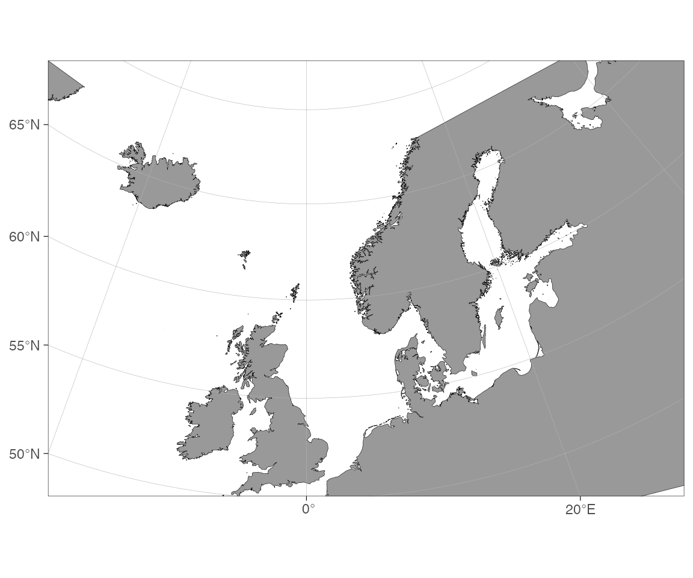
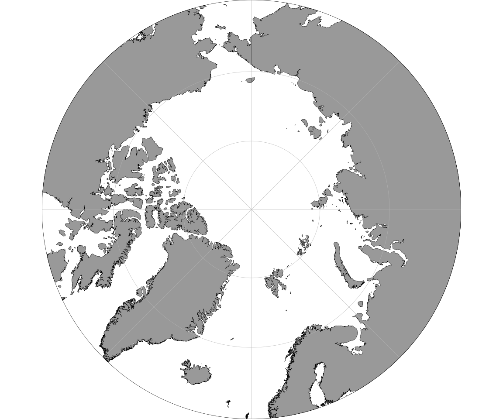
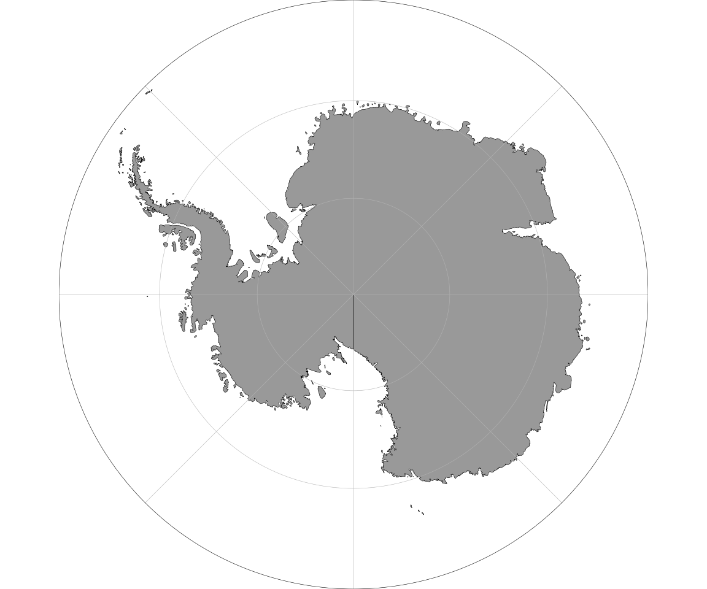
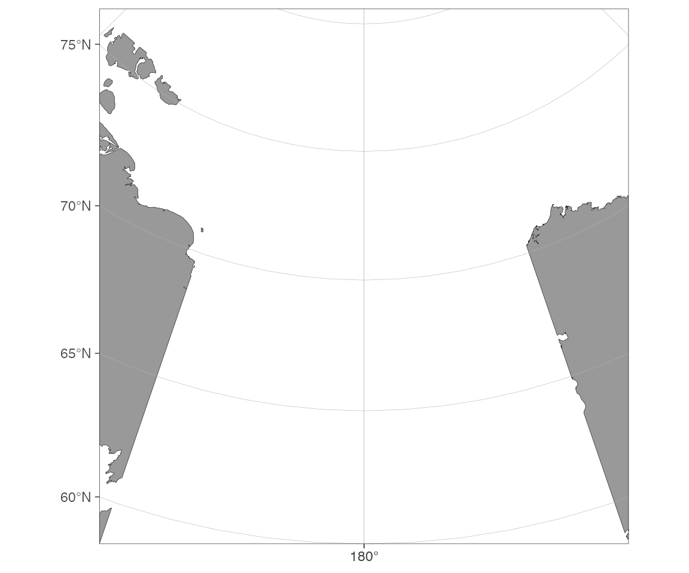
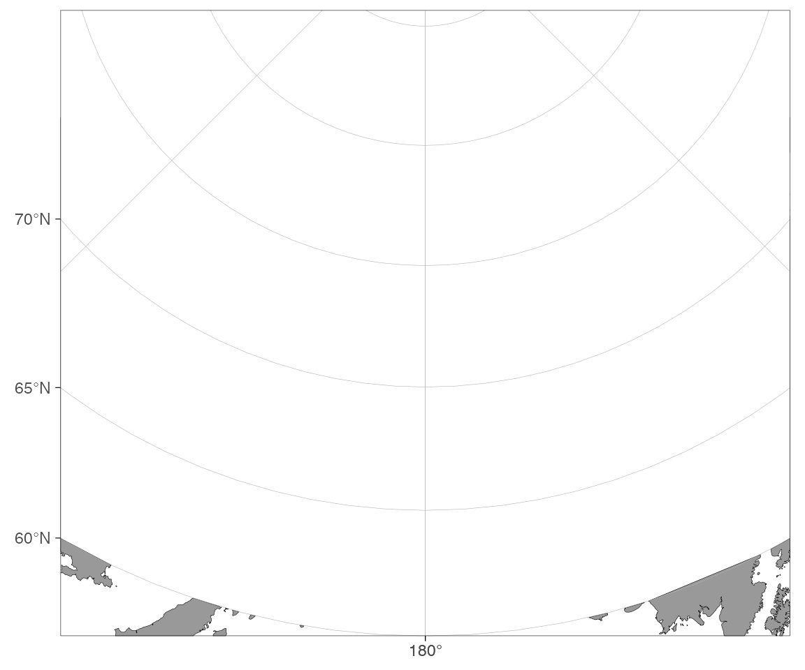
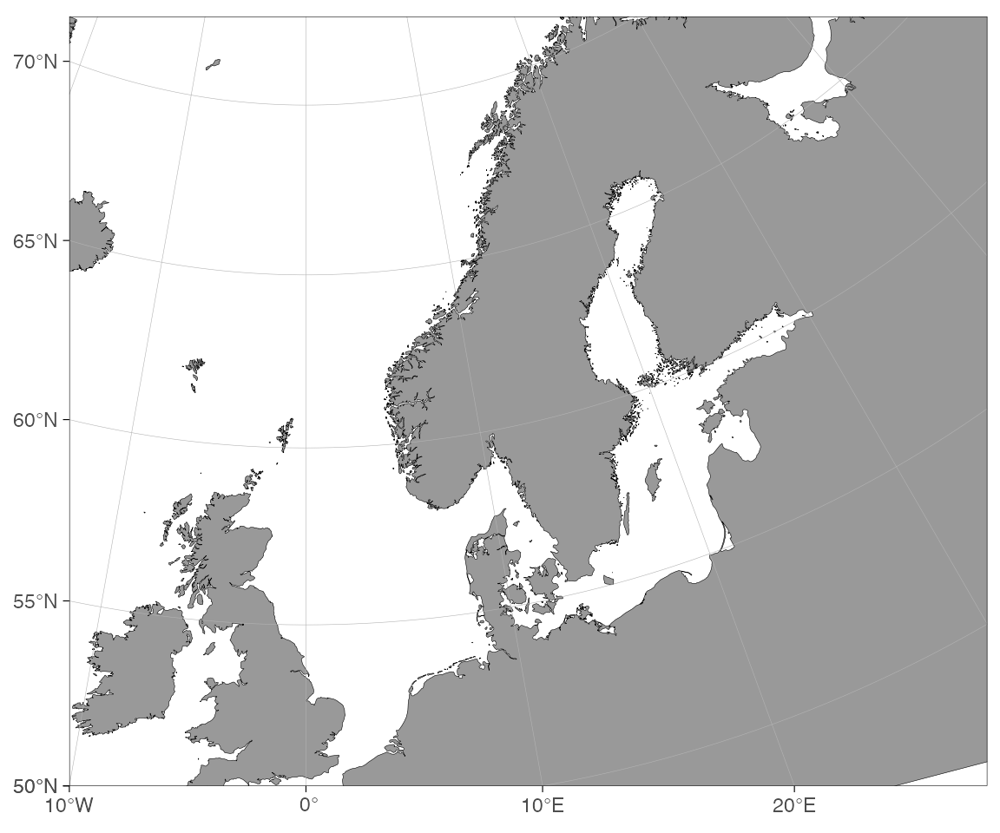

# ggOceanMaps cookbook

A collection of short, self-contained recipes for common ggOceanMaps
tasks. Each recipe is meant to be copy-pasteable. For background and the
conceptual walk-through, see the [user
manual](https://mikkovihtakari.github.io/ggOceanMaps/articles/ggOceanMaps.md).

``` r

library(ggOceanMaps)
library(ggplot2)
```

## Choosing a region

### How do I plot a specific lon/lat box?

``` r

basemap(limits = c(-20, 30, 50, 70))
```



`limits` is `c(xmin, xmax, ymin, ymax)`.

### How do I plot the Arctic / Antarctic?

A single value in `limits` means “polar projection bounded at this
latitude”:

``` r

basemap(60)    # Arctic
```



``` r

basemap(-60)   # Antarctic
```



### How do I plot a region that crosses the antimeridian?

``` r

basemap(limits = c(160, -160, 60, 80), rotate = TRUE)
```



Without `rotate = TRUE` you’ll get the whole world with a message; with
it, ggOceanMaps rotates the projection so the antimeridian sits in the
middle.

### How do I fit the map to my data automatically?

``` r

dt <- data.frame(lon = c(-150, 150), lat = c(60, 85))
basemap(data = dt, rotate = TRUE)
```



## Adding your own data

### How do I add points to a decimal-degree map?

``` r

dt <- data.frame(lon = c(0, 10, 20), lat = c(55, 60, 65))
basemap(limits = c(-10, 30, 50, 70)) +
  geom_point(data = dt, aes(x = lon, y = lat), color = "red", size = 3)
```



### How do I add points to a *projected* map?

Projected maps (polar, custom CRS) need the coordinates transformed
first:

``` r

dt <- data.frame(lon = c(0, 10, 20), lat = c(70, 75, 80))
dt <- transform_coord(dt, bind = TRUE)   # adds lon.proj, lat.proj
basemap(60) +
  geom_point(data = dt, aes(x = lon.proj, y = lat.proj),
             color = "red", size = 3)
```

Or let `ggspatial` handle the transform:

``` r

basemap(60) +
  ggspatial::geom_spatial_point(data = dt, aes(x = lon, y = lat),
                                crs = 4326, color = "red", size = 3)
```

### How do I quickly plot a data frame’s coordinates?

``` r

qmap(dt, color = I("red"))
```

[`qmap()`](https://mikkovihtakari.github.io/ggOceanMaps/reference/qmap.md)
picks limits and projection automatically.

## Bathymetry

### How do I add bathymetry without downloading anything?

``` r

basemap(limits = c(-20, 30, 50, 70), bathymetry = TRUE)
```

This uses the binned-blues raster shipped with the package.

### How do I get higher-resolution bathymetry?

High-resolution pre-made shapefiles live in the
[ggOceanMapsLargeData](https://github.com/MikkoVihtakari/ggOceanMapsLargeData)
repository. They are not bundled with the package (too large for CRAN);
[`basemap()`](https://mikkovihtakari.github.io/ggOceanMaps/reference/basemap.md)
downloads them on first use and caches them locally.

**Step 1 — set a permanent cache directory** (add to `~/.Rprofile`
once):

``` r

options(ggOceanMaps.datapath = "~/ggOceanMaps_data")
```

Without this the files land in
[`tempdir()`](https://rdrr.io/r/base/tempfile.html) and are
re-downloaded each session.

**Step 2 — request any map that needs high-res data**:

``` r

# Arctic raster bathymetry
basemap(60, bathymetry = TRUE)

# North Sea with polygon bathymetry contours
basemap(limits = c(-5, 10, 50, 60), bathy.style = "poly_blues")
```

On the first call you will be prompted to download the required `.rda`
file (~15–100 MB per region). After that the file is reused from disk
instantly.

### How do I use my own bathymetry raster (e.g. GEBCO, ETOPO, IBCAO)?

Download the grid from the source
([GEBCO](https://www.gebco.net/data-products/gridded-bathymetry-data/),
[ETOPO
2022](https://www.ncei.noaa.gov/products/etopo-global-relief-model)) and
save it as a NetCDF (`.nc`) or GeoTIFF (`.tif`).

**Quick route — point `ggOceanMaps.userpath` at the file:**

``` r

options(ggOceanMaps.userpath = "path/to/your/bathymetry.nc")

basemap(limits = c(-5, 10, 50, 60), bathy.style = "raster_user_blues")
# or the abbreviation:
basemap(limits = c(-5, 10, 50, 60), bathy.style = "rub")
```

[`basemap()`](https://mikkovihtakari.github.io/ggOceanMaps/reference/basemap.md)
crops to the plot extent, sign-flips (negative depths → positive), and
renders the raster automatically. Use `"raster_user_greys"` / `"rug"`
for greyscale. The `downsample` argument reduces resolution if the
native grid is too fine for the plot size.

**Manual route — pre-process for full control:**

``` r

rb <- raster_bathymetry(
  "path/to/your/bathymetry.nc",
  depths = NULL,                # continuous raster; use a depth vector for polygons
  boundary = c(-5, 10, 50, 60) # crop early to save memory
)

basemap(
  limits = c(-5, 10, 50, 60),
  shapefiles = list(land = dd_land, glacier = NULL, bathy = rb$raster),
  bathymetry = TRUE
)
```

The manual route is also the entry point for vectorizing the bathymetry
(depth contour polygons) — see the *Building your own shapefiles*
section below.

### How do I fetch bathymetry on demand from a web service?

Two WCS sources are wired into
[`basemap()`](https://mikkovihtakari.github.io/ggOceanMaps/reference/basemap.md)
— pick by region:

| Style alias         | Abbrev. | Source             | Coverage        | Resolution |
|---------------------|---------|--------------------|-----------------|------------|
| `wcs_emodnet_blues` | `wemb`  | EMODnet            | European waters | ~115 m     |
| `wcs_emodnet_grays` | `wemg`  | EMODnet            | European waters | ~115 m     |
| `wcs_etopo_blues`   | `wceb`  | ETOPO1 (NOAA NCEI) | Global          | ~1.85 km   |
| `wcs_etopo_grays`   | `wceg`  | ETOPO1 (NOAA NCEI) | Global          | ~1.85 km   |

``` r

# North Sea — high resolution from EMODnet
basemap(c(2, 3, 54, 55), bathy.style = "wemb")

# Hawaii — global coverage from ETOPO
basemap(c(-160, -154, 18, 23), bathy.style = "wceb")

# Indonesia / Java Trench — also ETOPO (outside EMODnet)
basemap(c(110, 120, -20, 30), bathy.style = "wceb")
```

For a manual fetch (e.g. to pass through
[`vector_bathymetry()`](https://mikkovihtakari.github.io/ggOceanMaps/reference/vector_bathymetry.md)
for a custom shapefile workflow), call
[`wcs_bathymetry()`](https://mikkovihtakari.github.io/ggOceanMaps/reference/wcs_bathymetry.md)
directly:

``` r

bathy_emo <- wcs_bathymetry(c(2, 3, 54, 55),   source = "emodnet")
bathy_eto <- wcs_bathymetry(c(110, 120, -20, 30), source = "etopo")

basemap(c(110, 120, -20, 30),
        shapefiles = list(land = dd_land, glacier = NULL,
                          bathy = bathy_eto$raster),
        bathymetry = TRUE)
```

Requirements / caveats:

- **Decimal-degree limits only**; polar maps are not supported.
- **EMODnet covers European regional seas only** (≈−36° to 43° lon, ≈15°
  to 90° lat). Outside that, use ETOPO. ggOceanMaps will error with a
  clear message and the suggested alternative if you pick the wrong
  source.
- **Bbox size is capped** per source: 50°² for EMODnet (~115 m grid),
  2000°² for ETOPO (~1.85 km grid). Override with `max_area_deg2` for
  larger requests; the function tiles automatically.
- **Caching** uses `getOption("ggOceanMaps.datapath")` (or
  [`tempdir()`](https://rdrr.io/r/base/tempfile.html) as fallback). Set
  it permanently in `.Rprofile` for cross-session reuse.
- **Citation**: EMODnet is CC-BY
  (<https://emodnet.ec.europa.eu/en/bathymetry>); ETOPO1 is Amante &
  Eakins 2009, NOAA NGDC
  (<https://www.ncei.noaa.gov/products/etopo-global-relief-model>).

## Building your own shapefiles

### How do I make land + bathymetry from a downloaded raster?

The full pipeline from a single source raster (GEBCO, ETOPO, IBCAO, …)
to a matched land + bathymetry pair is:

``` r

library(ggOceanMaps)

# 1. Process the raster — crop, sign-flip, bin depth levels
rb <- raster_bathymetry(
  "path/to/your/bathymetry.nc",
  depths = c(50, 200, 500, 1000, 2000, 4000),  # depth contour break points
  boundary = c(-5, 10, 50, 60)
)

# 2a. Vectorize bathymetry to depth-polygon shapefile
vb <- vector_bathymetry(rb, drop.crumbs = 10)   # drop islands < 10 km²

# 2b. Vectorize land from the same raster
vl <- vector_land(rb, drop.crumbs = 10)

# 3. Plot — plug both into basemap()
basemap(
  limits = c(-5, 10, 50, 60),
  shapefiles = list(land = vl, glacier = NULL, bathy = vb),
  bathymetry = TRUE
)
```

Use `depths = NULL` instead of a depth vector to keep the raster as a
continuous grid (skips vectorization, faster rendering):

``` r

rb_cont <- raster_bathymetry("path/to/your/bathymetry.nc",
                             depths = NULL, boundary = c(-5, 10, 50, 60))

basemap(limits = c(-5, 10, 50, 60),
        shapefiles = list(land = dd_land, glacier = NULL, bathy = rb_cont$raster),
        bathymetry = TRUE)
```

**Tip**: save the processed objects as `.rda` files so you don’t have to
re-process the full raster every session:

``` r

save(vb, vl, file = "north_sea_bathy.rda")
```

### How do I clip an existing shapefile to my region?

Use
[`clip_shapefile()`](https://mikkovihtakari.github.io/ggOceanMaps/reference/clip_shapefile.md)
to crop any sf polygon layer to a bounding box:

``` r

clipped <- clip_shapefile(
  my_sf_layer,
  limits = c(-5, 10, 50, 60)   # c(xmin, xmax, ymin, ymax) decimal degrees
)
```

[`clip_shapefile()`](https://mikkovihtakari.github.io/ggOceanMaps/reference/clip_shapefile.md)
handles both decimal-degree and projected inputs. For projected data
specify `proj.out` (a CRS string / EPSG code) to get the result back in
the map’s native projection.

## Special cases

### How do I draw ocean current vectors over a map?

The pattern is: load a velocity NetCDF, thin the grid to a drawable
density, transform coordinates if on a projected map, then draw arrows
with
[`geom_segment()`](https://ggplot2.tidyverse.org/reference/geom_segment.html).

``` r

library(stars)
library(dplyr)

# 1. Load u/v current components from a NetCDF
uv <- read_stars(c("u_current.nc", "v_current.nc"))

# 2. Convert to a data frame and thin to a manageable density
df <- as.data.frame(uv) |>
  na.omit() |>
  filter(row_number() %% 5 == 0)   # keep every 5th grid point

names(df)[1:4] <- c("lon", "lat", "u", "v")

# 3. Scale arrow length so they look good on the plot
scale <- 0.5   # degrees per m/s — tune to taste
df <- df |>
  mutate(lon_end = lon + u * scale,
         lat_end = lat + v * scale)

# 4. Plot
basemap(limits = c(10, 40, 70, 80), bathymetry = TRUE) +
  geom_segment(
    data = df,
    aes(x = lon, y = lat, xend = lon_end, yend = lat_end),
    arrow = arrow(length = unit(0.15, "cm")),
    color = "steelblue", linewidth = 0.4
  )
```

**On a projected (polar) map** the coordinates must be transformed
before plotting (the map axes are in metres, not degrees):

``` r

# transform_coord adds lon.proj / lat.proj columns in the map's CRS
df <- transform_coord(df, proj = 3995, bind = TRUE)
df <- df |>
  mutate(
    lon_end_proj = lon.proj + u * scale * 1e4,
    lat_end_proj = lat.proj + v * scale * 1e4
  )

basemap(75, bathymetry = TRUE) +
  geom_segment(
    data = df,
    aes(x = lon.proj, y = lat.proj,
        xend = lon_end_proj, yend = lat_end_proj),
    arrow = arrow(length = unit(0.15, "cm")),
    color = "steelblue", linewidth = 0.4
  )
```

### How do I add ICES or Norwegian fishery zones?

ggOceanMaps ships three zone datasets:

| Object | Coverage | Example use |
|----|----|----|
| `ices_areas` | ICES advisory areas | subareas, divisions, subdivisions |
| `fdir_main_areas` | Norwegian Directorate of Fisheries main areas | polygon chart |
| `fdir_sub_areas` | Norwegian Directorate of Fisheries sub-areas | finer grid |

All three are sf polygon objects and can be passed straight to
[`basemap()`](https://mikkovihtakari.github.io/ggOceanMaps/reference/basemap.md)
for automatic limits or overlaid with
[`geom_sf()`](https://ggplot2.tidyverse.org/reference/ggsf.html):

``` r

# Fit map to the extent of the ICES areas and draw them as outlines
basemap(ices_areas) +
  geom_sf(data = ices_areas, fill = NA, color = "red", linewidth = 0.4)
```

``` r

# Norwegian fisheries zones with filled polygons
basemap(fdir_main_areas, bathymetry = TRUE) +
  geom_sf(data = fdir_main_areas, fill = NA, color = "orange") +
  geom_sf_label(data = fdir_main_areas, aes(label = main_area))
```

Label columns: `ices_areas$Area_Full` (full area name),
`ices_areas$SubArea`, `ices_areas$Major_FA`;
`fdir_main_areas$main_area`; `fdir_sub_areas$main_area`,
`fdir_sub_areas$sub_area`.

## Saving and exporting

### How do I save the map to PNG/PDF?

``` r

p <- basemap(limits = c(-20, 30, 50, 70))
ggsave("europe.png", p, width = 6, height = 5, dpi = 300)
ggsave("europe.pdf", p, width = 6, height = 5)
```

[`basemap()`](https://mikkovihtakari.github.io/ggOceanMaps/reference/basemap.md)
returns a regular ggplot — anything that works on a ggplot works here.
