# ggOceanMaps User Manual

The ggOceanMaps package for [R](https://www.r-project.org/) allows
plotting data on bathymetric maps using
[ggplot2](https://ggplot2.tidyverse.org/reference/). The package is
designed for ocean sciences and greatly simplifies bathymetric map
plotting anywhere around the globe. ggOceanMaps uses openly available
geographic data. Citing the particular data sources is advised by the
CC-BY licenses whenever maps from the package are published (see the
[*Citations and data sources*](#citations-and-data-sources) section).
Note that the package comes with absolutely no warranty and that maps
generated by the package are meant for plotting scientific data only.
The maps are coarse generalizations of third-party data and therefore
inaccurate.

This manual is a concise overview. Each topic is covered in more depth
in a dedicated article:

- [Bathymetry](https://mikkovihtakari.github.io/ggOceanMaps/articles/bathymetry.md)
  — every way to get bathymetry into a map.
- [Customising
  shapefiles](https://mikkovihtakari.github.io/ggOceanMaps/articles/customising-shapefiles.md)
  — supplying your own land, glacier, and bathymetry layers.
- [Adding graphical
  elements](https://mikkovihtakari.github.io/ggOceanMaps/articles/adding-graphical-elements.md)
  — current arrows, velocity fields, and pie charts.
- [Premade
  maps](https://mikkovihtakari.github.io/ggOceanMaps/articles/premade-maps.md)
  and [Premade
  shapefiles](https://mikkovihtakari.github.io/ggOceanMaps/articles/premade-shapefiles.md)
  — the built-in map sets.
- [Cookbook](https://mikkovihtakari.github.io/ggOceanMaps/articles/cookbook.md)
  — short, copy-pasteable recipes.

## Basic use

**ggOceanMaps** extends on
[**ggplot2**](http://ggplot2.tidyverse.org/reference/). The package uses
spatial ([**sf**](https://r-spatial.github.io/sf/)) shape- (e.g. vector)
and ([**stars**](https://r-spatial.github.io/stars/)) raster files,
[geospatial packages for
R](https://cran.r-project.org/web/views/Spatial.html) to manipulate, and
ggplot2 to plot these data. The vector and raster plotting is conducted
internally in the `basemap` function, which uses [ggplot’s sf object
plotting
capabilities](https://ggplot2.tidyverse.org/reference/ggsf.html).

The primary aim of ggOceanMaps is to make plotting oceanographic spatial
data as simple as feasible, but also flexible for custom modifications.
The “as simple as feasible” part will be covered in this section, while
the “flexible for custom modifications” part is covered in the [Advanced
use](#advanced-use) section. The basic use section of this tutorial
assumes that the user knows how to use ggplot2. If you are not familiar
with this package, you may read the [Data
visualization](https://r4ds.had.co.nz/data-visualisation.html) section
in [Hadley Wickham & Garrett Grolemund](https://r4ds.had.co.nz/). This
tutorial does not describe functions in ggOceanMaps but rather focuses
on how to use them. Make sure to refer to the [function
documentation](https://mikkovihtakari.github.io/ggOceanMaps/reference/index.html)
while reading the tutorial.

``` r

library(ggOceanMaps)
```

### Limiting maps

To ensure simplicity, ggOceanMaps package attempts to use [decimal
degree](https://en.wikipedia.org/wiki/Decimal_degrees) [coordinate
system](https://en.wikipedia.org/wiki/Coordinate_system) as much as
possible. This system represents coordinates on a sphere, while maps are
plotted in two dimensions. Therefore, the underlying map data have to be
projected using [different mathematical algorithms depending on the
geographic location](#projections).

Maps can be limited (e.g. provide geographic location for a map) using
three arguments: `limits`, `data`, and `shapefiles`. The limit type is
automatically detected when supplied to the first argument (called `x`)
in the
[`basemap()`](https://mikkovihtakari.github.io/ggOceanMaps/reference/basemap.md)
and
[`qmap()`](https://mikkovihtakari.github.io/ggOceanMaps/reference/qmap.md)
functions.

#### Limits

The simplest way of defining the geographic location is to use the
`limits` argument with decimal degrees. The limits argument can be
defined either as a numeric vector of length 1 or 4. Specifying the
argument as a single integer between 30 and 88 or -88 and -30 plots a
polar stereographic map for the Arctic or Antarctic, respectively.

``` r

library(ggOceanMaps)
library(ggspatial) # for data plotting
basemap(limits = 60) # A synonym: basemap(60)
```

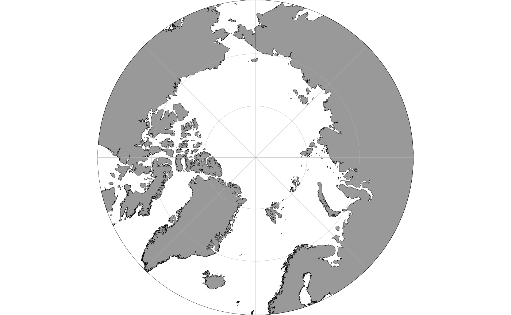

Rectangular maps are plotted by specifying the `limits` argument as a
numeric vector of length 4 where the first element defines the start
longitude, the second element the end longitude, the third element the
minimum latitude and the fourth element the maximum latitude of the
bounding box:

``` r

basemap(limits = c(-20, 20, 40, 59))
```

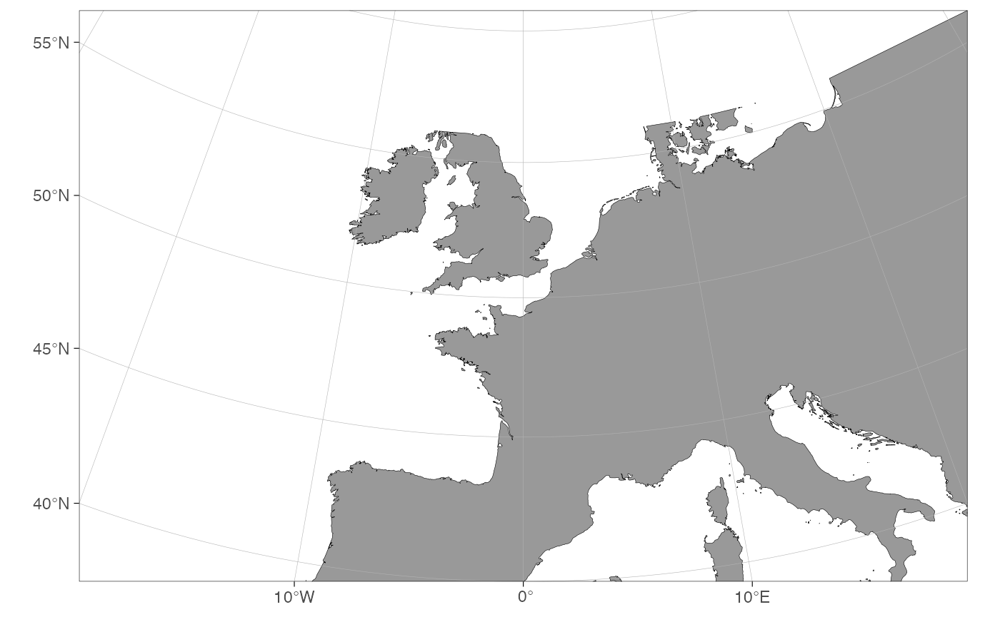

Limiting maps using decimal degrees is somewhat counter-intuitive
because maps plotted for polar regions (\>= 60 or \<= -60 latitude) are
actually projected to Arctic and Antarctic polar stereographic systems.
Because decimal degrees are angular units running counter-clockwise,
also the longitude limits have to be defined **counter-clockwise**.
Projected maps with decimal degree `limits` will lead to expanded limits
towards the poles when using Arctic and Antarctic Polar Stereographic
projections because decimal degrees represent a sphere:

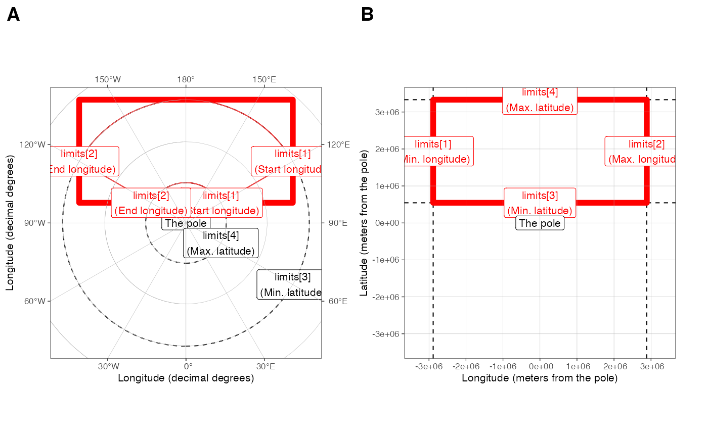

The figure above: Limiting rectangular basemaps is done by placing four
coordinates to the limit argument. A) If the limits are in decimal
degrees, the longitude limits (`[1:2]`) specify the start and end
segments of corresponding angular lines that should reside inside the
map area. The longitude limits are defined **counter-clockwise**. The
latitude limits `[3:4]` define the parallels that should reside inside
the limited region given the longitude segments. Note that the resulting
limited region (polygon with thick red borders) becomes wider than the
polygon defined by the coordinates (thin red borders). The example
limits are `c(120, -120, 60, 80)`. B) If the limits are given as
projected coordinates or as decimal degrees for maps with \|latitude\|
\< 60, limits elements represent lines encompassing the map area in
cartesian space. The example limits are the limits from A) projected to
the Arctic stereographic (crs = 3995).

The example above as a map. Note how the latitude limits give a much
larger map than one would expect from cartesian coordinates because the
60 $`^\circ`$N parallel is within the map area between 120 $`^\circ`$E
and 120 $`^\circ`$W meridians.

``` r

dt <- data.frame(lon = c(120, 120, -120, -120), lat = c(60, 80, 80, 60))

basemap(limits = c(120, -120, 60, 80)) +
  ggspatial::geom_spatial_polygon(
    data = dt, 
    aes(x = lon, y = lat), fill = NA, color = "red")
```

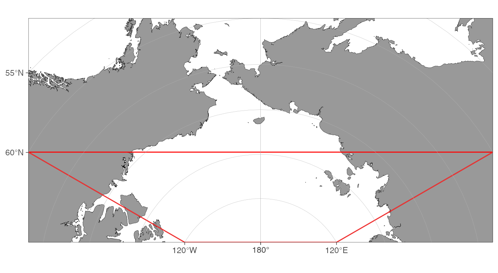

Exact control of map limits can be difficult using decimal degree limits
in polar regions. The `limits` argument also allows specifying the
limits in the underlying projected coordinate units. First, we will need
to find out how these units look like:

``` r

basemap(limits = 60, projection.grid = TRUE, grid.col = "red")
```

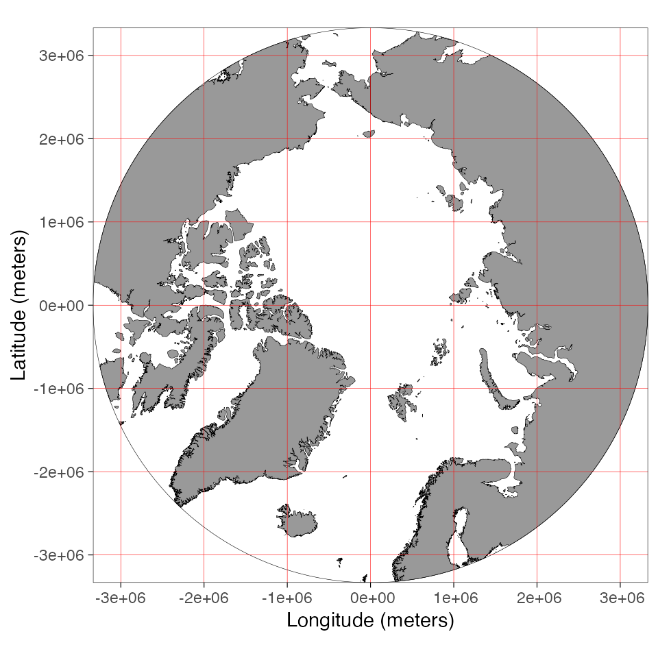

The `projection.grid` argument plots a grid using the projected actual
map coordinates instead of decimal degrees. The grid helps in defining
the `limits` using projected coordinates giving better control over the
map limits than decimal degree coordinates. The automatic shapefile
definition algorithm does not work for projected coordinates. Therefore,
if the limits are not given as decimal degrees (any longitude outside
the range \[-180, 180\] or latitude \[-90, 90\]), the function asks to
specify `shapefiles`. The `shapefiles` can be defined by partially
matching the names of the pre-made shapefiles in `shapefile_list`
(e.g. “Ar” would be enough for “ArcticStereographic”):

``` r

basemap(limits = c(-2e6, 1e6, 0, 3e6), shapefiles = "Arctic")
```

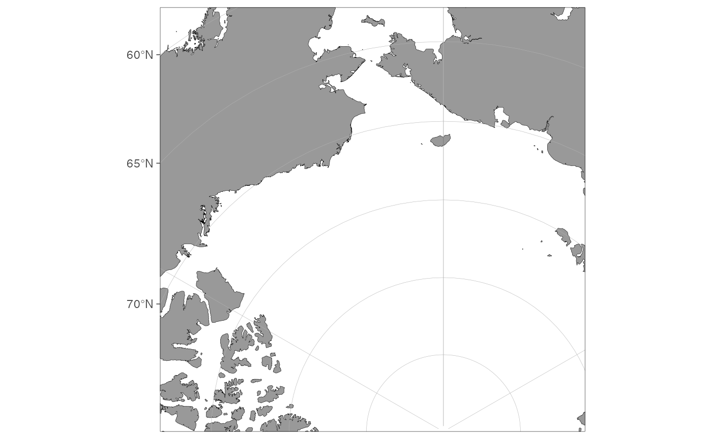

#### Data limits

The limits of a map can also be defined by inputting a data frame to the
`data` argument. The limits are automatically defined allowing the user
to quickly find limits for a desired spatial dataset:

``` r

dt <- expand.grid(lon = c(160, 180, -160), lat = c(60, 70, 80))

basemap(data = dt) + # a synonym: basemap(dt)
  ggspatial::geom_spatial_point(data = dt, aes(x = lon, y = lat), color = "red")
```

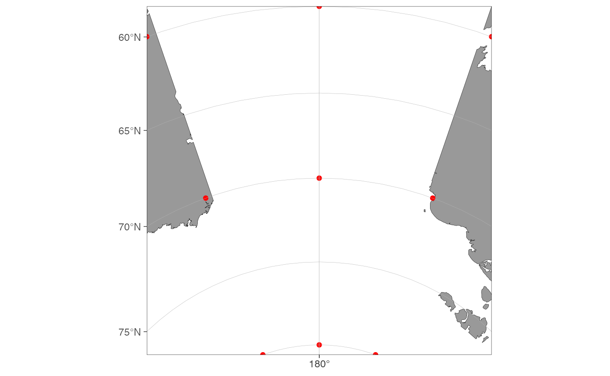

The function makes the map such that the outermost data points barely
fit into the mapped region. The space between the map borders and data
points can be adjusted using the `expand.factor` argument:

``` r

cowplot::plot_grid(
  basemap(dt, expand.factor = 1.1) +
    ggspatial::geom_spatial_point(data = dt, aes(x = lon, y = lat), color = "red") +
    theme(axis.title = element_blank()),
  basemap(dt, expand.factor = 0.9) +
    ggspatial::geom_spatial_point(data = dt, aes(x = lon, y = lat), color = "red") +
    theme(axis.title = element_blank()),
  labels = "AUTO"
)
```


**Figure:** The expand.factor argument can be used to expand (A) and
reduce (B) map region in relation to data.

See the [Adding data to maps](#adding-data-to-maps) section for more
information. The
[`basemap()`](https://mikkovihtakari.github.io/ggOceanMaps/reference/basemap.md)
function automatically detects columns containing longitude and latitude
information when the `data` argument is used. The automatic detection
algorithm is not very advanced and it is recommended to use intuitive
column names for longitude (such as “lon”, “long”, or “longitude”) and
latitude (“lat”, “latitude”) columns. The coordinate data have to be
given as decimal degrees for the `data` argument to function.

#### Shape files

The ggOceanMaps package contains a set of \[premade shapefiles\]. Only
the decimal degree land shapes are shipped with the package while others
are downloaded as needed. See the [front page for instructions how to
setup the automatic download
folder](https://mikkovihtakari.github.io/ggOceanMaps/index.html#data-path)
before you start downloading shape files. Any character supplied to the
`x` argument in the
[`basemap()`](https://mikkovihtakari.github.io/ggOceanMaps/reference/basemap.md)
function will automatically be understood as `shapefiles` argument. The
maps are limited showing the entire land shape. Use the `limits`
argument to further limit the shape file.

``` r

basemap("Arctic")
```

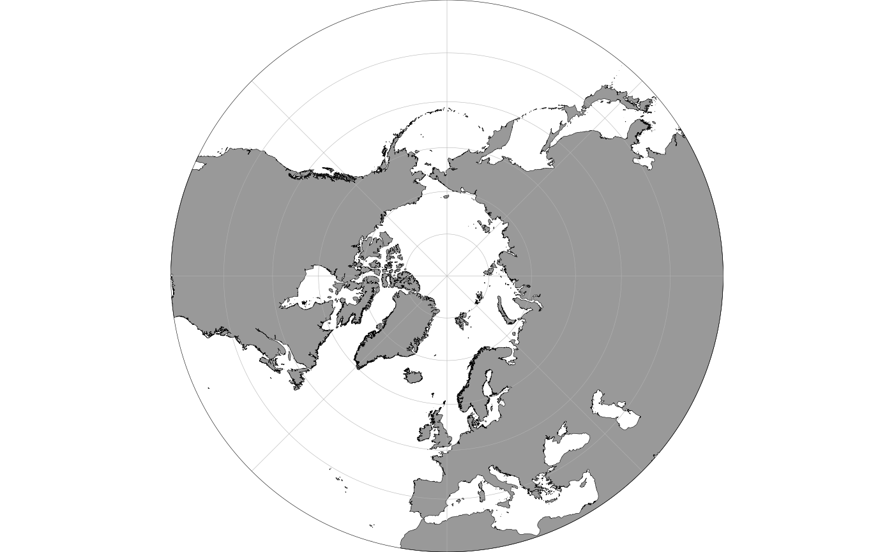

### Bathymetry

The simplest way to add bathymetry is `bathymetry = TRUE`, which uses
the low-resolution raster shipped with the package:

``` r

basemap(limits = c(-125, -110, 25, 35), bathymetry = TRUE)
```

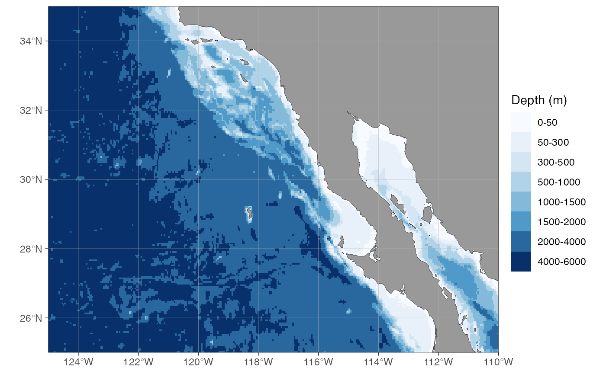

For higher detail, set `bathy.style` to one of the alternative styles.
The default is `"raster_binned_blues"` (`"rbb"`); switching to
`"raster_continuous_blues"` (`"rcb"`) gives you a higher-resolution
continuous raster (first call downloads it from
[ggOceanMapsLargeData](https://github.com/MikkoVihtakari/ggOceanMapsLargeData)).

``` r

basemap(limits = c(-125, -110, 25, 35), bathy.style = "rcb")
```

ggOceanMaps supports five different bathymetry data sources:

1.  **Shipped low-resolution raster** — `"rbb"` / `"rbg"`. Default. No
    setup, works offline (downsampled from ETOPO 2022).
2.  **ggOceanMapsLargeData** higher-resolution data — a continuous
    raster (`"rcb"`), filled polygon contours (`"pb"`), or contour lines
    (`"cb"`). One-time download per region.
3.  **Live download from a Web Coverage Service** — `"wceb"` (ETOPO1,
    ~1.85 km global) or `"wemb"` (EMODnet, ~115 m European waters).
    Tiles are cached locally after the first fetch.
4.  **Your own raster** (GEBCO, ETOPO, IBCAO, …) via
    `options(ggOceanMaps.userpath = "...")` — `"rub"` / `"rug"`.
5.  **Build-your-own** with
    [`raster_bathymetry()`](https://mikkovihtakari.github.io/ggOceanMaps/reference/raster_bathymetry.md)
    →
    [`vector_bathymetry()`](https://mikkovihtakari.github.io/ggOceanMaps/reference/vector_bathymetry.md)
    /
    [`vector_land()`](https://mikkovihtakari.github.io/ggOceanMaps/reference/vector_land.md).

The `bathy.style` string follows the pattern `geometry_palette`. Add
`_grays` (or change the final `b` → `g` in the abbreviation) for the
greyscale variant of any style. The full reference table — every style,
every abbreviation, and what each one needs — lives in
[`?basemap`](https://mikkovihtakari.github.io/ggOceanMaps/reference/basemap.md).
Each source is walked through with examples, and the data sources to
cite are listed, in the dedicated [Bathymetry
vignette](https://mikkovihtakari.github.io/ggOceanMaps/articles/bathymetry.md).

The *default `bathy.style` can be changed by setting the
`ggOceanMaps.bathy.style` option*.
`options(ggOceanMaps.bathy.style = "poly_blues")` would make the style
similar to older pre-2.0 versions of ggOceanMaps.

### Glaciers

Since 2.0, glaciers require a download. It is a good idea to use the
polar stereographic datasets for this purpose:

``` r

basemap(limits = -60, glaciers = TRUE, shapefiles = "Antarctic")
```

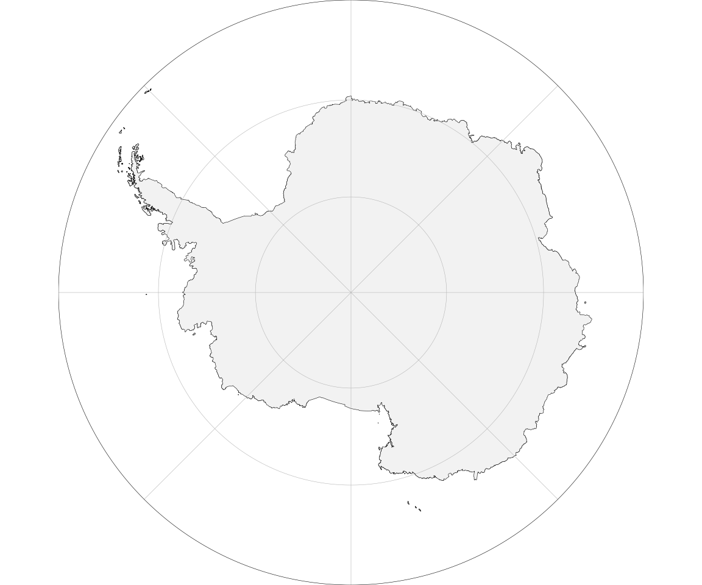

### Adding data to maps

The `basemap(...)` function works almost similarly to the `ggplot(...)`
function as a base for adding further layers to the plot. The difference
between the
[`basemap()`](https://mikkovihtakari.github.io/ggOceanMaps/reference/basemap.md)
and the
[`ggplot()`](https://ggplot2.tidyverse.org/reference/ggplot.html) is
that the
[`basemap()`](https://mikkovihtakari.github.io/ggOceanMaps/reference/basemap.md)
plot already contains multiple ggplot layers. All layers except
bathymetry have no other `aes` mapping than `x`, `y` and `group`.
Bathymetry is mapped to `fill` or `color` color in addition. This means
that when you add ggplot layers, you need to specify the `data` argument
explicitly as shown below. Another difference is that basemaps are
plotted using projected coordinates. The
[ggspatial](https://CRAN.R-project.org/package=ggspatial) and ggplot’s
[`geom_sf`](https://ggplot2.tidyverse.org/reference/ggsf.html) functions
convert the coordinates automatically to the projected coordinates:

``` r

dt <- data.frame(lon = c(seq(-180, 0, 30), seq(30, 180, 30)), lat = -70)

basemap(limits = -60, glaciers = TRUE, shapefiles = "Antarctic") +
  ggspatial::geom_spatial_point(data = dt, aes(x = lon, y = lat), color = "red")
```


The ggplot functions can also be used, but the coordinates need to be
transformed to the basemap projection first using the `transform_coord`
function:

``` r

basemap(limits = -60, glaciers = TRUE, shapefiles = "Antarctic") +
  geom_point(data = transform_coord(dt), aes(x = lon, y = lat), color = "red")
```


Note that the maps plotted in temperate and tropical regions are not
projected. Consequently, decimal degrees work for such maps directly:

``` r

dt <- data.frame(lon = c(-100, -80, -60), 
                 lat = c(10, 25, 40), 
                 var = c("a", "a", "b")
)

basemap(data = dt) + 
  geom_point(data = dt, aes(x = lon, y = lat), color = "red")
```

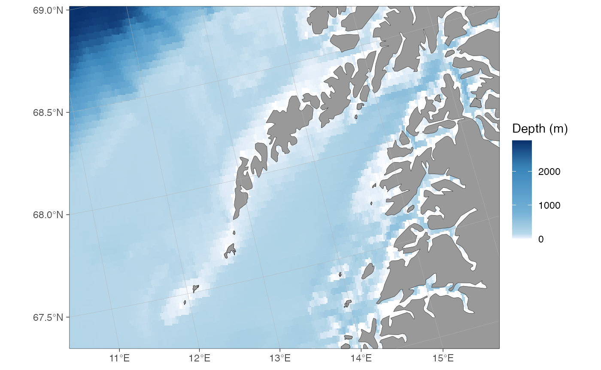

The `transform_coord` function detects the projection automatically,
given that the map is limited using a similar range of coordinates.
Therefore you can use the `transform_coord` as demonstrated above
whenever using standard ggplot layers.

``` r

transform_coord(data.frame(lon = -80, lat = 25), bind = TRUE)
```

    #>   lon lat lon.proj lat.proj
    #> 1 -80  25      -80       25

Worked recipes that build on this — current arrows, velocity fields, pie
charts, and recolouring bathymetry — are collected in the [Adding
graphical
elements](https://mikkovihtakari.github.io/ggOceanMaps/articles/adding-graphical-elements.md)
article.

### Rotating maps

The stereographic maps can be rotated to point towards north using the
`rotate` argument:

``` r

basemap(limits = c(-160, -80, 60, 85), rotate = TRUE)
```

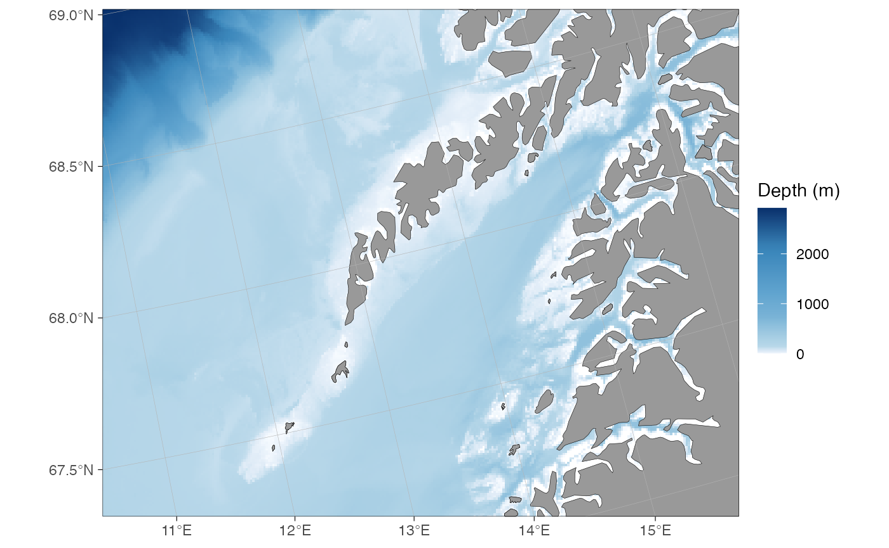

Note that rotation changes the underlying CRS and data need to be added
using `ggspatial::geom_spatial_*`,
[`ggplot2::geom_sf()`](https://ggplot2.tidyverse.org/reference/ggsf.html)
or `transform_coord(rotate = TRUE)` functions.

### Quick map

The `qmap` function is designed as a shortcut to quickly take a look at
a spatial dataset. This function automatically detects the type of data
fed into the function and plots a map using appropriate geometries,
limits, and projection. You can use the `expand.factor` argument to
adjust the automatic zoom into `data`.

``` r

dt <- data.frame(lon = c(-100, -80, -60), 
                 lat = c(10, 25, 40), 
                 var = c("a", "a", "b")
)

qmap(dt, color = I("red")) # set color
```


``` r

qmap(dt, color = var, expand.factor = 1.3) # map color, zoom out
```


## Advanced use

This section focuses on flexibility and user modifications. It is
assumed that advanced users understand the basics of geographic
information systems (GIS) and how to use these systems in R (e.g. see
the [Making Maps with
R](https://geocompr.robinlovelace.net/adv-map.html) chapter in [Lovelace
et al. 2020](https://geocompr.robinlovelace.net/index.html)).

### Projections

The `basemap` function uses the `limits` argument to automatically
detect the required projection for a map (or the `data` argument to
calculate `limits`). The algorithms deciding which projection to use are
defined in `define_shapefiles` and `shapefile_list` functions. The
`basemap` function uses decimal degree land shapes as default and
transforms them to polar stereographic projections based on following
rules (given as [EPSG codes](https://epsg.io/)):

- **4326** WGS 84 / World Geodetic System 1984, used in GPS. Called
  “DecimalDegree”. For min latitude (`limits[3]`) \< 30 or \> -30, max
  latitude (`limits[4]`) \< 60 or \> -60, and single integer latitudes
  \< 30 and \> -30.
- **3995** WGS 84 / Arctic Polar Stereographic. Called
  “ArcticStereographic”. For max latitude (`limits[4]`) \>= 60 (if min
  latitude (`limits[3]`) \>= 30), and single integer latitudes \>= 30
  and \<= 89.
- **3031** WGS 84 / Antarctic Polar Stereographic. Called
  “AntarcticStereographic”. For max latitude (`limits[4]`) \<= -60 (if
  min latitude (`limits[3]`) \<= -30), and single integer latitudes \<=
  -30 and \>= -89.

Further, there are higher resolution data that can be downloaded when
needed. They use a projection which suits that region. Here are all
`shapefiles` and their projections (CRS):

| name                   |   crs |
|:-----------------------|------:|
| ArcticStereographic    |  3995 |
| AntarcticStereographic |  3031 |
| DecimalDegree          |  4326 |
| Svalbard               | 32633 |
| Europe                 |  3035 |

Since 2.0, it is possible to override the default CRS used by
[`basemap()`](https://mikkovihtakari.github.io/ggOceanMaps/reference/basemap.md)
using the `crs` argument:

``` r

basemap(limits = c(0, 15, 55, 65), crs = 32631)
```

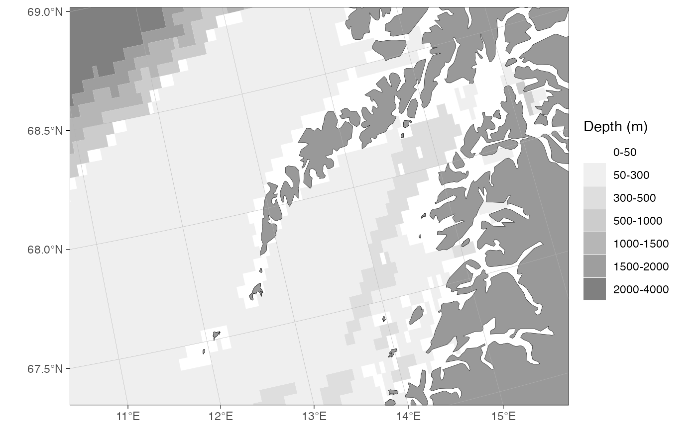

### Appearance

#### Customizing bathymetry scales

The `bathy.style = "*_binned_*"` bathymetry polygons are mapped to
`geom_fill_discrete` and can be modified using standard ggplot syntax:

``` r

basemap(limits = c(-140, -105, 20, 40), bathymetry = TRUE) + 
  scale_fill_viridis_d("Water depth (m)")
```

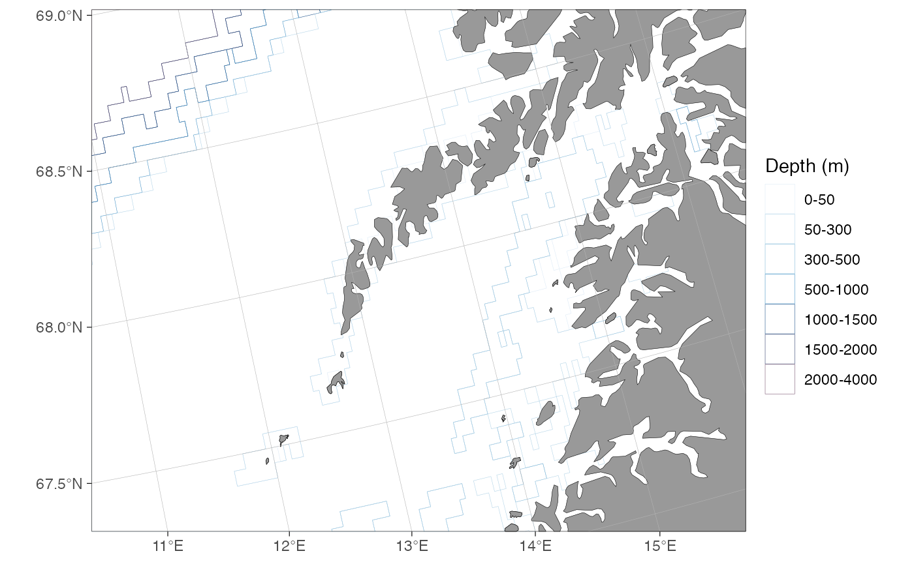

The `bathy.style = "*_continuous_*"` bathymetry polygons are mapped to
`geom_fill_continuous`:

``` r

basemap(limits = c(-140, -105, 20, 40), bathy.style = "rcb") +
  scale_fill_viridis_c("Water depth (m)")
```

The `bathy.style = "contour_*"` bathymetry lines are mapped to
`geom_color_discrete`:

``` r

basemap(limits = c(0, 60, 68, 80), bathymetry = TRUE, bathy.style = "contour_blues") + 
  scale_color_hue()
```

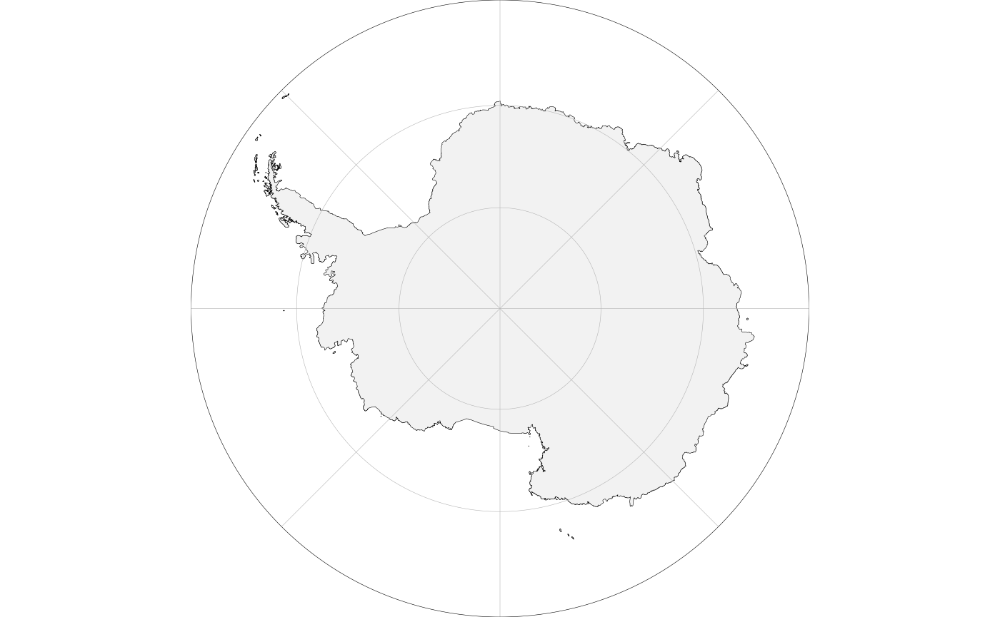

### Graphical parameters

The `basemap` function uses graphical parameters that (very objectively)
happen to please the eye of the author and have worked in the
applications needed by the author. The default parameters may suddenly
change without warning. You may want to modify the appearances of a
`basemap` to your own liking. This can be done using the `*.col` (fill),
`*.border.col` (line color) and `*.size` (line width) arguments:

``` r

basemap(limits = c(-20, 30, 55, 70), glaciers = TRUE, 
        bathymetry = TRUE, bathy.style = "poly_greys",
        land.col = "#eeeac4", gla.col = "cadetblue", 
        land.border.col = NA, gla.border.col = NA,
        grid.size = 0.05)
```


Graticules (the grid lines) can be removed by setting the `grid.col` to
`NA`. Axis titles are omitted by default; add them with standard ggplot
code:

``` r

basemap(limits = c(124, 148, 31, 50), grid.col = NA) +
  labs(x = "Longitude", y = "Latitude")
```

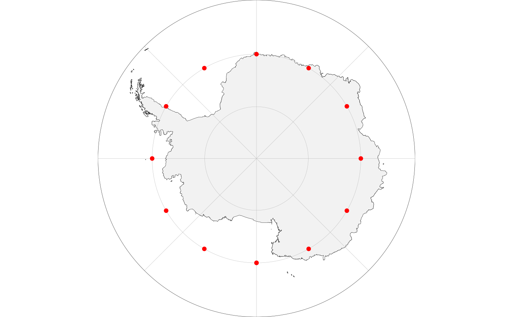

### Modifying basemap objects

The objects produced by the `basemap` function are standard ggplot
objects with the difference that relevant information used in mapping is
added to `attributes` of the object:

``` r

p <- basemap(-60)
names(attributes(p))
```

    #>  [1] "class"       "S7_class"    "data"        "layers"      "scales"     
    #>  [6] "guides"      "mapping"     "theme"       "coordinates" "facet"      
    #> [11] "layout"      "labels"      "meta"        "plot_env"    "bathymetry" 
    #> [16] "glaciers"    "limits"      "polarmap"    "map.grid"    "crs"

Accessing the `attributes` allows custom modifications of maps produced
by the `basemap` function — see *Reordering layers* below for an
example.

### Reordering layers

Spatial data added to a
[`basemap()`](https://mikkovihtakari.github.io/ggOceanMaps/reference/basemap.md)
are drawn *on top* of land, glaciers, and graticules. To push those base
layers back above your data (for example to hide polygon outlines that
fall on land), wrap the plot in
[`reorder_layers()`](https://mikkovihtakari.github.io/ggOceanMaps/reference/reorder_layers.md).
The
[Cookbook](https://mikkovihtakari.github.io/ggOceanMaps/articles/cookbook.md)
has a worked example using the ICES and Norwegian fisheries zones.

### More customisation recipes

[`basemap()`](https://mikkovihtakari.github.io/ggOceanMaps/reference/basemap.md)
returns a standard `ggplot` object, so most styling is ordinary ggplot2
code. Short, copy-pasteable recipes for the common cases live in the
[Cookbook](https://mikkovihtakari.github.io/ggOceanMaps/articles/cookbook.md):

- adding a scale bar and north arrow,
- colouring the ocean (panel background),
- moving graticules above or below your data,
- adding a second `fill` scale on top of bathymetry (via `ggnewscale`),
- labelling longitude and latitude on polar maps.

### Custom shapefiles

When the premade maps do not cover your region at the resolution you
need, you can pass your own land, glacier, and bathymetry layers to
[`basemap()`](https://mikkovihtakari.github.io/ggOceanMaps/reference/basemap.md)
via the `shapefiles` argument:

``` r

basemap(
  limits = c(10, 53, 70, 80),
  shapefiles = list(land = my_land, glacier = my_glacier, bathy = my_bathy),
  bathymetry = TRUE, glaciers = TRUE
)
```

The list elements `land`, `glacier`, and `bathy` are all recognised; set
`glacier` and/or `bathy` to `NULL` if you do not need them. All three
must share one projection, which
[`basemap()`](https://mikkovihtakari.github.io/ggOceanMaps/reference/basemap.md)
then uses for the map.

Building those layers — clipping an existing shapefile, turning a
GEBCO/ETOPO grid into matched land and depth-contour polygons with
[`raster_bathymetry()`](https://mikkovihtakari.github.io/ggOceanMaps/reference/raster_bathymetry.md)
→
[`vector_bathymetry()`](https://mikkovihtakari.github.io/ggOceanMaps/reference/vector_bathymetry.md)
/
[`vector_land()`](https://mikkovihtakari.github.io/ggOceanMaps/reference/vector_land.md),
or reading Geonorge depth data with
[`geonorge_bathymetry()`](https://mikkovihtakari.github.io/ggOceanMaps/reference/geonorge_bathymetry.md)
— is covered step by step in the dedicated [Customising
shapefiles](https://mikkovihtakari.github.io/ggOceanMaps/articles/customising-shapefiles.md)
article. Useful raster and vector data sources are listed in the
[Bathymetry](https://mikkovihtakari.github.io/ggOceanMaps/articles/bathymetry.md)
article.

## Known issues

The land and glacier shapes do not get dissolved correctly when
projecting from decimal degrees:

``` r

basemap(60, glaciers = TRUE)
```

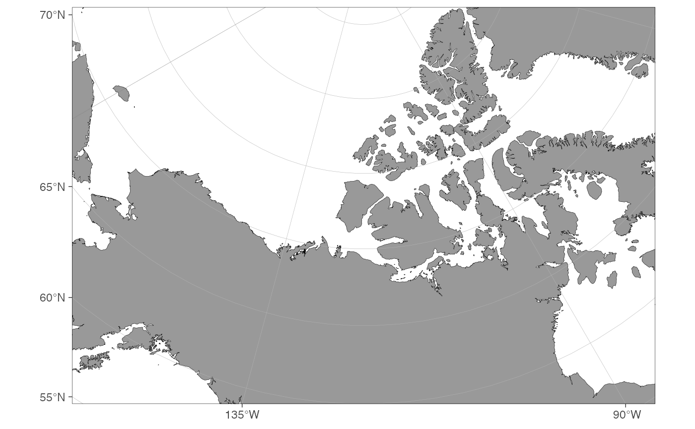

A solution until the issue has been fixed is to use projected
downloadable shape files:

``` r

basemap(60, glaciers = TRUE, shapefiles = "Arctic")
```


## Citations and data sources

The data used by the package are not the property of the Institute of
Marine Research nor the author of the package. It is, therefore,
important that you cite the data sources used in a map you generate with
the package. Please see
[here](https://mikkovihtakari.github.io/ggOceanMaps/#citations-and-data-sources)
for a list of data sources.

Please cite the package whenever maps generated by the package are
published. For up-to-date citation information, please use:

``` r

citation("ggOceanMaps")
```

    #> To cite package 'ggOceanMaps' in publications use:
    #> 
    #>   Vihtakari M (2026). _ggOceanMaps: Plot Data on Oceanographic Maps
    #>   using 'ggplot2'_. R package version 3.0.0,
    #>   <https://mikkovihtakari.github.io/ggOceanMaps/>.
    #> 
    #> A BibTeX entry for LaTeX users is
    #> 
    #>   @Manual{,
    #>     title = {ggOceanMaps: Plot Data on Oceanographic Maps using 'ggplot2'},
    #>     author = {Mikko Vihtakari},
    #>     year = {2026},
    #>     note = {R package version 3.0.0},
    #>     url = {https://mikkovihtakari.github.io/ggOceanMaps/},
    #>   }
