# ggOceanMaps User Manual

The ggOceanMaps package for [R](https://www.r-project.org/) allows
plotting data on bathymetric maps using
[ggplot2](https://ggplot2.tidyverse.org/reference/). The package is
designed for ocean sciences and greatly simplifies bathymetric map
plotting anywhere around the globe. ggOceanMaps uses openly available
geographic data. Citing the particular data sources is advised by the
CC-BY licenses whenever maps from the package are published (see the
[*Citations and data sources*](#citations-and-data-sources) section).
Note that the package comes with absolutely no warranty and that maps
generated by the package are meant for plotting scientific data only.
The maps are coarse generalizations of third-party data and therefore
inaccurate.

## Basic use

**ggOceanMaps** extends on
[**ggplot2**](http://ggplot2.tidyverse.org/reference/). The package uses
spatial ([**sf**](https://r-spatial.github.io/sf/)) shape- (e.g. vector)
and ([**stars**](https://r-spatial.github.io/stars/)) raster files,
[geospatial packages for
R](https://cran.r-project.org/web/views/Spatial.html) to manipulate, and
ggplot2 to plot these data. The vector and raster plotting is conducted
internally in the `basemap` function, which uses [ggplot’s sf object
plotting
capabilities](https://ggplot2.tidyverse.org/reference/ggsf.html).

The primary aim of ggOceanMaps is to make plotting oceanographic spatial
data as simple as feasible, but also flexible for custom modifications.
The “as simple as feasible” part will be covered in this section, while
the “flexible for custom modifications” part is covered in the [Advanced
use](#advanced-use) section. The basic use section of this tutorial
assumes that the user knows how to use ggplot2. If you are not familiar
with this package, you may read the [Data
visualization](https://r4ds.had.co.nz/data-visualisation.html) section
in [Hadley Wickham & Garrett Grolemund](https://r4ds.had.co.nz/). This
tutorial does not describe functions in ggOceanMaps but rather focuses
on how to use them. Make sure to refer to the [function
documentation](https://mikkovihtakari.github.io/ggOceanMaps/reference/index.html)
while reading the tutorial.

``` r
library(ggOceanMaps)
```

### Limiting maps

To ensure simplicity, ggOceanMaps package attempts to use [decimal
degree](https://en.wikipedia.org/wiki/Decimal_degrees) [coordinate
system](https://en.wikipedia.org/wiki/Coordinate_system) as much as
possible. This system represents coordinates on a sphere, while maps are
plotted in two dimensions. Therefore, the underlying map data have to be
projected using [different mathematical algorithms depending on the
geographic location](#projections).

Maps can be limited (e.g. provide geographic location for a map) using
three arguments: `limits`, `data`, and `shapefiles`. The limit type is
automatically detected when supplied to the first argument (called `x`)
in the [`basemap()`](../reference/basemap.md) and
[`qmap()`](../reference/qmap.md) functions.

#### Limits

The simplest way of defining the geographic location is to use the
`limits` argument with decimal degrees. The limits argument can be
defined either as a numeric vector of length 1 or 4. Specifying the
argument as a single integer between 30 and 88 or -88 and -30 plots a
polar stereographic map for the Arctic or Antarctic, respectively.

``` r
library(ggOceanMaps)
library(ggspatial) # for data plotting
basemap(limits = 60) # A synonym: basemap(60) 
```


Rectangular maps are plotted by specifying the `limits` argument as a
numeric vector of length 4 where the first element defines the start
longitude, the second element the end longitude, the third element the
minimum latitude and the fourth element the maximum latitude of the
bounding box:

``` r
basemap(limits = c(-20, 20, 40, 59))
```


Limiting maps using decimal degrees is somewhat counter-intuitive
because maps plotted for polar regions (\>= 60 or \<= -60 latitude) are
actually projected to Arctic and Antarctic polar stereographic systems.
Because decimal degrees are angular units running counter-clockwise,
also the longitude limits have to be defined **counter-clockwise**.
Projected maps with decimal degree `limits` will lead to expanded limits
towards the poles when using Arctic and Antarctic Polar Stereographic
projections because decimal degrees represent a sphere:


The figure above: Limiting rectangular basemaps is done by placing four
coordinates to the limit argument. A) If the limits are in decimal
degrees, the longitude limits (`[1:2]`) specify the start and end
segments of corresponding angular lines that should reside inside the
map area. The longitude limits are defined **counter-clockwise**. The
latitude limits `[3:4]` define the parallels that should reside inside
the limited region given the longitude segments. Note that the resulting
limited region (polygon with thick red borders) becomes wider than the
polygon defined by the coordinates (thin red borders). The example
limits are `c(120, -120, 60, 80)`. B) If the limits are given as
projected coordinates or as decimal degrees for maps with \|latitude\|
\< 60, limits elements represent lines encompassing the map area in
cartesian space. The example limits are the limits from A) projected to
the Arctic stereographic (crs = 3995).

The example above as a map. Note how the latitude limits give a much
larger map than one would expect from cartesian coordinates because the
60 $`^\circ`$N parallel is within the map area between 120 $`^\circ`$E
and 120 $`^\circ`$W meridians.

``` r
dt <- data.frame(lon = c(120, 120, -120, -120), lat = c(60, 80, 80, 60))

basemap(limits = c(120, -120, 60, 80)) +
  ggspatial::geom_spatial_polygon(
    data = dt, 
    aes(x = lon, y = lat), fill = NA, color = "red")
```


Exact control of map limits can be difficult using decimal degree limits
in polar regions. The `limits` argument also allows specifying the
limits in the underlying projected coordinate units. First, we will need
to find out how these units look like:

``` r
basemap(limits = 60, projection.grid = TRUE, grid.col = "red")
```


The `projection.grid` argument plots a grid using the projected actual
map coordinates instead of decimal degrees. The grid helps in defining
the `limits` using projected coordinates giving better control over the
map limits than decimal degree coordinates. The automatic shapefile
definition algorithm does not work for projected coordinates. Therefore,
if the limits are not given as decimal degrees (any longitude outside
the range \[-180, 180\] or latitude \[-90, 90\]), the function asks to
specify `shapefiles`. The `shapefiles` can be defined by partially
matching the names of the pre-made shapefiles in `shapefile_list`
(e.g. “Ar” would be enough for “ArcticStereographic”):

``` r
basemap(limits = c(-2e6, 1e6, 0, 3e6), shapefiles = "Arctic") 
```


#### Data limits

The limits of a map can also be defined by inputting a data frame to the
`data` argument. The limits are automatically defined allowing the user
to quickly find limits for a desired spatial dataset:

``` r
dt <- expand.grid(lon = c(160, 180, -160), lat = c(60, 70, 80))

basemap(data = dt) + # a synonym: basemap(dt)
  ggspatial::geom_spatial_point(data = dt, aes(x = lon, y = lat), color = "red")
```


The function makes the map such that the outermost data points barely
fit into the mapped region. The space between the map borders and data
points can be adjusted using the `expand.factor` argument:

``` r
cowplot::plot_grid(
  basemap(dt, expand.factor = 1.1) +
    ggspatial::geom_spatial_point(data = dt, aes(x = lon, y = lat), color = "red") +
    theme(axis.title = element_blank()),
  basemap(dt, expand.factor = 0.9) +
    ggspatial::geom_spatial_point(data = dt, aes(x = lon, y = lat), color = "red") +
    theme(axis.title = element_blank()),
  labels = "AUTO"
)
```


Figure above: The expand.factor argument can be used to expand (A) and
reduce (B) map region in relation to data.

See the [Adding data to maps](#adding-data-to-maps) section for more
information. The [`basemap()`](../reference/basemap.md) function
automatically detects columns containing longitude and latitude
information when the `data` argument is used. The automatic detection
algorithm is not very advanced and it is recommended to use intuitive
column names for longitude (such as “lon”, “long”, or “longitude”) and
latitude (“lat”, “latitude”) columns. The coordinate data have to be
given as decimal degrees for the `data` argument to function.

#### Shape files

The ggOceanMaps package contains a set of \[premade shapefiles\]. Only
the decimal degree land shapes are shipped with the package while others
are downloaded as needed. See the [front page for instructions how to
setup the automatic download
folder](https://mikkovihtakari.github.io/ggOceanMaps/index.html#data-path)
before you start downloading shape files. Any character supplied to the
`x` argument in the [`basemap()`](../reference/basemap.md) function will
automatically be understood as `shapefiles` argument. The maps are
limited showing the entire land shape. Use the `limits` argument to
further limit the shape file.

``` r
basemap("Arctic")
```


### Bathymetry

Bathymetry system was revised in version 2.0. Bathymetry can be plotted
by simply specifying `bathymetry = TRUE` or `bathy.style` (no need to
specify both any longer):

``` r
basemap(limits = c(-125, -110, 25, 35), bathymetry = TRUE)
```


The default, `bathy.style = "raster_binned_blues"`, uses a
low-resolution raster file shipped with ggOceanMaps. The package
contains an option to plot higher resolution bathymetries than the
default binned blue alternative. These bathymetries can be accessed by
specifying the `bathy.style` argument and require a download from
ggOceanMapsLargeData or other online repositories.

``` r
basemap(limits = c(-125, -110, 25, 35), bathy.style = "rcb") # synonym to "raster_continuous_blues"
```

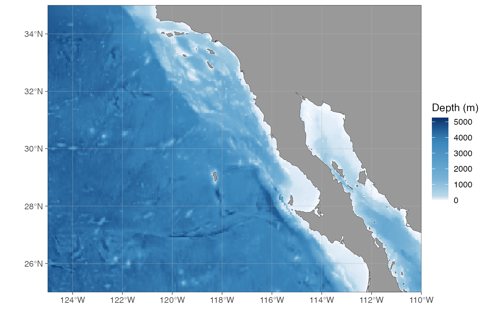

The `bathy.style` character argument consists of three parts separated
by a `_`. The *first part gives the type*: raster, poly(gon), or
contour. The two latter ones use vector data. The *second part gives the
resolution*: binned, continuous or user. The continuous and user options
cannot be used for vector data.

The user option accepts any raster file that can be opened using
[stars::read_stars](https://search.r-project.org/CRAN/refmans/stars/html/read_stars.html).
The path to the file has to be stored in `ggOceanMaps.userpath` option
(e.g. `options(ggOceanMaps.userpath = "PATH_TO_THE_FILE")`) (you can set
this in .Rprofile to avoid having to type it every time).

The *last part defines the color*: blues or grays. These *options can be
abbreviated* by specifying the first letter of each part. Gray contour
lines are an exception to the rule above and can be plotted using
bathy.style = “contour_gray”. Future versions may contain a combination
of raster and gray contours, but these have not been implemented yet.
Currently implemented bathy.style alternatives are:

- *`NULL` (default)*. Bathymetry style is searched from
  `getOption("ggOceanMaps.bathy.style")`. If not found,
  `"raster_binned_blues"` is used.

``` r
basemap(c(11,16,67.3,68.6), bathymetry = TRUE)
```


- *`"raster_binned_blues"`* or `"rbb"` plots binned raster bathymetry
  filled with different shades of blue. Does not require a download.

``` r
basemap(c(11,16,67.3,68.6), bathy.style = "rbb")
```


- *`"raster_binned_grays"`* or `"rbg"` the same than above but uses
  different shades of gray.

``` r
basemap(c(11,16,67.3,68.6), bathy.style = "rbg")
```


- *`"raster_continuous_blues"`* or `"rcb"` plots continuous raster
  bathymetry filled with different shades of blue. More detailed and
  visually more appealing than the binned bathymetry. Requires a
  download.

``` r
basemap(c(11,16,67.3,68.6), bathy.style = "rcb")
```


- *`"raster_continuous_grays"`* or `"rcg"` the same than above but uses
  different shades of gray.

``` r
basemap(c(11,16,67.3,68.6), bathy.style = "rcg")
```

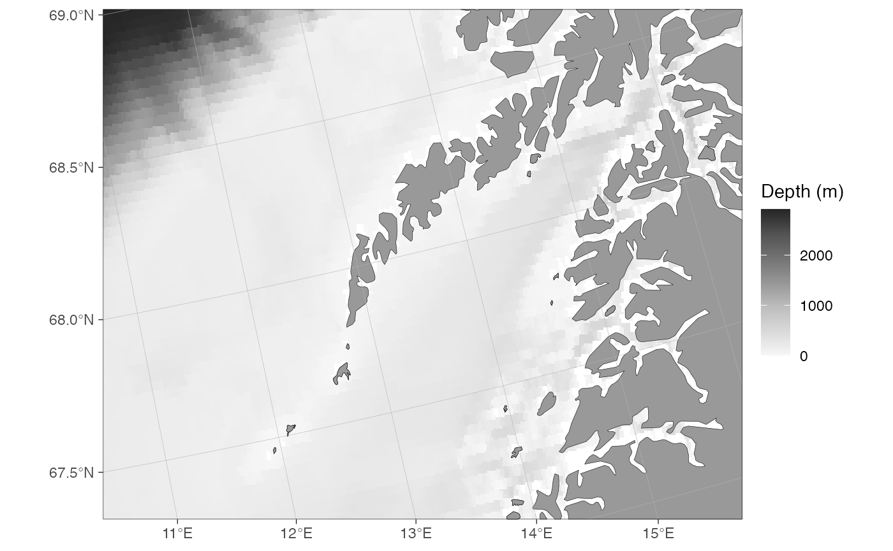

- *`"raster_user_blues"`* or `"rub"` plots continuous raster bathymetry
  filled with different shades of blue from
  `getOption("ggOceanMaps.user.path")`. Any file supported by
  [stars::read_stars](https://search.r-project.org/CRAN/refmans/stars/html/read_stars.html)
  should work. The file has to be placed into the location specified by
  the path. Experimental feature. Has been tested using ETOPO 60
  arc-second and GEBCO 15 arc-second grids. Please report any bugs you
  find.

``` r
basemap(c(11,16,67.3,68.6), bathy.style = "rub")
```


- *`"raster_user_grays"`* or `"rug"` the same than above but uses
  different shades of gray.

``` r
basemap(c(11,16,67.3,68.6), bathy.style = "rug")
```


- *`"poly_binned_blues"`*, `"poly_blues"`, `"pbb"` and `"pb"` plot
  polygon bathymetry filled with different shades of blue. Default in
  the versions older than 2.0 of ggOceanMaps. Requires a download.

``` r
basemap(c(11,16,67.3,68.6), bathy.style = "pb")
```

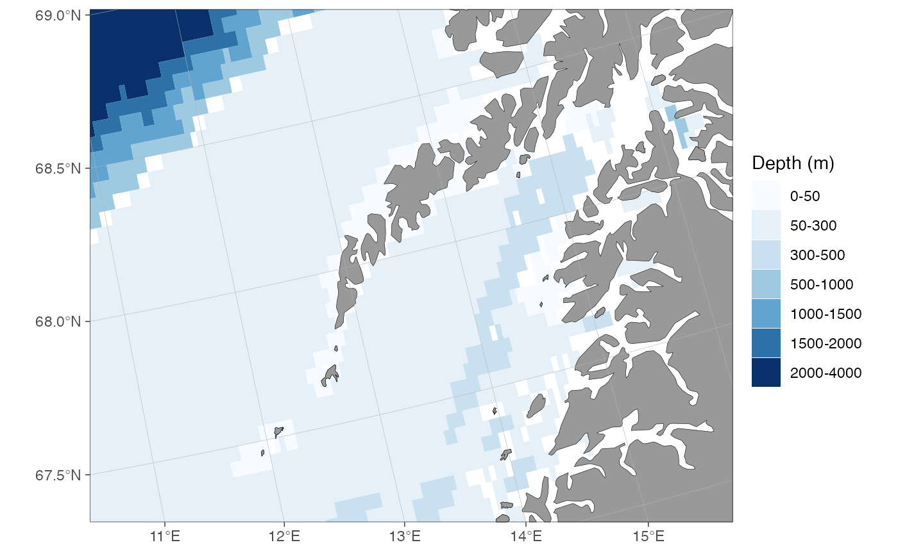

- *`"poly_binned_grays"`*, `"poly_grays"`, `"pbg"` or `"pg"` same than
  above but uses different shades of gray.

``` r
basemap(c(11,16,67.3,68.6), bathy.style = "pg")
```


- *`"contour_binned_blues"`*, `"contour_blues"`, `"cbb"` or `"cb"`
  contour lines with different shades of blue. Requires a download.

``` r
basemap(c(11,16,67.3,68.6), bathy.style = "cb")
```


- *`"contour_gray"`*, `"contour_gray"` or `"cg"` plots gray contour
  lines. Requires a download.

``` r
basemap(c(11,16,67.3,68.6), bathy.style = "cg")
```

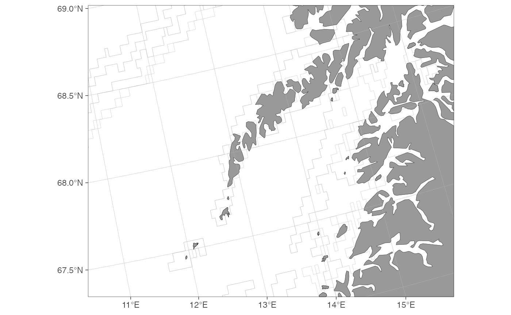

The *default `bythy.style` can be changed by setting the
`ggOceanMaps.bathy.style` option*.
`options(ggOceanMaps.bathy.style = "poly_blues")` would make the style
similar to older pre-2.0 versions of ggOceanMaps.

### Glaciers

Since 2.0, glaciers require a download. It is a good idea to use the
polar stereographic datasets for this purpose:

``` r
basemap(limits = -60, glaciers = TRUE, shapefiles = "Antarctic")
```


### Adding data to maps

The `basemap(...)` function works almost similarly to the `ggplot(...)`
function as a base for adding further layers to the plot. The difference
between the [`basemap()`](../reference/basemap.md) and the
[`ggplot()`](https://ggplot2.tidyverse.org/reference/ggplot.html) is
that the [`basemap()`](../reference/basemap.md) plot already contains
multiple ggplot layers. All layers except bathymetry have no other `aes`
mapping than `x`, `y` and `group`. Bathymetry is mapped to `fill` or
`color` color in addition. This means that when you add ggplot layers,
you need to specify the `data` argument explicitly as shown below.
Another difference is that basemaps are plotted using projected
coordinates. The
[ggspatial](https://CRAN.R-project.org/package=ggspatial) and ggplot’s
[`geom_sf`](https://ggplot2.tidyverse.org/reference/ggsf.html) functions
convert the coordinates automatically to the projected coordinates:

``` r
dt <- data.frame(lon = c(seq(-180, 0, 30), seq(30, 180, 30)), lat = -70)

basemap(limits = -60, glaciers = TRUE, shapefiles = "Antarctic") + 
  ggspatial::geom_spatial_point(data = dt, aes(x = lon, y = lat), color = "red")
```


The ggplot functions can also be used, but the coordinates need to be
transformed to the basemap projection first using the `transform_coord`
function:

``` r
basemap(limits = -60, glaciers = TRUE, shapefiles = "Antarctic") + 
  geom_point(data = transform_coord(dt), aes(x = lon, y = lat), color = "red")
```


Note that the maps plotted in temperate and tropical regions are not
projected. Consequently, decimal degrees work for such maps directly:

``` r
dt <- data.frame(lon = c(-100, -80, -60), 
                 lat = c(10, 25, 40), 
                 var = c("a", "a", "b")
)

basemap(data = dt) + 
  geom_point(data = dt, aes(x = lon, y = lat), color = "red")
```

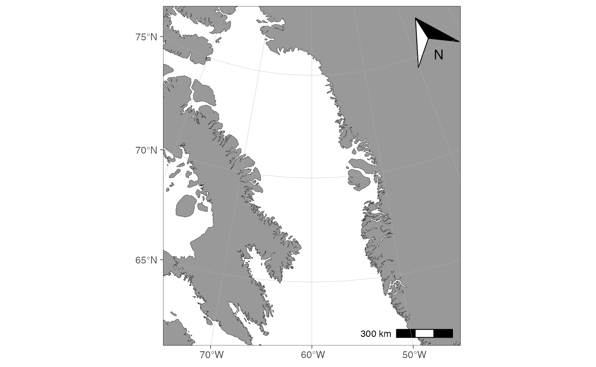

The `transform_coord` function detects the projection automatically,
given that the map is limited using a similar range of coordinates.
Therefore you can use the `transform_coord` as demonstrated above
whenever using standard ggplot layers.

``` r
transform_coord(data.frame(lon = -80, lat = 25), bind = TRUE)
```

    #>   lon lat lon.proj lat.proj
    #> 1 -80  25      -80       25

### Rotating maps

The stereographic maps can be rotated to point towards north using the
`rotate` argument:

``` r
basemap(limits = c(-160, -80, 60, 85), rotate = TRUE)
```


Note that rotation changes the underlying CRS and data need to be added
using `ggspatial::geom_spatial_*`,
[`ggplot2::geom_sf()`](https://ggplot2.tidyverse.org/reference/ggsf.html)
or `transform_coord(rotate = TRUE)` functions.

### Quick map

The `qmap` function is designed as a shortcut to quickly take a look at
a spatial dataset. This function automatically detects the type of data
fed into the function and plots a map using appropriate geometries,
limits, and projection. You can use the `expand.factor` argument to
adjust the automatic zoom into `data`.

``` r
dt <- data.frame(lon = c(-100, -80, -60), 
                 lat = c(10, 25, 40), 
                 var = c("a", "a", "b")
)

qmap(dt, color = I("red")) # set color
```


``` r
qmap(dt, color = var, expand.factor = 1.3) # map color, zoom out
```

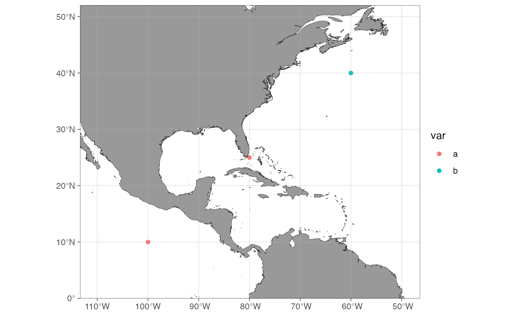

## Advanced use

This section focuses on flexibility and user modifications. It is
assumed that advanced users understand the basics of geographic
information systems (GIS) and how to use these systems in R (e.g. see
the [Making Maps with
R](https://geocompr.robinlovelace.net/adv-map.html) chapter in [Lovelace
et al. 2020](https://geocompr.robinlovelace.net/index.html)).

### Projections

The `basemap` function uses the `limits` argument to automatically
detect the required projection for a map (or the `data` argument to
calculate `limits`). The algorithms deciding which projection to use are
defined in `define_shapefiles` and `shapefile_list` functions. The
`basemap` function uses decimal degree land shapes as default and
transforms them to polar stereographic projections based on following
rules (given as [EPSG codes](https://epsg.io/)):

- **4326** WGS 84 / World Geodetic System 1984, used in GPS. Called
  “DecimalDegree”. For min latitude (`limits[3]`) \< 30 or \> -30, max
  latitude (`limits[4]`) \< 60 or \> -60, and single integer latitudes
  \< 30 and \> -30.
- **3995** WGS 84 / Arctic Polar Stereographic. Called
  “ArcticStereographic”. For max latitude (`limits[4]`) \>= 60 (if min
  latitude (`limits[3]`) \>= 30), and single integer latitudes \>= 30
  and \<= 89.
- **3031** WGS 84 / Antarctic Polar Stereographic. Called
  “AntarcticStereographic”. For max latitude (`limits[4]`) \<= -60 (if
  min latitude (`limits[3]`) \<= -30), and single integer latitudes \<=
  -30 and \>= -89.

Further, there are higher resolution data that can be downloaded when
needed. They use a projection which suits that region. Here are all
`shapefiles` and their projections (CRS):

| name                   |   crs |
|:-----------------------|------:|
| ArcticStereographic    |  3995 |
| AntarcticStereographic |  3031 |
| DecimalDegree          |  4326 |
| Svalbard               | 32633 |
| Europe                 |  3035 |

Since 2.0, it is possible to override the default CRS used by
[`basemap()`](../reference/basemap.md) using the `crs` argument:

``` r
basemap(limits = c(0, 15, 55, 65), crs = 32631)
```

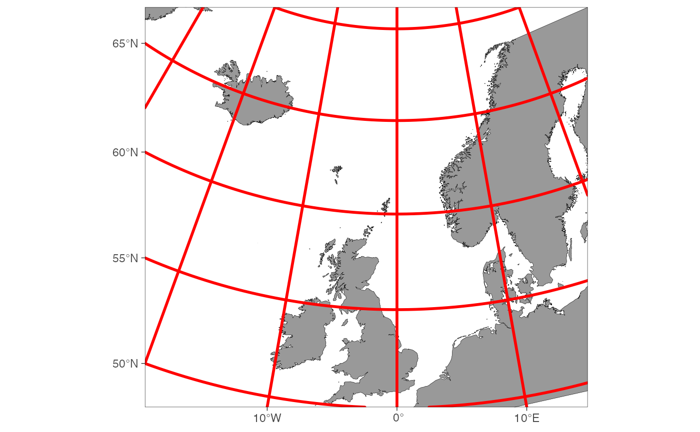

### Appearance

#### Customizing bathymetry scales

The `bathy.style = "*_binned_*"` bathymetry polygons are mapped to
`geom_fill_discrete` and can be modified using standard ggplot syntax:

``` r
basemap(limits = c(-140, -105, 20, 40), bathymetry = TRUE) + 
  scale_fill_viridis_d("Water depth (m)")
```

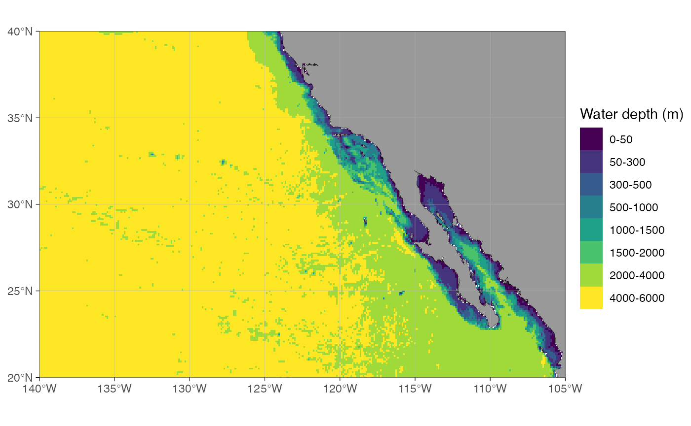

The `bathy.style = "*_continuous_*"` bathymetry polygons are mapped to
`geom_fill_continuous`:

``` r
basemap(limits = c(-140, -105, 20, 40), bathy.style = "rcb") + 
  scale_fill_viridis_c("Water depth (m)")
```


The `bathy.style = "contour_*"` bathymetry lines are mapped to
`geom_color_discrete`:

``` r
basemap(limits = c(0, 60, 68, 80), bathymetry = TRUE, bathy.style = "contour_blues") + 
  scale_color_hue()
```


### Graphical parameters

The `basemap` function uses graphical parameters that (very objectively)
happen to please the eye of the author and have worked in the
applications needed by the author. The default parameters may suddenly
change without warning. You may want to modify the appearances of a
`basemap` to your own liking. This can be done using the `*.col` (fill),
`*.border.col` (line color) and `*.size` (line width) arguments:

``` r
basemap(limits = c(-20, 30, 55, 70), glaciers = TRUE, 
        bathymetry = TRUE, bathy.style = "poly_greys",
        land.col = "#eeeac4", gla.col = "cadetblue", 
        land.border.col = NA, gla.border.col = NA,
        grid.size = 0.05)
```

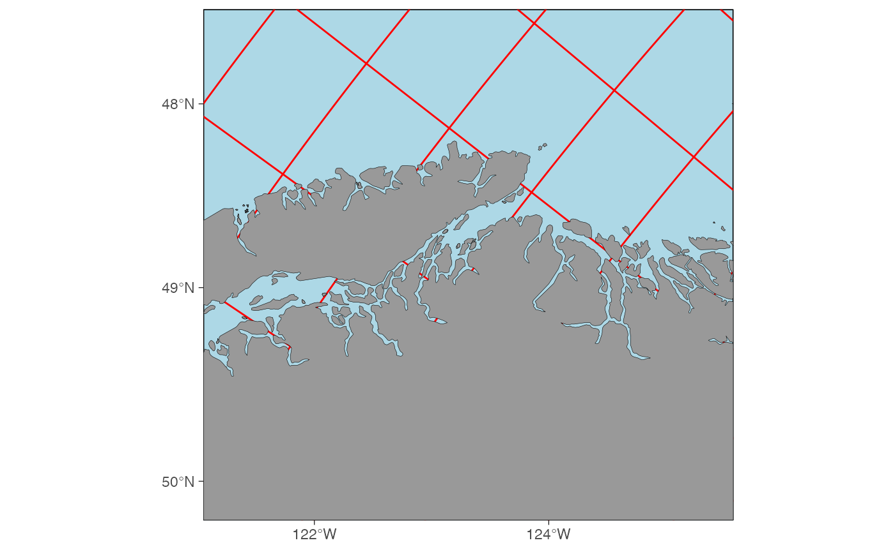

Graticules (the grid lines) can be removed by setting the `grid.col` to
`NA`. Axis labels can be manipulated using standard ggplot code:

``` r
basemap(limits = c(124, 148, 31, 50), grid.col = NA) + 
  labs(x = NULL, y = "Only latitude for you, ...")
```


### Add scale bar and north arrow

Scale bar and north arrows can be added using the [**ggspatial**
functions](https://paleolimbot.github.io/ggspatial/index.html):

``` r
basemap(limits = c(-75, -45, 62, 78), rotate = TRUE) + 
  ggspatial::annotation_scale(location = "br") + 
  ggspatial::annotation_north_arrow(location = "tr", which_north = "true") 
```


Note that the north arrow in the example above points toward north where
it is placed and that the direction of north varies as shown by the
meridians. The scale bar is correct at 71 $`\circ`$N latitude as
specified by the projection (crs = 3995) for Arctic stereographic maps.

### Modifying basemap objects

The objects produced by the `basemap` function are standard ggplot
objects with the difference that relevant information used in mapping is
added to `attributes` of the object:

``` r
p <- basemap(-60)
names(attributes(p))
```

    #>  [1] "class"       "S7_class"    "data"        "layers"      "scales"     
    #>  [6] "guides"      "mapping"     "theme"       "coordinates" "facet"      
    #> [11] "layout"      "labels"      "meta"        "plot_env"    "bathymetry" 
    #> [16] "glaciers"    "limits"      "polarmap"    "map.grid"    "crs"

Accessing the `attributes` allow custom modifications of maps produced
by the `basemap` function. See the [Reordering
layers](#reordering-layers) section as an example.

### Reordering layers

Sometimes there is a need to move land, glacier, and grid layers on top
of spatial data added on a `basemap`. This can be done using the
`reorder_layers` function. This example uses Norwegian fishing regions
(Hovedområder f.o.m. 2018), which can be downloaded from the [Norwegian
Directorate of Fisheries data portal](https://www.fiskeridir.no/) (use
“ESRI shapefile” option). The example works for any spatial polygons
with crs information, however.

The Norwegian fishing regions are included as an example dataset in the
**ggOceanMaps** package. You can add any data you want using the
[`sf::st_read`](https://r-spatial.github.io/sf/reference/st_read.html)
function.

``` r
data(fdir_areas)

basemap(fdir_main_areas) + 
  ggspatial::annotation_spatial(fdir_main_areas, fill = NA)
```

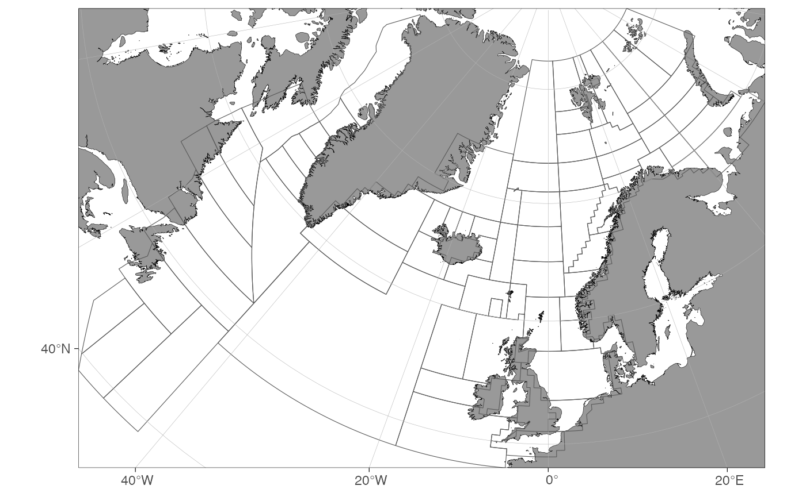

The initial plot draws the polygons. Note how the polygon boundaries are
partly on land. We want to eventually hide them under land. We also add
region labels and color the polygons based on their area to demonstrate
the capabilities of sf, ggplot2, ggspatial and ggOceanMaps:

``` r
labels <- suppressWarnings(sf::st_centroid(fdir_main_areas))
fdir_main_areas$area <- as.numeric(sf::st_area(fdir_main_areas))/1e9 # calculate area in 1000 km2

p <- basemap(fdir_main_areas) +
  geom_sf(data = fdir_main_areas, aes(fill = area)) +
  geom_sf_text(data = labels, aes(label = main_area), size = FS(8), fontface = 2) +
  scale_fill_distiller(name = "Area\n(1000 km2)",
                       palette = "Spectral", na.value = "white",
                       limits = c(0, 500), oob = scales::squish)

reorder_layers(p)
```

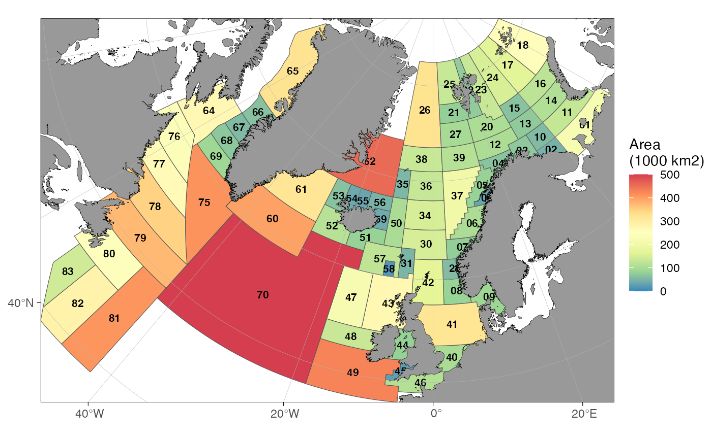

Ideally, the region labels should not go under land. This can be fixed
by plotting the labels on top of the reordered ggplot object. To
demonstrate how to reorder layers, we do this manually here:

``` r
p <- reorder_layers(p)
tmp <- sapply(p$layers, function(k) !is.null(k$mapping$label)) # the layer with label mapping
p$layers <- c(p$layers[-which(tmp)], p$layers[which(tmp)])
p
```


### Contolling the plotting order of graticules

Graticules are plotted using
[`ggplot2::coord_sf()`](https://ggplot2.tidyverse.org/reference/ggsf.html)
and are regarded as the *panel* element in the
[`ggplot2::theme()`](https://ggplot2.tidyverse.org/reference/theme.html).
Note that also background color is included in the *panel* element (see
the next section). The
[`ggOceanMaps::theme_map()`](https://mikkovihtakari.github.io/ggOceanMaps/reference/theme_map.html)
function, which is automatically executed together with every
[`basemap()`](../reference/basemap.md) and
[`qmap()`](../reference/qmap.md) command, controls the position of the
graticules and they are set on top by default:

``` r
basemap(limits = c(-20, 15, 50, 70), grid.col = "red", grid.size = 1)
```

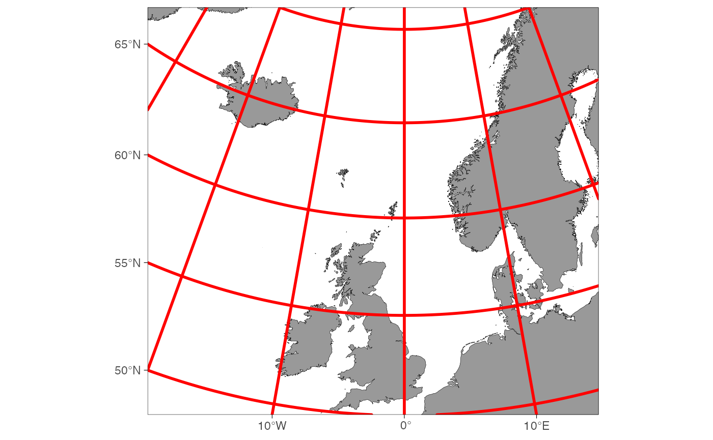

To move the graticules under all layers, use the `panel.ontop` argument
in
[`ggplot2::theme()`](https://ggplot2.tidyverse.org/reference/theme.html):

``` r
basemap(limits = c(-20, 15, 50, 70), grid.col = "red", grid.size = 1) + 
  theme(panel.ontop = FALSE)
```


Sometimes there is a need to control the position of graticules in
between layers. At the time of writing, ggplot does not offer a
straightforward way to do this, but we can use the code from
[`ggplot2::coord_sf()`](https://github.com/tidyverse/ggplot2/blob/7571122f6a9455ccce9f8ceb9a2196c0a70be646/R/coord-sf.R#L226)
to make the graticules:

``` r
p <- basemap(limits = c(-20, 15, 50, 70), grid.col = NA) + # without graticules 
  geom_sf(data = ices_areas, aes(fill = SubArea), show.legend = FALSE) 

# Make the graticules:
lims <- attributes(p)$limits 
graticule <- sf::st_graticule(
  c(lims[1], lims[3], lims[2], lims[4]), 
  crs = attributes(p)$crs,
  lon = seq(-180, 180, 15), lat = seq(-90, 90, 5))

# Plot
reorder_layers(p) +
  geom_sf(data = graticule, color = "grey70", size = LS(0.5)) + # graticules
  coord_sf(xlim = lims[1:2], ylim = lims[3:4], # redefine limits
           crs = attributes(p)$crs) +
  # labels on top of graticules
  geom_sf_label(
    data = suppressWarnings(sf::st_centroid(sf::st_make_valid(ices_areas))), 
    aes(label = Area_Full)
  )
```

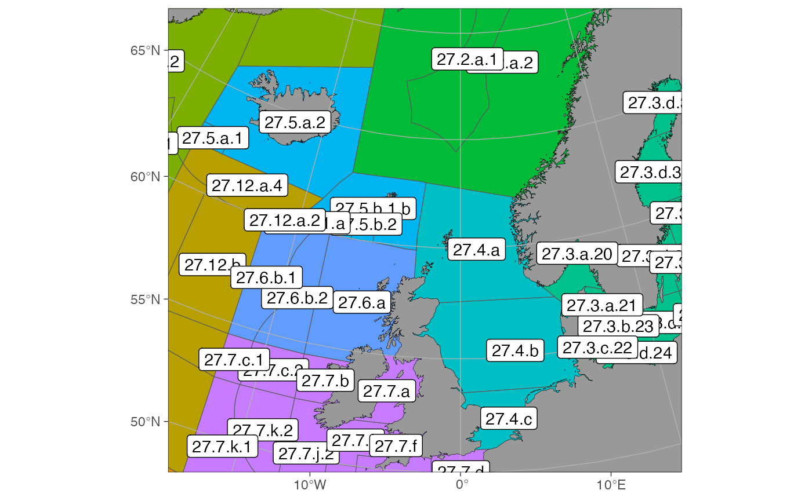

An exception are the polar maps for which graticules are drawn by
ggOceanMaps (because ggplot2 graticules for those maps were bugged some
years ago when writing the function; this part requires a revision at
some point).

``` r
X <- basemap_data(60)

basemap(60, grid.col = NA) +
  geom_sf(
    data = X$map.grid$lon.grid.lines, 
    color = "red", size = 1) +
  geom_sf(
    data = X$map.grid$lat.grid.lines, 
    color = "red", size = 1) +
  geom_sf(
    data = X$shapefiles$land, 
    fill = "grey60", color = "black", size = 0.1)
```

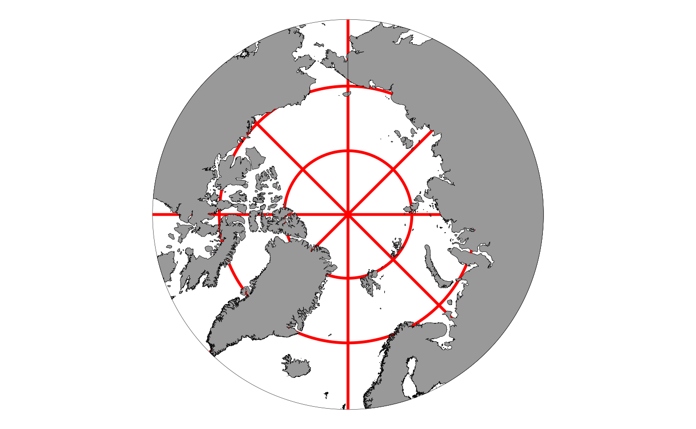

### Coloring the ocean (background)

Similarly, the
[`ggplot2::theme()`](https://ggplot2.tidyverse.org/reference/theme.html)
*panel* element allows [coloring the
ocean](https://stackoverflow.com/questions/67615318/how-to-colour-the-ocean):

``` r
basemap(expand.grid(lon = c(-129, -124), lat = c(49, 53)), grid.col = "red", grid.size = 0.5) + 
  theme(panel.background = element_rect(fill = "lightblue"),
        panel.ontop = FALSE) 
```


If you want the graticules on top, you’ll need to define them manually
because, both, the background and the grid, are contained in the same
ggplot element called *panel*:

``` r
p <- basemap(expand.grid(lon = c(-129, -124), lat = c(49, 53)), grid.col = NA) + 
  theme(panel.background = element_rect(fill = "lightblue"),
        panel.ontop = FALSE) 

# Make the graticules:
lims <- attributes(p)$limits 
graticule <- sf::st_graticule(
  c(lims[1], lims[3], lims[2], lims[4]), 
  crs = attributes(p)$crs,
  lon = attributes(p)$map.grid$lon.breaks, 
  lat = attributes(p)$map.grid$lat.breaks
)

# Plot
p + 
  geom_sf(data = graticule, color = "red", size = LS(1)) + # graticules
  coord_sf(xlim = lims[1:2], ylim = lims[3:4], # redefine limits
           crs = attributes(p)$crs) 
```

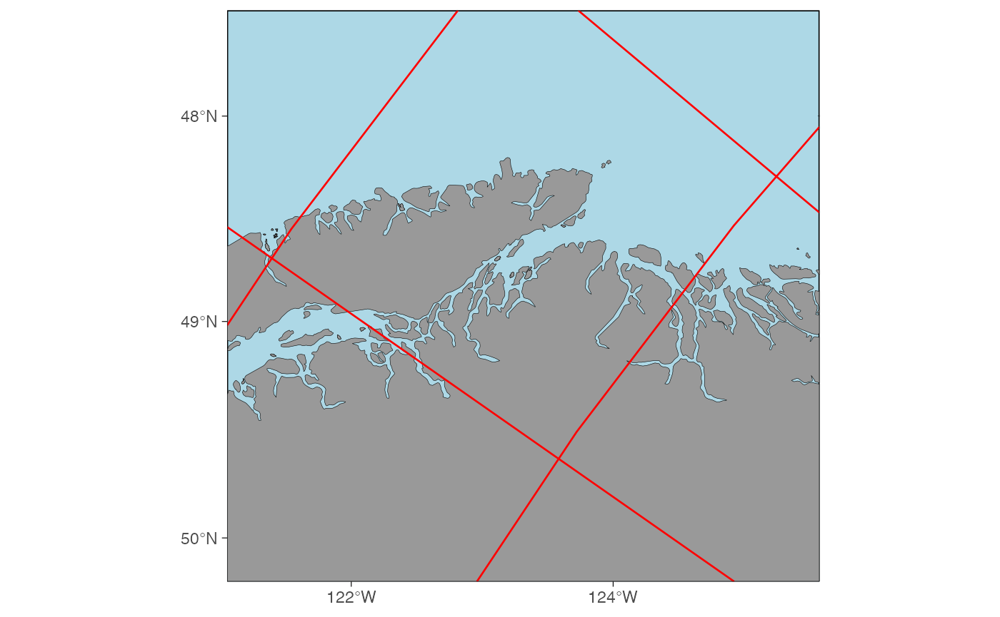

### Add a fill scale on top of bathymetry

``` r
basemap(c(-20, 15, 50, 70), bathymetry = TRUE) + 
  annotation_spatial(ices_areas, aes(fill = Area_Full))
#> Error in `f()`:
# ! Insufficient values in manual scale. 75 needed but only 9 provided.
# Run `rlang::last_error()` to see where the error occurred.
```

This error comes because ggplot does not allow two color scales with
similar mapping in one plot. The issue can be evaded by using contour
bathymetry:

``` r
basemap(c(-20, 15, 50, 70), bathymetry = TRUE, 
        bathy.style = "contour_blues", legends = FALSE) + 
  annotation_spatial(ices_areas, aes(fill = Area_Full), alpha = 0.4) + 
  theme(legend.position = "none")
```

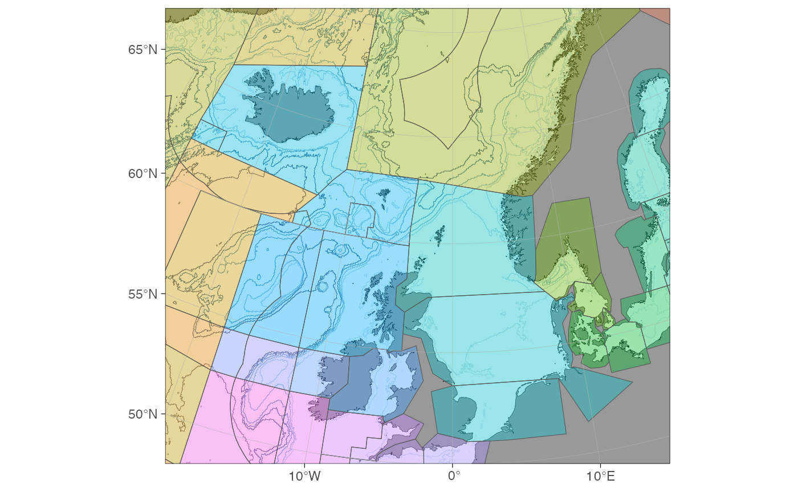

Or by using the [ggnewscale](https://github.com/eliocamp/ggnewscale)
package to make the data `fill` mapping disconnected from that in
`basemap`:

``` r
basemap(limits = c(-20, 15, 50, 70), bathymetry = TRUE, 
        bathy.style = "poly_greys") +
  ggnewscale::new_scale_fill() +
  annotation_spatial(ices_areas, aes(fill = Area_Full), alpha = 0.4) + 
  theme(legend.position = "none")
```

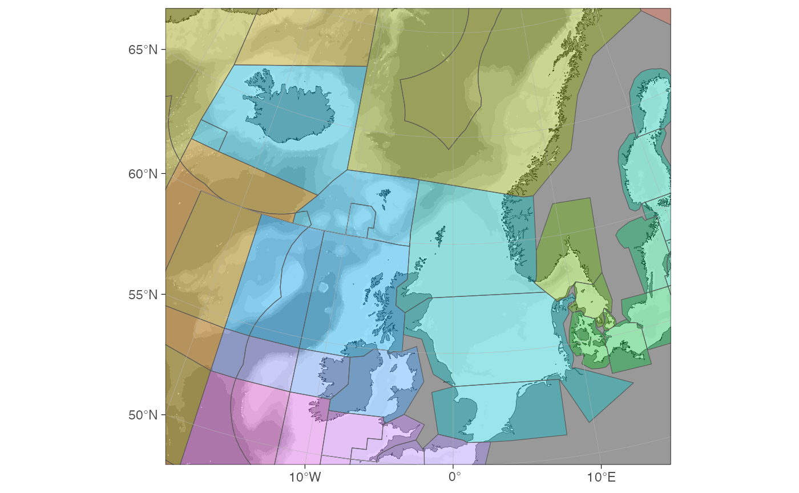

### Add longitude and latitude labels to a polar map

Since adding longitude and latitude labels to polar maps requires some
manual fiddling for each map, there is no premade solution for this.
Instead, you can do this using the sf package:

``` r
library(sf); library(dplyr)

p <- basemap(-60, shapefiles = "Antarctic")

p + 
  geom_text(
    data =
      attributes(p)$map.grid$lat.grid.lines %>% 
      sf::st_coordinates() %>% 
      as.data.frame() %>% 
      dplyr::filter(X == -180) %>%
      dplyr::add_row(X = -180, Y = -90, L1 = 3, L2 = 1) %>% 
      transform_coord(proj.out = attributes(p)$crs, bind = TRUE),
    aes(x = lon.proj, y = lat.proj, label = paste0(abs(Y), "\u00B0S"))
  ) +
  geom_text(
    data =
      attributes(p)$map.grid$lon.grid.lines %>% 
      sf::st_coordinates() %>% 
      as.data.frame() %>% 
      dplyr::filter(Y == -60) %>%
      dplyr::mutate(Y = -63) %>% 
      transform_coord(proj.out = attributes(p)$crs, bind = TRUE),
    aes(x = lon.proj, y = lat.proj, 
        label = ifelse(sign(X) == 1, paste0(abs(X), "\u00B0E"), 
                       paste0(abs(X), "\u00B0W"))
    )
  ) +
  theme(plot.margin = margin(0.25, 0.25, 0.25, 0.25, "cm"))
```

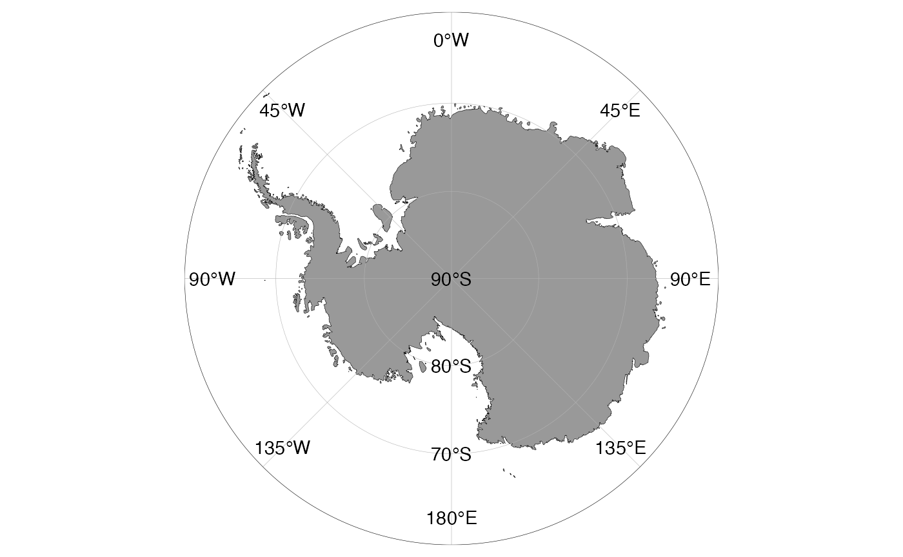

### Custom shapefiles

The ggOceanMaps package uses vector (spatial polygon) data for land and
glaciers to make the plotting more efficient and to produce sharp images
at any resolution. Further, both vector and raster bathymetries can be
used. Each of these layers have to be defined using the same projection.
Since the shapefiles are large and generating them may require long
processing time, it is most convenient to save them in a Rdata file in
sf format and load them to the memory when used to make a map. Useful
sources for spatial data are:

**Vector data**

- [Natural Earth
  Data](http://www.naturalearthdata.com/downloads/10m-physical-vectors/)
  provides polygon data in relatively high detail for the entire Earth.
  Used as data-source for land and glacier shapes throughout the
  package, except for the most detailed maps.
- [European Environment
  Agency](https://www.eea.europa.eu/en/datahub/datahubitem-view/af40333f-9e94-4926-a4f0-0a787f1d2b8f)
  provides high-resolution land shapes for Europe.
- [Norwegian Mapping Authority](https://www.kartverket.no/) provides
  high-resolution spatial data for mainland Norway and Svalbard.
- [Norwegian Polar Institute](https://geodata.npolar.no/) provides
  high-resolution vector data for Norwegian polar regions.

**Raster data for bathymetry**

- [GEBCO Compilation Group (2019) GEBCO 2019 15-arcsecond
  grid](https://www.gebco.net/data_and_products/gridded_bathymetry_data/gebco_2019/gebco_2019_info.html).
  The highest resolution open bathymetry grid available at the moment.
  Referred to as “GEBCO data”.
- [ETOPO1 15 Arc-Second Global Relief
  Model](https://www.ncei.noaa.gov/products/etopo-global-relief-model).
  Can also be accessed using the
  [`marmap::getNOAA.bathy`](https://www.rdocumentation.org/packages/marmap/versions/1.0.3/topics/getNOAA.bathy)
  (see [Section 1](#making)). Referred to as “NOAA data” and “ETOPO
  data”.

There are probably more sources which the author has not needed yet.
Please send an email to add more options to the list. The bathymetry
datasets are large and require vectorization before they can be plotted
in *ggplot2* within a reasonable time.

Here we go through how to plot customized shapefiles for the Barents Sea
as an example. A similar procedure can be applied to any region in the
world.

#### Bathymetries

The [Natural Earth
Data](http://www.naturalearthdata.com/downloads/10m-physical-vectors/)
provides bathymetry vector data, which can be readily used in
ggOceanMaps. The contours in that dataset are, however, not very
practical for marine biology and fisheries in shallow seas such as the
Barents Sea. Download the [ETOPO dataset as Ice surface elevation
NetCDF](https://www.ncei.noaa.gov/products/etopo-global-relief-model) to
a folder in your computer. It may be beneficial to make a “GIS” or
“Shapefiles” folder where you store similar datasets for later use.
Whether you use ice or bed-rock surface does not matter for this example
as there are no glaciers under the sea-level within the region of
interest. In any case, this choice has no visual effect because land and
glaciers will be plotted on top of the bathymetry, but the ice surface
option will lead to smaller file size.

The bathymetry needs first to be reclassified and formatted for the
consequent vectorization step. First, we need to define the location of
the ETOPO dataset and to find limits for our region in decimal degrees.
The limits can be found using the `basemap` function. It is advised to
use slightly wider limits than the region of interest.

``` r
etopoPath <- "" # Replace by the path to the folder where the ETOPO1 grd file is located.
lims <- c(-8, 65, 68, 82)
projection <- "EPSG:32636"
basemap(limits = lims)
```

We also need to define an appropriate projection. We will use the [UTM
36N zone projection](http://epsg.io/32636), which is approximately in
the middle of our area of interest. We define higher resolution contour
in depths 0-500 m because our area of interest is relatively shallow.
The `raster_bathymetry` function is relatively slow for large data. The
`aggregation.factor` argument can be used to reduce file size but will
influence the resolution of the resulting shapefile (higher factors lead
to a lower resolution).

``` r
rb <- raster_bathymetry(bathy = paste(etopoPath, "ETOPO1_Ice_g_gmt4.grd", sep = "/"),
                        depths = c(50, 100, 200, 300, 500, 1000, 1500, 2000, 4000, 6000, 10000), 
                        proj.out = projection, 
                        boundary = lims
)
```

Now we have the bathyRaster object which can be vectorized:

``` r
class(rb)
names(rb)
raster::plot(rb$raster)
```

The vectorization is done using the `vector_bathymetry` function. The
`drop.crumbs` and `remove.holes` parameters can be used to reduce the
file size, while the `smooth` parameter makes the contours look smoother
under high zoom levels. Note that the smoothing of raster cell edges is
completely arbitrary and may lead to map contours that do not exist in
reality.

``` r
bs_bathy <- vector_bathymetry(rb)
sp::plot(bs_bathy)
```

#### Land shapes

Land shapes could theoretically be defined from the bathymetry raster
(depth = 0). Nevertheless, since the [10m Natural Earth
Data](http://www.naturalearthdata.com/downloads/10m-physical-vectors/)
vectors are of high resolution, there has been no need to write a
function to do this. We use Natural Earth Data instead. Download the
Natural Earth Data [Land and Minor
Islands](http://www.naturalearthdata.com/downloads/10m-physical-vectors/)
vectors to your “GIS” or “Shapefiles” folder and define folder paths
under:

``` r
NEDPath <- "" # Natural Earth Data location
outPath <- "" # Data output location
```

Once done, we go ahead and process the shapefiles:

``` r
world <- rgdal::readOGR(paste(NEDPath, "ne_10m_land/ne_10m_land.shp", sep = "/"))
islands <- rgdal::readOGR(paste(NEDPath, "ne_10m_minor_islands/ne_10m_minor_islands.shp", sep = "/"))
world <- rbind(world, islands)

bs_land <- clip_shapefile(world, lims)
bs_land <- sp::spTransform(bs_land, CRSobj = sp::CRS(projection))
rgeos::gIsValid(bs_land) # Has to return TRUE, if not use rgeos::gBuffer
bs_land <- rgeos::gBuffer(bs_land, byid = TRUE, width = 0)
sp::plot(bs_land)
```

##### Glacier shapes

Download the Natural Earth Data [Glaciated
Areas](http://www.naturalearthdata.com/downloads/10m-physical-vectors/)
vectors to your `NEDPath`.

``` r
glaciers <- rgdal::readOGR(paste(NEDPath, "ne_10m_glaciated_areas/ne_10m_glaciated_areas.shp", sep = "/"))
rgeos::gIsValid(glaciers) # Needs buffering
glaciers <- rgeos::gBuffer(glaciers, byid = TRUE, width = 0)

bs_glacier <- clip_shapefile(glaciers, lims)
bs_glacier <- sp::spTransform(bs_glacier, CRSobj = sp::CRS(projection))
rgeos::gIsValid(bs_glacier)
sp::plot(bs_glacier)
```

#### Plotting the shapefiles using basemap

Now that we have the shapefiles, we can save them to a file so that we
do not run the script above every time we plot a map using custom
shapefiles.

``` r
save(bs_bathy, bs_land, bs_glacier, file = paste(outPath, "bs_shapes.rda", sep = "/"), compress = "xz")
```

The shapefiles can now be plotted using the `basemap` function:

``` r
basemap(shapefiles = list(land = bs_land, glacier = bs_glacier, bathy = bs_bathy), bathy.style = "poly_blues", glaciers = TRUE)
```

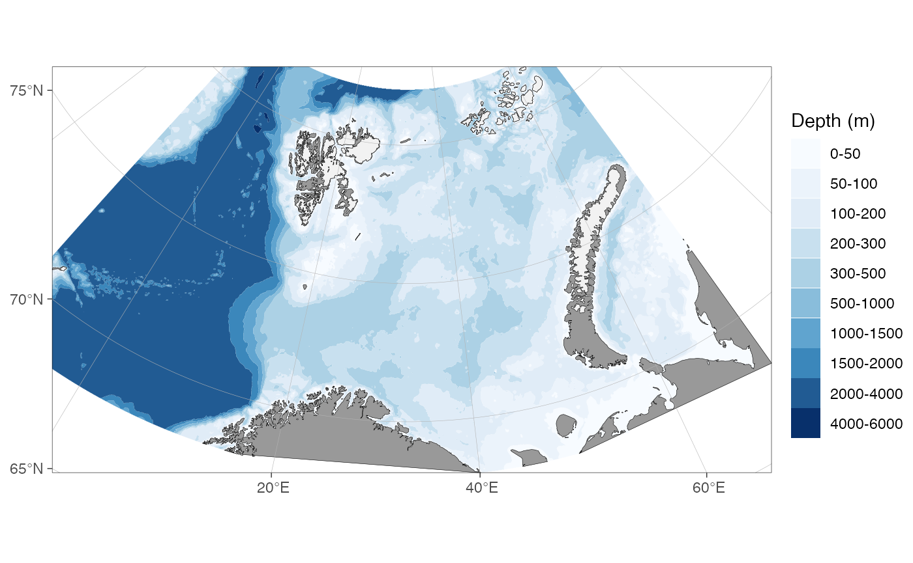

The list elements `land`, `glacier` and `bathy` are required, but
`glacier` and `bathy` can be set to `NULL` if `bathymetry` and
`glaciers` are set to `FALSE`, respectively. This means that you are not
forced to define bathymetries and glaciers for your custom shapefile
maps if plotting them is not desired. Note how the map becomes plotted
outside its actual limits. This issue will hopefully be fixed in the
future. The map can be limited using the `limits` or `data` arguments as
any `basemap`:

``` r
basemap(limits = c(10, 53, 70, 80), shapefiles = list(land = bs_land, glacier = bs_glacier, bathy = bs_bathy), bathy.style = "poly_blues", glaciers = TRUE)
```

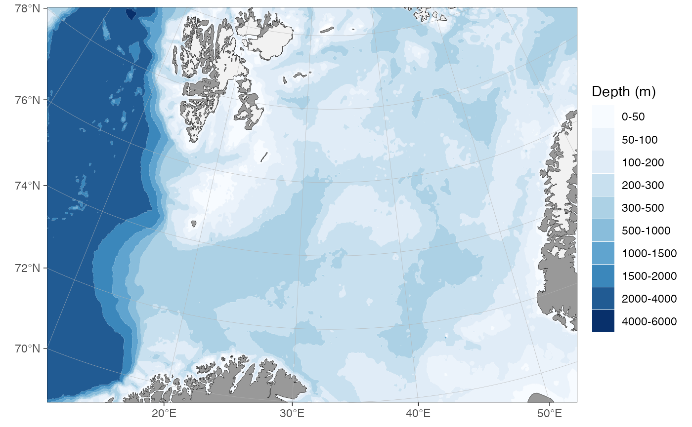

## Known issues

The land and glacier shapes do not get dissolved correctly when
projecting from decimal degrees:

``` r
basemap(60, glaciers = TRUE)
```

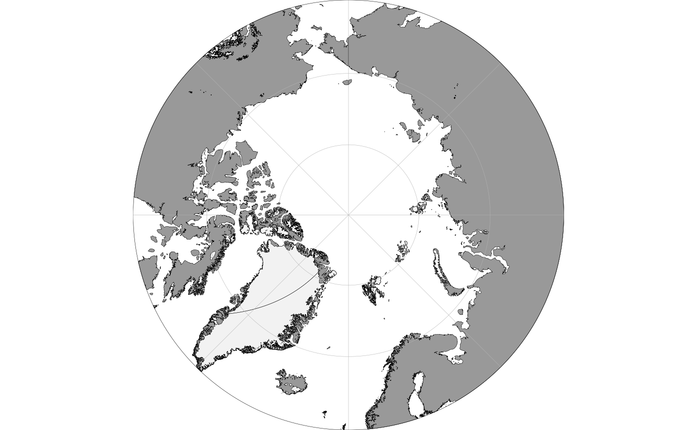

A solution until the issue has been fixed is to use projected
downloadable shape files:

``` r
basemap(60, glaciers = TRUE, shapefiles = "Arctic")
```


## Citations and data sources

The data used by the package are not the property of the Institute of
Marine Research nor the author of the package. It is, therefore,
important that you cite the data sources used in a map you generate with
the package. Please see
[here](https://mikkovihtakari.github.io/ggOceanMaps/#citations-and-data-sources)
for a list of data sources.

Please cite the package whenever maps generated by the package are
published. For up-to-date citation information, please use:

``` r
citation("ggOceanMaps")
```

    #> To cite package 'ggOceanMaps' in publications use:
    #> 
    #>   Vihtakari M (2026). _ggOceanMaps: Plot Data on Oceanographic Maps
    #>   using 'ggplot2'_. R package version 2.3.0,
    #>   <https://mikkovihtakari.github.io/ggOceanMaps/>.
    #> 
    #> A BibTeX entry for LaTeX users is
    #> 
    #>   @Manual{,
    #>     title = {ggOceanMaps: Plot Data on Oceanographic Maps using 'ggplot2'},
    #>     author = {Mikko Vihtakari},
    #>     year = {2026},
    #>     note = {R package version 2.3.0},
    #>     url = {https://mikkovihtakari.github.io/ggOceanMaps/},
    #>   }
