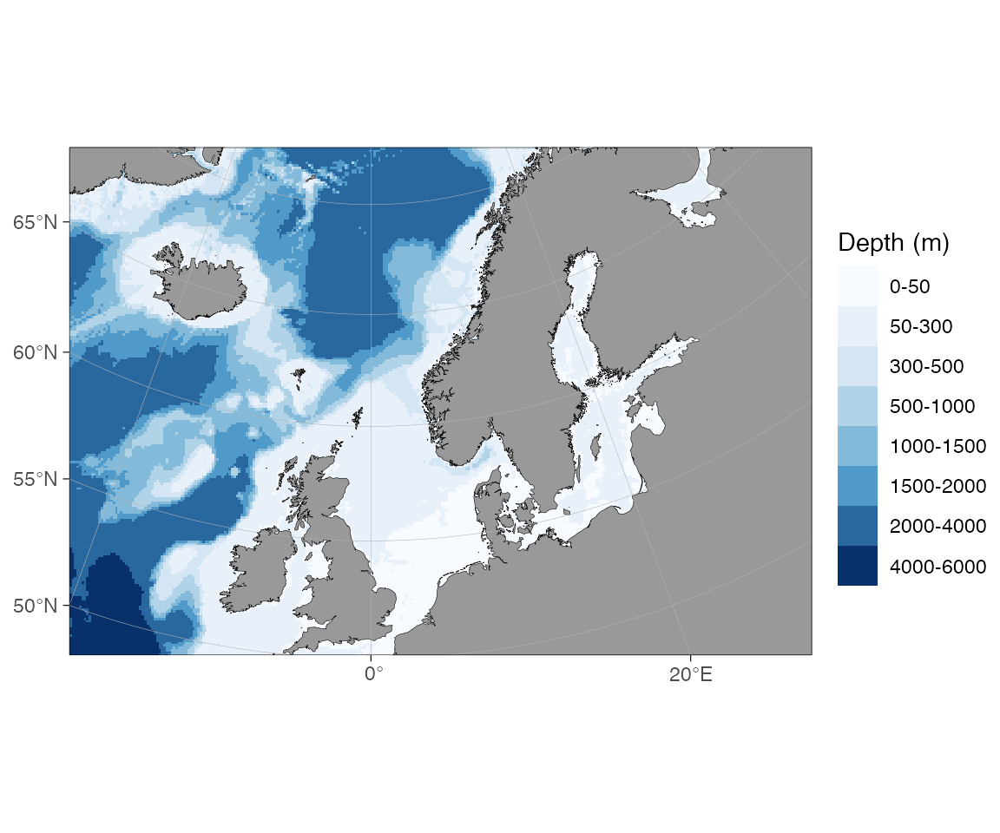

# New features in ggOceanMaps version 3

``` r

library(ggOceanMaps)
```

## Bringing ggOceanMaps to the AI age

Version 3 marks a change in direction. From now on, ggOceanMaps is
developed with the help of AI coding assistants (Claude Code, GitHub
Copilot), and a core goal of the package is to **help AI agents make
good maps on behalf of their users**. Plotting oceanographic data should
be a one-sentence request, whether you type it yourself or ask an
assistant to do it for you.

The most visible part of this shift is a new
[`AGENTS.md`](https://github.com/MikkoVihtakari/ggOceanMaps/blob/master/AGENTS.md)
file shipped with the package. It gives AI assistants concise, accurate
instructions for *using* ggOceanMaps — the projection rules, the
`shapefiles` contract, how
[`transform_coord()`](https://mikkovihtakari.github.io/ggOceanMaps/reference/transform_coord.md)
works, and the common pitfalls — so they spend less time guessing and
more time helping. The documentation site was also reorganised around
this idea: a short [user
manual](https://mikkovihtakari.github.io/ggOceanMaps/articles/ggOceanMaps.md)
that links out to focused, in-depth articles.

Everything below is new or substantially improved in version 3.

## On-demand high-resolution bathymetry

The biggest functional addition is
[`wcs_bathymetry()`](https://mikkovihtakari.github.io/ggOceanMaps/reference/wcs_bathymetry.md):
high-resolution bathymetry downloaded on demand from Web Coverage
Services, with no manual file handling. You select it through the
`bathy.style` argument and ggOceanMaps fetches, caches, and renders the
right tiles for your map extent.

Two sources are available:

- **EMODnet** (~115 m, European waters) —
  `bathy.style = "wcs_emodnet_blues"` (`"wemb"`) or
  `"wcs_emodnet_grays"` (`"wemg"`).
- **ETOPO1 from NOAA NCEI** (~1.85 km, global) —
  `bathy.style = "wcs_etopo_blues"` (`"wceb"`) or `"wcs_etopo_grays"`
  (`"wceg"`). Use this when EMODnet has no coverage.

``` r

# High-resolution EMODnet bathymetry around Tromsø, downloaded on the fly
basemap(c(18.4, 19.3, 69.5, 69.9), bathy.style = "wemb")
```

Bounding boxes outside a source’s coverage fail cleanly with a pointer
to the right alternative, large boxes are tiled and mosaicked
automatically, and the downloaded tiles are cached under
`getOption("ggOceanMaps.datapath")` so the next map is instant. See the
[Bathymetry
article](https://mikkovihtakari.github.io/ggOceanMaps/articles/bathymetry.md)
for the full list of sources and rendered examples.

## Build your own shapefiles

The create-your-own-bathymetry workflow is now complete.
[`raster_bathymetry()`](https://mikkovihtakari.github.io/ggOceanMaps/reference/raster_bathymetry.md)
turns a GEBCO/ETOPO/IBCAO grid into a `bathyRaster`, and **two**
vectorisers consume it:
[`vector_bathymetry()`](https://mikkovihtakari.github.io/ggOceanMaps/reference/vector_bathymetry.md)
for depth-contour polygons (as before) and the new
[`vector_land()`](https://mikkovihtakari.github.io/ggOceanMaps/reference/vector_land.md)
for a matching land polygon extracted from the same grid.

``` r

rb <- raster_bathymetry(
  bathy = "path/to/your/grid.nc",
  depths = c(50, 100, 200, 500, 1000),
  proj.out = 4326,
  boundary = c(-5, 10, 50, 60)
)

basemap(
  limits = c(-5, 10, 50, 60),
  shapefiles = list(
    land   = vector_land(rb),       # NEW in v3
    glacier = NULL,
    bathy  = vector_bathymetry(rb)
  ),
  bathymetry = TRUE
)
```

Because land and bathymetry come from the same grid, their edges line
up. The [Customising shapefiles
article](https://mikkovihtakari.github.io/ggOceanMaps/articles/customising-shapefiles.md)
walks through this pipeline,
[`clip_shapefile()`](https://mikkovihtakari.github.io/ggOceanMaps/reference/clip_shapefile.md),
and reading Norwegian Geonorge depth data with
[`geonorge_bathymetry()`](https://mikkovihtakari.github.io/ggOceanMaps/reference/geonorge_bathymetry.md).

## Expanded documentation

Version 3 splits the old single manual into a concise overview plus a
set of focused articles:

- **[Bathymetry](https://mikkovihtakari.github.io/ggOceanMaps/articles/bathymetry.md)**
  — every way to get bathymetry into a map, from the shipped
  low-resolution grid to on-demand WCS and your own rasters.
- **[Customising
  shapefiles](https://mikkovihtakari.github.io/ggOceanMaps/articles/customising-shapefiles.md)**
  — supplying your own land, glacier, and bathymetry layers.
- **[Adding graphical
  elements](https://mikkovihtakari.github.io/ggOceanMaps/articles/adding-graphical-elements.md)**
  — ocean-current arrows (velocity quivers and schematic “Figure 1”
  arrows) and pie charts on maps via `scatterpie::geom_scatterpie()`.
- **[Cookbook](https://mikkovihtakari.github.io/ggOceanMaps/articles/cookbook.md)**
  — short, copy-pasteable recipes.

## Tested and more reliable

Version 3 ships a comprehensive automated test suite: smoke tests
covering the historical regression corpus run everywhere, and `vdiffr`
SVG snapshot tests catch “code runs but wrong map” regressions. This
release also fixes several long-standing clipping problems. For example,
projected maps with decimal-degree limits used to cut off land near the
map edges — `basemap(c(-20, 30, 50, 70))` clipped off northern Norway.
The clip boundary is now densified before reprojection, so the full
extent is kept:

``` r

basemap(c(-20, 30, 50, 70), bathymetry = TRUE)
```



The map above is built entirely from the low-resolution data shipped
with the package, reprojected to Arctic stereographic on the fly — no
downloads required.

## Upgrading from version 2

Version 3 is backwards compatible with version 2 map code; existing
[`basemap()`](https://mikkovihtakari.github.io/ggOceanMaps/reference/basemap.md)
and
[`qmap()`](https://mikkovihtakari.github.io/ggOceanMaps/reference/qmap.md)
calls keep working. If you used the older bathymetry styles, see the
[version 2 release
notes](https://mikkovihtakari.github.io/ggOceanMaps/articles/new-features-v2.md)
and the [Bathymetry
article](https://mikkovihtakari.github.io/ggOceanMaps/articles/bathymetry.md)
for the current `bathy.style` names.
